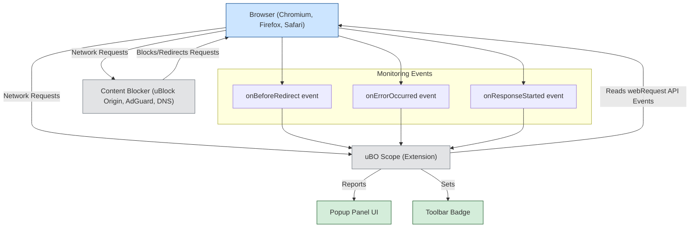

# Integration with Content Blockers & Browsers

Understanding how uBO Scope integrates with various content blockers and operates across different browser platforms is crucial to harnessing its full potential. This page explains exactly how uBO Scope works alongside popular content blockers, what types of network requests it can monitor, and the boundaries of its visibility imposed by browser APIs and architecture.

---

## How uBO Scope Works Alongside Content Blockers

uBO Scope is designed as a transparent companion extension that independently observes the network requests reported by the browser. It does not block or alter requests itself, but instead monitors and logs the outcome of every network connection attempt made by webpages and browser components.

### Complementary to Content Blocking Extensions

- **Independent Observation**: uBO Scope listens to the browser’s `webRequest` API to detect all network requests, regardless of which content blockers you have installed.
- **Outcome Reporting**: For each request, it categorizes the result as one of the following:
  - **Allowed** (requests completed successfully)
  - **Stealth-blocked** (requests redirected or otherwise silently suppressed by content blockers)
  - **Blocked** (requests aborted or errored out)

This comprehensive accounting allows you to see a clear picture of what connections your browser is attempting and what is actually allowed through, independent of any content blocker’s UI or metrics.

### Works with Major Content Blockers

Whether you are using:

- uBlock Origin
- AdGuard
- DNS-level blocking solutions

uBO Scope captures the effective network behavior by relying on native browser events, which fire after content blockers have applied their rules. This enables you to verify the true impact of your privacy setup.

<Tip>
Content blockers often report their own block counts that may not align with actual network outcomes. uBO Scope bypasses this ambiguity by showing the browser-level reality.
</Tip>

---

## Visibility Scope: What Requests uBO Scope Can See

uBO Scope’s visibility depends on the browser’s support for the `webRequest` API and the specific event listeners it uses. It tracks these key network events:

- `onBeforeRedirect` (indicates stealth-blocked or redirected connections)
- `onErrorOccurred` (indicates blocked or failed connections)
- `onResponseStarted` (indicates successful connections)

### Supported Network Schemes

uBO Scope monitors network requests over these transports:

- HTTP and HTTPS (`https?://`)
- WebSocket and Secure WebSocket (`ws://`, `wss://`)

Requests made over other schemes or internal browser processes are outside its scope.

### Limitations

- **Browser coverage**: uBO Scope works with browsers that expose the `webRequest` API with required events. This includes Chromium-based browsers, Firefox, and Safari (recent versions).
- **Invisibility of some internal requests**: Network requests made outside the reach of `webRequest` (e.g., special browser features or protocols) cannot be reported.
- **Blocking at DNS or network layer**: When blocking is done outside the browser (e.g., via DNS-level filtering), uBO Scope still sees the resulting network failures but cannot detect the exact blocking mechanism.

<Warning>
Not all network requests can be monitored due to browser API constraints. uBO Scope reports the browser’s view of connections, not all lower-level network activity.
</Warning>

---

## Cross-Browser Support & Platform Differences

uBO Scope has been developed to function across major browsers, leveraging their respective extension systems and available APIs.

| Browser           | Support Details                               | Manifest Version | Notes
|-------------------|-----------------------------------------------|------------------|---------------------------
| Chromium (Edge, Chrome) | Full use of Manifest V3; service worker background; supports webRequest with required events | 3                | Uses service worker for background logic
| Firefox           | Manifest V3 with service worker; supports webRequest API events | 3                | Requires Firefox 128+ for full support
| Safari            | Service worker with scripts for background; supports webRequest for HTTP(s) | 3                | Requires Safari 18.5+; WebSocket monitoring limited to http(s) only

### Manifest and Permissions

Each platform manifest declares permissions for `activeTab`, `storage`, and crucially `webRequest` with broad host permissions (`http://*/*`, `https://*/*`, `ws://*/*`, `wss://*/*`). This wide access allows comprehensive monitoring across all browsing activity.

### User Experience Consistency

From the user’s perspective, the popup panel and badge behave identically regardless of browser, providing a uniform and reliable experience in reporting third-party connections.

---

## Real-World User Flow: Monitoring Network Connections Alongside Your Content Blocker

1. **Install uBO Scope alongside your preferred content blocker** (e.g., uBlock Origin).
2. **Browse as normal.** uBO Scope listens and records the network requests the browser attempts.
3. **Open the uBO Scope popup panel.**
   - See a clear summary of all connected domains, divided into allowed, stealth-blocked, and blocked categories.
   - Confirm that blocked domains correspond with your expectations.
4. **Use uBO Scope to cross-verify your content blocker’s effectiveness.**
   - Identify if some requests are slipping through unnoticed.
   - Detect stealth blocking via redirects not apparent in blocker UI.

This workflow enhances your confidence and understanding of your browser’s network activity, empowering you to fine-tune your privacy tools.

---

## Troubleshooting and Common Questions

<AccordionGroup title="Common Issues and Fixes">
<Accordion title="Why doesn’t uBO Scope show connections for some browser features?">
Certain browser-internal processes and non-network API calls are outside the scope of `webRequest`. uBO Scope reports what the browser network stack exposes.
</Accordion>
<Accordion title="Will uBO Scope’s report always match my content blocker’s block count?">
No. Content blockers may use internal heuristics and partial reporting. uBO Scope reflects the browser’s actual network request outcomes, which may differ in count and categorization.
</Accordion>
<Accordion title="Can uBO Scope see all WebSocket requests?">
It sees WebSocket connection attempts made via standard web APIs (`ws://`, `wss://`) if the browser supports it in `webRequest`.
</Accordion>
<Accordion title="Is uBO Scope affected by browser privacy settings?">
uBO Scope depends on APIs exposed by your browser. Certain privacy features or restrictive modes might limit data accessible via `webRequest`.
</Accordion>
</AccordionGroup>

---

## Summary Diagram: Integration Overview

---

## Next Steps

To maximize the value from uBO Scope’s integration capabilities:

- Install your preferred content blockers alongside uBO Scope.
- Explore the popup panel to get real-time insights into allowed, blocked, and stealth-blocked remote servers.
- Read the [Understanding Badge Counts and Reports](/getting-started/introduction-overview/understanding-badge-and-reports) guide to interpret the data correctly.
- Consult the [Debunking 'Block Count' Myths in Content Blocking](/guides/advanced-usage-patterns/debunking-block-count-myths) for deeper understanding.

For developers and filter list maintainers, leverage uBO Scope’s comprehensive network visibility to validate effective blocking and identify third-party resource usage.

---

## References

- [uBO Scope GitHub Repository](https://github.com/gorhill/uBO-Scope)
- [What is uBO Scope? (Product Overview)](/overview/introduction-value/product-overview)
- [Understanding Badge Counts and Reports](/getting-started/introduction-overview/understanding-badge-and-reports)
- [Debunking 'Block Count' Myths in Content Blocking](/guides/advanced-usage-patterns/debunking-block-count-myths)
- [System Architecture & Data Flow](/overview/architecture-core-concepts/system-architecture)
- [Core Concepts & Terminology](/overview/architecture-core-concepts/core-terminology)

