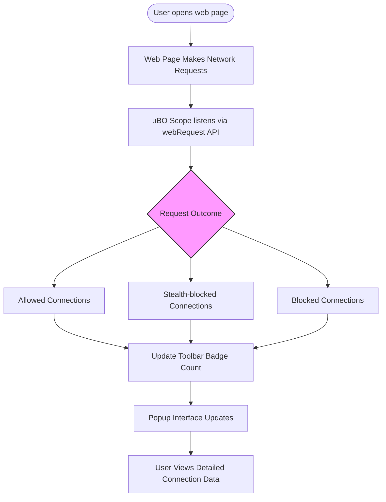

# Core Features & Capabilities of uBO Scope

## See All Remote Connections at a Glance

uBO Scope puts you in control by revealing every network connection that a web page attempts or successfully makes—no matter what content blockers are running. This page gives you a fast, clear overview of what uBO Scope offers, so you can quickly understand its core capabilities and the value it brings during everyday browsing.

---

## Real-Time Reporting of Connections

From the moment a page loads, uBO Scope listens transparently to every network request using the browser's `webRequest` API. It tracks connections:

- **Allowed:** Resources that loaded successfully from third-party remote servers.
- **Blocked:** Requests blocked or failed to connect.
- **Stealth-blocked:** Redirects caught and hidden by content blockers.

This live insight reveals the true story behind all connection attempts—including those bypassing traditional content blockers or DNS-level filtering.

**Benefit:** Know exactly which external servers your browser talks to on any page, empowering privacy understanding and control.

## Toolbar Badge for Third-Party Connection Count

The toolbar icon serves as your instant indicator, showing the **number of distinct third-party domains** connected to on the current page.

- A **lower badge count** signals fewer third-party connections, often indicating a cleaner browsing experience.
- The badge updates dynamically as you navigate or reload tabs.

<u>Why this matters:</u> Not all third-party connections are bad—legitimate content delivery networks (CDNs) and services appear here. Seeing the true count helps discern real privacy risks from expected connections.

## Compatibility with All Content Blockers

uBO Scope operates independently and transparently alongside any content blocker or DNS-based filter you use. It reports **network requests regardless of how they were handled or blocked,** provided the browser exposes them to the `webRequest` API.

- Works with blockers like uBlock Origin, AdBlock Plus, or system-level DNS filtering.
- Reveals connections that your content blocker may allow or stealthily block.

## Detailed Connection Outcomes Categorization

uBO Scope classifies connections into three clear categories within its popup interface:

- **Allowed:** Connections that succeeded without interference.
- **Stealth-blocked:** Connections redirected or hidden by blockers to remain undetected.
- **Blocked:** Connections that failed due to blocking or errors.

This classification helps you understand exactly what happens behind the scenes in your network traffic.

## Supporting Filter List Maintainers and Advanced Users

Though simple and transparent, uBO Scope is a powerful tool for filter list creators and advanced privacy enthusiasts. It:

- Provides real usage data on remote server connections.
- Helps debunk myths about blocker efficacy based on block counts.
- Enables data-driven filter list improvements by showing actual connections observed in the wild.

---

## How These Features Work Together

Visualize your browsing session as a flow of network requests, each classified and tallied in real time. The browser toolbar badge gives an at-a-glance snapshot of third-party reach, while the detailed popup lets you deep-dive into each connection’s fate.

This combination delivers clarity on "who is connecting to what," enabling you to make informed decisions about privacy and content blocking.

## Practical Examples

- When visiting a news website, see which advertising or tracking domains are allowed despite your content blocker.
- On social media platforms, view the number of third-party domains your browser contacts and identify stealth-blocked trackers hidden from page scripts.
- While developing or testing filter lists, monitor how changes affect the actual third-party connections during browsing.

---

## Tips for Maximizing uBO Scope's Benefits

- **Regularly check the badge count:** A sudden spike in third-party connections may indicate new trackers or unwanted scripts.
- **Inspect the popup list:** Review domains in the allowed and stealth-blocked sections to identify suspicious or unexpected servers.
- **Combine with content blockers:** Use uBO Scope as an independent verification tool to validate your blocker’s effectiveness.
- **Don’t rely on blocked counts alone:** A high block count does not guarantee better blocking; focus on the actual connections allowed.

## Common Pitfalls to Avoid

- Expecting the extension to block connections itself—it only reports them.
- Interpreting the badge count as a full security assessment without context.
- Using "ad blocker test" webpages as reliable benchmarks—these tests produce unrealistic requests that do not reflect real browsing.

---

## Getting Started Preview

Ready to see these features in action? To begin:

1. Install uBO Scope for your browser (Chrome, Firefox, Safari).
2. Visit any website and click the uBO Scope toolbar icon to open the popup.
3. Watch live as connections load, block, or stealth-block.
4. Use the badge count for quick assessment of third-party reach.

For detailed setup instructions and usage guidance, see the [Installing and Setting Up uBO Scope](https://docs.uboscoop.org/guides/core-workflows/install-and-setup) page.

---

## Summary

| Feature                          | Description                                      | User Benefit                          |
|---------------------------------|-------------------------------------------------|-------------------------------------|
| Real-time connection reporting  | Tracks all remote server requests live          | Transparent network visibility      |
| Toolbar badge count             | Shows number of distinct third-party domains    | Quick privacy state overview        |
| Compatible with all blockers   | Works alongside other content blocking tools     | Complete, unbiased connection data |
| Outcome categorization          | Separates connections into allowed, stealthed, blocked | In-depth connection insights        |
| Advanced filtering support      | Data aids filter list maintainers and enthusiasts | Enhances blocker reliability        |

<u>uBO Scope is your companion that sheds light on the hidden network activity of web pages, empowering better privacy decisions and a deeper understanding of your browser’s connections.</u>

---

## Related Documentation

- [What is uBO Scope?](https://docs.uboscoop.org/overview/intro-basics/what-is-ubo-scope) — Learn about the product's core purpose and how it works.
- [Target Audience & Use Cases](https://docs.uboscoop.org/overview/intro-basics/who-should-use) — Discover who benefits most from the extension.
- [Troubleshooting Installation & First Use](https://docs.uboscoop.org/getting-started/core-usage-and-setup/troubleshooting-installation) — Resolve common issues seamlessly.
- [Understanding the Popup: Reading Connection Insights](https://docs.uboscoop.org/guides/core-workflows/understanding-the-popup) — Dive deeper into the interface and data interpretation.

---

For the full source and latest releases, visit the [uBO Scope GitHub repository](https://github.com/gorhill/uBO-Scope).

---

<Callout>
**Note:** uBO Scope reports only network requests accessible via the browser's `webRequest` API. Requests made outside this scope (e.g., some native DNS or isolated browser features) are not visible to the extension.
</Callout>

---

### Example of Toolbar Badge and Popup Interaction

This flow illustrates how uBO Scope continuously monitors and updates users on remote server connections, supporting proactive browsing management.
