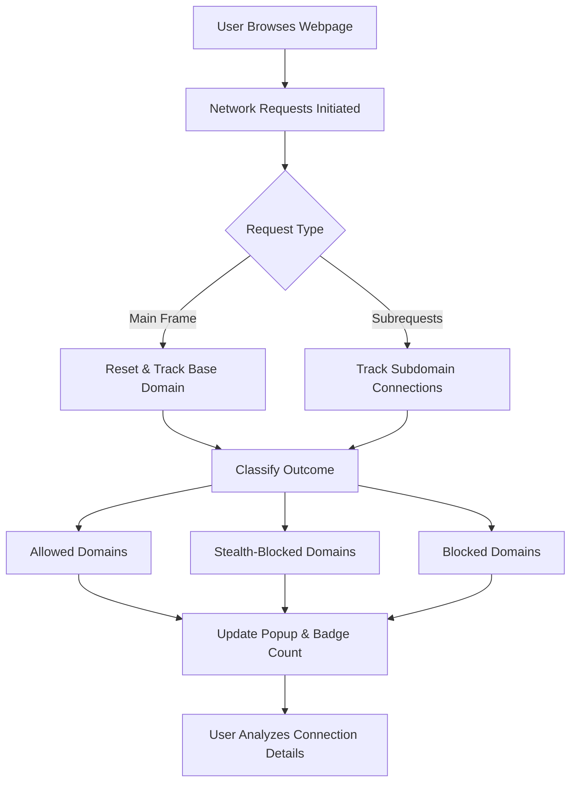

# What is uBO Scope?

## Discover the True Reach of Every Webpage You Visit

uBO Scope is a lightweight, privacy-focused browser extension designed to transparently reveal every attempted and successful connection your browser makes to remote servers when loading a webpage. It empowers you by showing the exact number of distinct third-party servers contacted, enabling you to assess each webpage's privacy and security posture effortlessly.

- **Instant Insight:** Check in real-time how many and which distinct third-party servers a webpage contacts.
- **Comprehensive Visibility:** Capture connections no matter the content blocker in use, leveraging browser network APIs.
- **Platform-Agnostic:** Works seamlessly across Chromium-based browsers and Firefox.
- **User-Friendly Interface:** A simple popup displays detailed connection outcomes categorized by allowed, stealth-blocked, or blocked requests.
- **Badge Summary:** Toolbar icon badge shows the count of third-party domains contacted for immediate awareness.

### Who Benefits From uBO Scope?
This extension is essential for privacy-conscious users, security auditors, filter list maintainers, and anyone curious about how websites interact with external servers behind the scenes.

---

## What Is uBO Scope?

uBO Scope is a browser extension companion to uBlock Origin, engineered to precisely measure and report the network connections webpages initiate to remote servers. It focuses on revealing network activity in an unobtrusive way — presenting users with clear insights into third-party connections without interfering with normal browsing.

### The Core Problem It Solves

Browsing the web often means unknowingly connecting to multiple third-party servers, which can impact privacy and security. uBO Scope fills the gap by surfacing this hidden network activity, helping you identify the extent and nature of these connections.

### How uBO Scope Stands Out

Unlike generic network monitors, uBO Scope prioritizes clarity and actionable information: it counts distinct third-party domains contacted, categorizes connection outcomes (allowed, blocked, stealth-blocked), and reports them with precision, regardless of the content blockers or network-level filters employed.

---

## Key Features & Capabilities

### Real-Time Third-Party Server Detection
Monitors every network request made by the active tab and identifies distinct third-party domains contacted.

### Outcome Categorization
- **Allowed:** Connections successfully established.
- **Stealth-Blocked:** Connections blocked in a way invisible to pages (e.g., stealthy content blocking).
- **Blocked:** Connections explicitly blocked.

### Badge Count Summarization
The extension icon badge displays the number of distinct third-party domains contacted, offering a quick privacy metric at a glance.

### Cross-Browser Support
Supports Chromium browsers and Firefox by leveraging respective web extension APIs, providing a consistent experience across platforms.

### Transparent and Lightweight
Operates efficiently in the background, recording and aggregating network activity without affecting browser performance.

### Popup Overview Panel
Instantly visualize:
- The current page’s hostname and domain.
- Lists of domains contacted, grouped by outcome.
- Request counts per domain, helping identify dominant or suspicious third parties.

#### Example Use Case
Visiting a news website, uBO Scope reveals several third-party ad networks and trackers contacted. The badge count quickly shows privacy impact, and the popup provides detailed domains and counts for further investigation.

---

## Why You Should Care

### Gain Control Over Your Privacy Exposure
By knowing which servers your browser talks to, especially those outside your primary domain, you can make informed decisions about which content blockers or filters to employ.

### Validate Content Blocker Effectiveness
uBO Scope’s insights help you verify if your content blocker truly limits third-party communications rather than just blocking superficial elements.

### Debunk Common Misconceptions About Blocking
Many believe that higher block counts equal better protection. uBO Scope shows that lower third-party domain counts are a more reliable privacy metric.

### Useful for Filter List Maintainers
Track real-world domain connections to refine filter lists and ensure they block effectively without excessive false positives.

### Time and Efficiency Benefits
Instead of manually dissecting network logs or relying on unreliable test pages, uBO Scope offers convenient, real-world metrics instantly.

---

## Getting Started Preview

Getting started with uBO Scope is straightforward:

1. **Install uBO Scope:** Available on [Chrome Web Store](https://chromewebstore.google.com/detail/ubo-scope/bbdpgcaljkaaigfcomhidmneffjjjfgp) and [Firefox Add-ons](https://addons.mozilla.org/firefox/addon/ubo-scope/).
2. **Navigate to any webpage:** The extension automatically monitors requests.
3. **Click the toolbar icon:** See a popup summarizing all distinct third-party connections grouped by status.
4. **Interpret the badge count:** Understand the number of unique third-party domains contacted by the current page.

For detailed installation steps and troubleshooting, consult the [Getting Started](https://example.docs/getting-started/intro-installation/about-ubo-scope) sections.

---

## Troubleshooting & Best Practices

- **No Data Displayed?** Ensure the extension has appropriate permissions and is enabled.
- **Unexpectedly High Counts?** Some webpages load legitimate resources from multiple CDNs; verify context before judging.
- **Interpreting Stealth Blocking:** This indicates connections silently blocked without page detection, often the most privacy-relevant.

---

Feel empowered to unveil your browsing footprint and make privacy decisions with confidence using uBO Scope.

---

**Learn more and get the source code:** [uBO Scope on GitHub](https://github.com/gorhill/uBO-Scope)

---

## Visual Overview

This flow represents how uBO Scope intercepts and categorizes network requests, updating the UI for user insight.

---

For a complete understanding of the extension’s workflows and architecture, explore the [System Architecture & Data Flow](https://example.docs/overview/architecture-concepts/arch-overview-dataflow) page.
