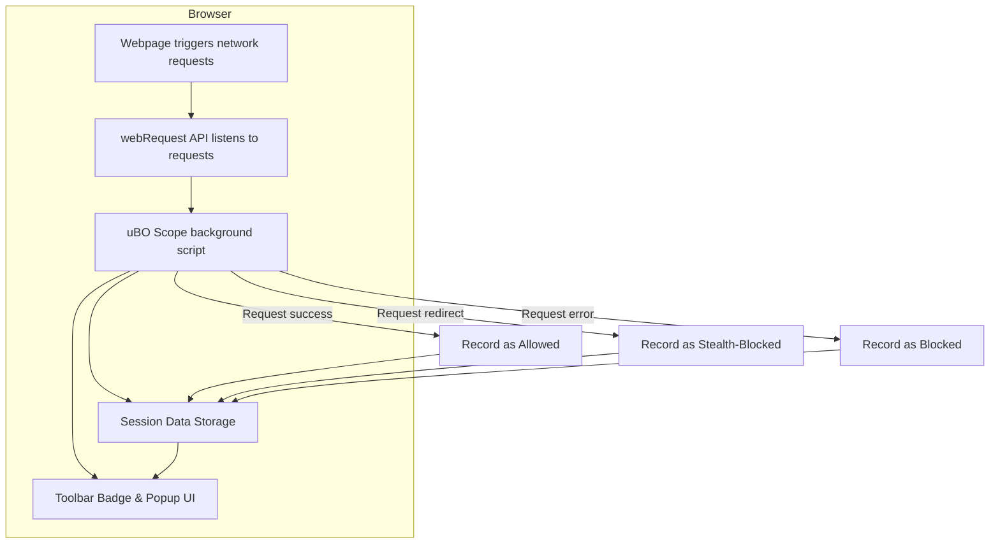

# What is uBO Scope?

## Discover the Network Connections Your Browser Makes — Transparently

uBO Scope is a unique companion extension designed to shed light on all network requests initiated by your browser, revealing every attempted or successful connection to remote servers. Regardless of which content blocker or DNS method you use, uBO Scope provides a clear, transparent view into the real network activity behind the scenes.

### Why uBO Scope Matters for Your Web Privacy

On the modern web, browsers routinely connect to numerous third-party servers to fetch resources—even beyond those explicitly requested by website content. While content blockers work hard to moderate or eliminate unwanted connections, understanding _what_ connections actually occur is crucial for evaluating privacy.

uBO Scope empowers you to:

- See **all** network requests your browser makes, independent of content blocking methods or DNS filtering.
- Track whether those connections were allowed, stealthily blocked, or outright blocked.
- Gain insight even if the browser or content blocker uses stealthy blocking techniques that hide activity from webpages or other tools.

This insight is essential to genuinely understand your browsing footprint and how effectively your content blockers protect you.

---

## What is uBO Scope?

At its core, uBO Scope is a browser extension that **monitors network requests** from webpages to remote servers and reports on their outcomes. It works alongside content blockers—specifically the widely used uBlock Origin—but is designed to function irrespective of which blocker or DNS filtering you use.

Instead of blocking connections itself, uBO Scope acts as a vigilant observer, relying on the browser's `webRequest` API to listen in on every network request and record whether it succeeded, was blocked, or was redirected (stealth-blocked).

### The Problem uBO Scope Solves

Browser-based content blockers often struggle with transparency because their blocking might occur in ways that webpages or standard tools can't detect accurately. This can lead to misinformation about how many connections are truly blocked or allowed.

Many users rely on superficial metrics like "block count" from content blockers — but these can be misleading since a higher block count doesn’t always mean better blocking. uBO Scope fills this gap by giving you raw, unfiltered data about _all_ network requests and their outcomes.

### What Makes uBO Scope Unique?

- **Universal Insight**: Reports network requests regardless of how or where blocking occurs (be it in the browser, via DNS-based filters, or elsewhere), as long as the browser's `webRequest` API is functional.
- **Distinct Outcome Categories**: Shows if requests were allowed, blocked fully, or stealth-blocked (i.e., redirected transparently).
- **Third-Party Connection Focus**: Highlights distinct third-party domains contacted, helping identify external network exposure.
- **Lightweight & Transparent**: Does not block or interfere, but provides an accurate reflection of network behavior.

### How It Works (High-Level)

When you visit a webpage, it triggers many network requests for different resources, potentially from various remote servers. uBO Scope registers listeners on the browser’s `webRequest` API and records each request’s outcome:

- **Allowed:** Request succeeded or was permitted.
- **Stealth-blocked:** Request was redirected silently.
- **Blocked:** Request failed to connect.

It then groups these requests by domain and displays them in a clear, user-friendly popup attached to the extension icon. The count badge on the toolbar icon tells you how many distinct third-party remote servers were contacted with allowed connections.

---

## Key Capabilities of uBO Scope

- **Accurate Network Request Logging:** Monitors and logs web requests in real-time.

- **Outcome Categorization:** Splits connections into allowed, stealth-blocked, and blocked, providing a nuanced understanding.

- **Domain Aggregation:** Collects and counts unique hostnames and domains contacted.

- **Seamless Integration:** Works alongside any content blocker without interfering.

- **Persistent Session Data:** Saves and restores session data for consistent tracking within sessions.

- **Badge Count Indicator:** Displays the number of distinct third-party domains with allowed connections on the toolbar icon for quick, at-a-glance awareness.

### Real-World Context

Imagine you visit a news website. Behind the scenes, that site loads content from its own servers, plus analytics, ad networks, content delivery networks, and social media widgets. With uBO Scope:

- You see exactly which third-party domains your browser tries to connect to.
- You know which were successfully contacted and which were blocked or stealth-blocked by your content blocker or DNS filter.
- You gain confidence in whether your ad blocker or DNS filtering is truly reducing network exposure.

---

## Why You Should Care: The Benefits and Typical Use Cases

### What You Gain

- **Transparency:** No more hidden network activity or unreliable block counts—see your web connections clearly.

- **Privacy Validation:** Assess how effectively your current content blocking strategy shields you.

- **Myth Busting:** Avoid common misconceptions, such as block counts equating to blocker quality or relying on unhelpful "ad blocker test" websites.

- **Filter List Empowerment:** Useful for filter list maintainers assessing real-world connection data.

### Common Scenarios Where uBO Scope Excels

- You want an objective view of third-party connections your browser makes on any site.

- You are troubleshooting why certain trackers or ads appear despite using blockers.

- You want to compare outcomes across different blockers or DNS rules.

- You work on or maintain filter lists and need accurate data on network request outcomes.

### Before and After uBO Scope

| Without uBO Scope | With uBO Scope |
|-|-|
| You rely on unreliable block counts or sidebar tools. | You obtain precise counts of unique third-party domains contacted.
| Uncertainty about stealth-blocking or DNS-based blocking effects. | Clear visibility into stealth-blocked requests and blocked requests.
| Misled by "ad blocker test" pages that don’t reflect actual browsing. | Confident analysis based on real web requests across sites.

---

## Getting Started Preview

To start exploring, simply install uBO Scope from your browser’s extension store. Once installed:

- Click the uBO Scope icon to view a popup summary of domains connected by the active tab.
- Observe the badge count indicating how many unique third-party domains were contacted.
- Use this data alongside your content blocker to adjust blocking rules or assess privacy.

For detailed installation steps and next actions, see [Installation Instructions](https://github.com/gorhill/uBO-Scope#installation) and [Using the Extension for the First Time](/getting-started/getting-your-first-results/using-the-extension-for-the-first-time).

---

## Practical Tips for Using uBO Scope

- **Interpret Badge Counts Correctly:** Lower badge counts mean fewer third-party connections — generally more desirable.
- **Understand Outcomes:** "Stealth-blocked" requests are often transparently redirected, which content blockers use to evade detection.
- **Combine with Content Blockers:** Use uBO Scope alongside blockers like uBlock Origin for fuller insight.
- **Beware of Non-Reported Requests:** Network requests not exposed through the browser's `webRequest` API won’t be visible (e.g., some native app connections).

---

<u><i>uBO Scope increases your awareness of how your browser interacts with the web — a critical first step toward stronger, more informed online privacy.</i></u>

---

## Additional Resources & Links

- GitHub Repository: [https://github.com/gorhill/uBO-Scope](https://github.com/gorhill/uBO-Scope)
- uBlock Origin Companion: [https://github.com/gorhill/uBlock](https://github.com/gorhill/uBlock)
- Public Suffix List used internally: [https://publicsuffix.org/](https://publicsuffix.org/)
- Understanding network requests and browser privacy: [Mozilla Web Docs](https://developer.mozilla.org/en-US/docs/Web/HTTP/Overview)

---

## See Also

- [Value Proposition & Use Cases](/overview/intro-core-value/value-proposition-use-cases)
- [Feature Overview](/overview/feature-glimpse-quickstart/feature-overview)
- [Installation Instructions](/getting-started/installation-and-setup/installation-instructions)

---

# Diagram: How uBO Scope Tracks Network Requests

