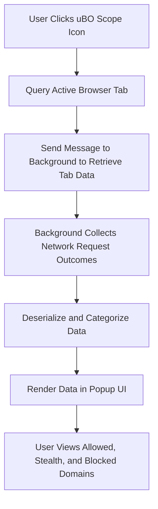

# What is uBO Scope?

## Unlocking Full Visibility into Your Browser’s Network Connections

uBO Scope is a lightweight, transparent browser extension designed to empower users by revealing every outgoing network connection initiated by your active browser tab. Unlike traditional blockers or analytics tools, uBO Scope does not interfere or block; instead, it provides a clear, real-time window into the web connections your browser is making.

### Why uBO Scope Matters

In today’s internet landscape, understanding where your browser communicates is essential for privacy-conscious users, developers, and filter list maintainers. uBO Scope bridges the gap by showing all remote connections attempted or completed regardless of which content blocker you use — or even if none is used at all.

### Who Benefits From uBO Scope?
- **Privacy-Savvy Users:** Gain transparency over third-party connections that occur behind the scenes, making it easier to evaluate and control your online exposure.
- **Filter List Maintainers:** Validate the effectiveness of your filter lists with accurate, unbiased visibility into network requests.
- **Developers and Researchers:** Monitor real network activity to diagnose issues or analyze web behavior without relying on simulated or incomplete data.

---

## What Does uBO Scope Show?

uBO Scope uses the browser’s native `webRequest` API to track all network requests your active tab attempts to make. It categorizes these connections into three clear outcomes:

- **Not Blocked (Allowed):** Connections successfully completed.
- **Stealth Blocked:** Connections intercepted silently by content blockers or other protections.
- **Blocked:** Connections explicitly blocked or failed.

This transparent classification lets you easily assess the true nature of your network interactions.

### Visualizing Network Requests

Opening the uBO Scope popup displays a well-organized list of domains contacted by the active tab:

- Domains are grouped by outcome (allowed, stealth, blocked).
- Counts of connections per domain help you identify the most contacted servers.
- The total number of distinct domains connected is prominently summarized.

This interface cuts through noise and complexity, giving you actionable insight at a glance.

---

## How uBO Scope Works Beneath the Surface (Conceptual Overview)

Without diving into technical internals, here’s how uBO Scope supports your need for clarity:

- It listens to all network requests reported by the browser’s `webRequest` API, capturing attempts regardless of blocker state.
- Each request’s hostname and domain are extracted and resolved using a trusted public suffix list, ensuring accurate aggregation.
- Requests are categorized based on their success or failure, along with silent redirects or errors.
- Data is stored in-session and presented live on demand in the popup interface.

Because it relies on native browser APIs, uBO Scope functions effectively even when content blockers use stealthy methods or DNS-level blocking that typical tools can’t observe.

---

## Real-World Value and Use Cases

### Transparency Without Bias
Many privacy tools focus on blocking or filtering, but it’s easy to lose sight of what actually happens during page loads. uBO Scope fills this transparency gap by providing a neutral, unfiltered report of network activities.

### Validation Across Different Content Blockers
Content blockers can hide their true impact behind high block counts or stealthy actions. uBO Scope exposes the actual network footprint, helping users understand which third-party connections are truly getting through.

### Supporting Filter List Development
Maintainers can use uBO Scope as an auditing tool to verify if their filter rules effectively reduce distinct third-party connections without false positives or unintended allowances.

---

## Getting Started with uBO Scope

Activating uBO Scope is straightforward:

1. Install the extension from your browser's official add-ons repository.
2. Click the uBO Scope icon while on any webpage to open the popup.
3. Instantly view a summarized, categorized list of all remote connections made by that tab.

The badge on the toolbar icon dynamically reflects the number of distinct third-party domains contacted — a quick metric to gauge page network breadth.

For more detailed usage instructions and troubleshooting, refer to the [Getting Started](#) and [Troubleshooting](#) guides.

---

## Summary

uBO Scope offers an indispensable, real-time view into your browser’s network behavior. By transparently showing every connection regardless of blocking mechanisms, it empowers you to make informed privacy decisions and optimize filter lists with confidence.

Explore this extension to take control of your online footprint through clear, factual insights into what your browser communicates — no guesswork, no hidden connections.

---

_For technical enthusiasts interested in the internals, explore the [How uBO Scope Works (with Diagram)](/overview/concepts-architecture/system-architecture) page to understand the architecture underpinning this extension._


---

#### References
- [uBO Scope GitHub Repository](https://github.com/gorhill/uBO-Scope)
- [Browser webRequest API documentation (MDN)](https://developer.mozilla.org/en-US/docs/Mozilla/Add-ons/WebExtensions/API/webRequest)


---

### Code snippet example: How the popup initializes and presents data

```javascript
(async () => {
    const [ tab ] = await browser.tabs.query({ active: true, currentWindow: true });
    if (!tab) return;

    sendMessage({ what: 'getTabData', tabId: tab.id })
        .then(response => {
            const data = deserialize(response);
            renderPanel(data); // Display network connections categorized
        })
        .finally(() => {
            dom.cl.remove(dom.body, 'loading');
        });
})();
```

This snippet illustrates how uBO Scope fetches network request data for the current tab and updates the popup UI accordingly.

---

### Visual Layout Preview



This user flow shows how interaction leads to information display seamlessly in the popup interface.


---

<button onclick="window.location.href='/getting-started/installation-basics/extension-installation'">Next: Installing uBO Scope</button>

---