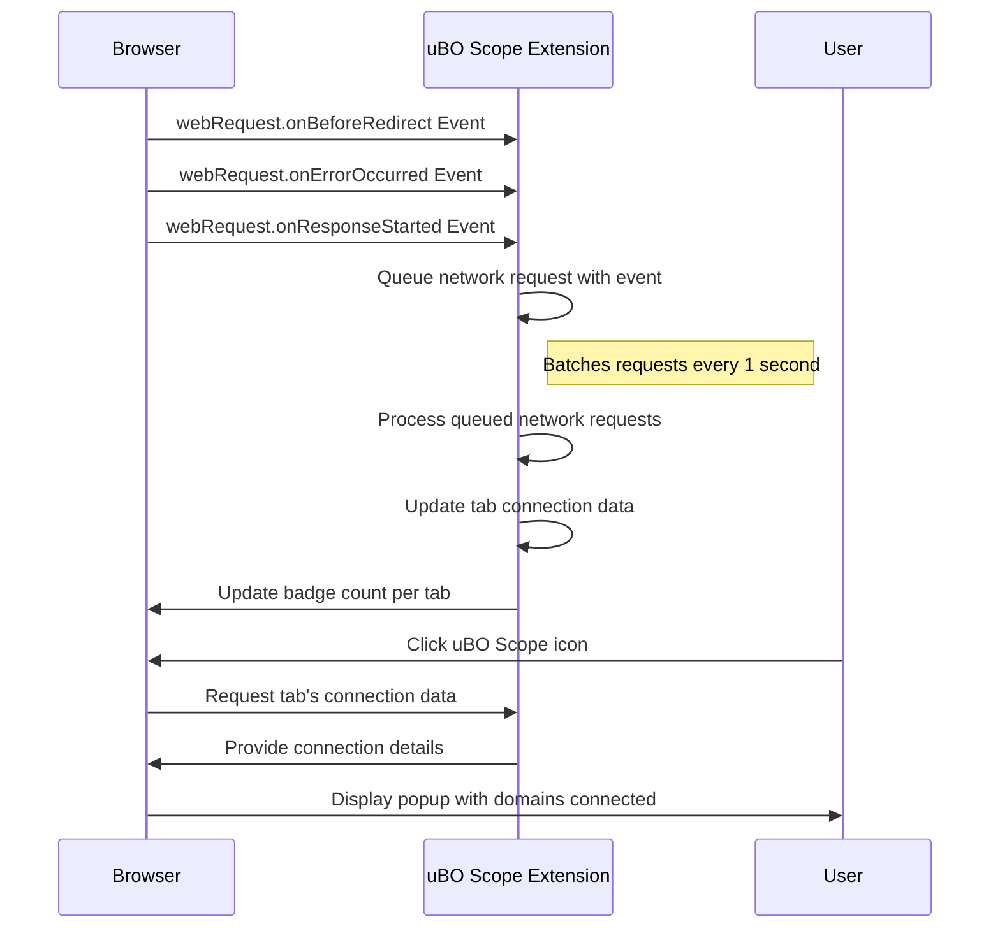

# What is uBO Scope?

## Revealing the Invisible: Understanding uBO Scope

Every time you browse the web, your browser connects to many servers behind the scenes—some essential, some third-party services that load additional content or track activity. uBO Scope is a browser extension designed to make this invisible web activity visible, empowering you to see exactly which remote servers your browser talks to.

### Why is This Important?

Understanding these connections helps you:

- **Gain transparency** into your online footprint beyond what typical content blockers reveal.
- **Identify and audit third-party domains** that your visited websites connect to.
- **Challenge assumptions** about the effectiveness of content blockers based on block counts.
- **Assist filter list maintainers** with real-world connection data, especially on devices with limited browser tools.

### Key Value Propositions

- **Independent connection tracking:** Works regardless of which content blocker you use or network-level DNS blocking.
- **Third-party server focus:** Shows distinct third-party remote servers contacted, letting you assess actual exposure.
- **Simple, clear UI:** A badge count and popup panel display connection summaries by allowed, stealth-blocked, or blocked categories.
- **Helpful for filter maintainers:** Provides raw insights useful for refining filter lists and diagnosing issues.

### Who Should Use uBO Scope?

- Privacy-conscious users wanting detailed visibility into their network connections.
- Users skeptical of block counts as a quality metric for content blockers.
- Filter list maintainers seeking an independent tool to assess real-world connections.

---

## What is uBO Scope?

uBO Scope is a lightweight browser extension that reports all attempted or successful connections to remote servers initiated by web pages in your browser. It provides a clear and independent view of network activity, helping users see what happens under the hood while browsing—connections that many blockers or browsers keep hidden.

### Core Mission

The core purpose is to make these connections visible, clarifying the nature and count of distinct third-party servers your browser communicates with, independent of any content blocking in place. This transparency enables smarter decisions about your privacy and filter lists.

### How Does uBO Scope Work?

It taps into browser APIs, specifically the `webRequest` listener, to monitor network requests and their outcomes (allowed, blocked, redirects, errors). It counts unique third-party domain connections and displays this number as a badge on the toolbar icon, with further details available in a popup panel.

<u>Note:</u> It depends on the browser's ability to report network requests via the `webRequest` API. Requests outside this scope (e.g., certain internal or future browser network mechanisms) will not be visible.

### Addressing Common Misconceptions

uBO Scope helps debunk two key myths:

- **Higher block counts mean better blocking:** A higher number of blocked items may actually correlate with more connections allowed overall.
- **Ad blocker test web pages provide reliable results:** Such tests use unrealistic scenarios and fail to capture stealth blocking and real-world network behavior.

---

## Features That Bring Visibility and Clarity

### 1. Toolbar Icon Badge
A real-time counter shows the number of distinct third-party remote servers your browser connected to on the active tab. A lower badge count signals fewer third-party connections, usually a positive privacy indicator.

### 2. Popup Panel
When you click the icon, a panel appears summarizing recent connections:
- **Not Blocked:** Domains successfully connected.
- **Stealth Blocked:** Domains whose connections were stealthily blocked (usually redirects or hidden attempts).
- **Blocked:** Domains explicitly blocked.

Each section lists unique domains with a count of how many requests each domain had.

### 3. Independent Network Request Monitoring
It monitors network traffic regardless of content blockers or DNS-level blocking. Even when other tools filter or block requests, uBO Scope reports the true connection outcomes as seen by the browser.

### 4. Support for Multiple Browsers
Available for Chromium-based browsers (e.g., Chrome) and Firefox, ensuring broad accessibility without compromising functionality.

---

## Real-World Use Cases

### Privacy & Security Awareness
See exactly which third-party domains your favorite websites contact, helping to spot unexpected connections or overreaching trackers.

### Evaluating Content Blockers
Compare different content blockers beyond block counts by observing actual distinct third-party connections allowed.

### Filter List Maintenance
Get actionable data to validate or improve filter lists, especially on devices where conventional developer tools are unavailable.

### Educational Insights
Learn how web pages rely on multiple external servers and understand the network ecosystem behind modern web browsing.

---

## Getting Started with uBO Scope

1. **Install the extension** from [Chrome Web Store](https://chromewebstore.google.com/detail/ubo-scope/bbdpgcaljkaaigfcomhidmneffjjjfgp) or [Firefox Add-ons](https://addons.mozilla.org/firefox/addon/ubo-scope/).
2. After installation, browse normally.
3. Observe the badge count on the toolbar icon—it updates live to show third-party server counts.
4. Click the icon to open the popup panel for detailed domain connection information.

<u>Tip:</u> Keep in mind the badge shows *unique third-party servers contacted*—a powerful metric beyond simple block counts.

---

## Best Practices and Tips

- Use uBO Scope as your go-to measure for connection visibility rather than relying on block counts alone.
- Review the popup regularly to stay informed about third-party connections on high-traffic or sensitive sites.
- Filter list maintainers should leverage detailed domain counts to fine-tune their blocking rules.
- Combine uBO Scope with other privacy tools to get a comprehensive picture.

## Common Pitfalls

- Some legitimate third-party services like Content Delivery Networks (CDNs) may appear in the count—this is normal.
- uBO Scope relies on the browser's `webRequest` API, so some requests may not appear if the browser restricts reporting.
- Badge counts do not indicate blocking power but unique server contacts, so do not interpret high counts as poor blocking without context.

---

By making transparent what is otherwise hidden, uBO Scope equips you with the knowledge to understand and control your web connections better than ever before.

---

## Additional Resources

- [Official GitHub Repository](https://github.com/gorhill/uBO-Scope) for source code and updates.
- Related documentation pages:
  - [Why Visibility Into Connections Matters](/overview/intro-value-prop/why-it-matters)
  - [How uBO Scope Works](/overview/core-concepts-arch/how-it-works)
  - [Interpreting the Badge and Popup Panel](/guides/getting-started-usage/interpreting-badge-popup)

## Diagram: How uBO Scope Monitors Network Requests

