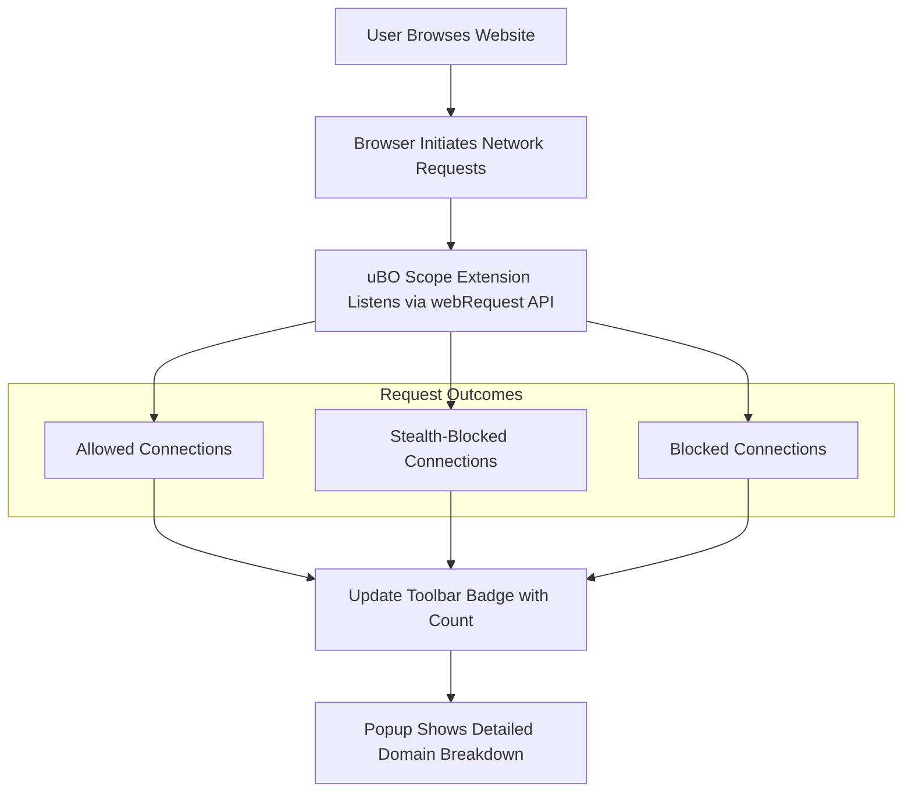

# What Is uBO Scope?

## Discover Every Remote Connection Your Browser Makes

uBO Scope is a lightweight browser extension designed to reveal every attempted or successful connection to remote servers that occur when you visit any website. By making these network requests visible, it helps demystify what happens in the background during your web browsing sessions.

- **See All Connections:** Uncover every remote server your browser tries to reach, whether the connection was allowed, blocked, stealth-blocked, or redirected.
- **Understand Your Web Traffic:** Gain clear insight into how many distinct third-party domains a webpage communicates with.
- **Independent of Your Content Blocker:** Works alongside any content blocking solution, reporting network activity regardless of which blockers or DNS-level filtering are in use.
- **Real-Time Updates:** The toolbar badge dynamically indicates the number of distinct third-party connections per active tab.
- **Easy Interaction:** Quickly view a detailed breakdown of connections via the popup panel.

### Who Should Use uBO Scope?
This tool is invaluable for privacy-conscious users, security analysts, filter list maintainers, and developers who want transparency into the web traffic landscape of the sites they visit.

---

## What Is uBO Scope?

At its core, uBO Scope is a simple, browser-based network monitoring tool. It acts as a companion extension to popular blockers like uBlock Origin but focuses solely on exposing which remote servers your browser attempts to communicate with — not on blocking them.

This makes uBO Scope a dedicated observer of your web activity, showing you where your browser’s network requests go. By uncovering these connections, it reveals the complex web of third-party domains involved in loading any webpage — from content delivery networks to trackers and ad networks.

## The Problem It Solves

Modern websites often connect to numerous external servers, many of which can be hidden from plain sight. Understanding these connections is crucial for:

- Evaluating the effectiveness of content blockers.
- Gaining visibility into potential privacy leaks.
- Troubleshooting connectivity and blocking issues.
- Educating oneself about web tracking and resource loading.

uBO Scope empowers you with this clarity by gathering and displaying all network requests — whether allowed or blocked — made by your browser during a browsing session.

## What Makes uBO Scope Unique?

Unlike other network monitoring tools, uBO Scope:

- Uses the browser's native `webRequest` API to capture all relevant network activity, including requests affected by content blockers or DNS filters.
- Focuses specifically on third-party domain connections, providing a distinct count and categorization of allowed, stealth-blocked, and blocked hosts.
- Provides a simple, user-friendly interface that shows domains and counts without overwhelming you with raw data.
- Does not require complex setup or permissions beyond those necessary to observe web requests.

## How uBO Scope Works at a High Level

When you browse a website, uBO Scope listens quietly in the background. The extension categorizes each network request your browser makes into:

- **Allowed:** Requests that succeeded and reached their destinations.
- **Stealth-blocked:** Requests that were blocked without obvious traces to the webpage, often by content blockers operating stealthily.
- **Blocked:** Requests that were explicitly blocked and identified.

These network request outcomes are collected tab-by-tab, counting distinct domains involved. The extension updates the toolbar badge with the number of unique third-party domains connected for the active tab and populates the popup panel with detailed breakdowns.

### Example User Flow
1. Navigate to a news website.
2. The uBO Scope badge on the toolbar displays a number representing how many third-party domains were contacted.
3. Click on the badge to open the popup panel.
4. Instantly see which domains were connected, categorized by allowed, stealth-blocked, or blocked.

This workflow provides immediate, actionable insight into your web traffic without requiring complex setup or analysis.

---

## Practical Tips for Using uBO Scope

- **Interpret the Badge Wisely:** A lower badge count usually means fewer third-party connections, which often correlates to better privacy.
- **Not All Third Parties Are Bad:** Many legitimate websites use content delivery networks (CDNs) and other essential third-party services.
- **Use Alongside Your Blocker:** uBO Scope does not block requests but helps you verify which are allowed or blocked by your current content blocker.
- **Refresh the Page to See Updated Results:** Network activity is tracked per load; refreshing a page updates the data accordingly.

---

## Troubleshooting Common Scenarios

- **Badge Shows No Count:** This can happen if no network requests were made or if the extension is not active on that tab.
- **Blocked Domains Count is Zero:** Some blockers stealth-block requests or block at DNS level. uBO Scope categorizes stealth-blocked domains separately.
- **Unexpected Connections:** Use the detailed popup to identify questionable domains and adjust your content blocker or privacy settings accordingly.

---

## Getting Started Preview

To start using uBO Scope:

1. Install the extension compatible with your browser (Chrome, Firefox, Safari).
2. Visit any website and observe the badge count.
3. Click the badge to open the popup panel for domain details.

To dive deeper, explore [Why Use uBO Scope?](./value-proposition), [How uBO Scope Works](./highlevel-architecture), and [Revealing All Remote Connections on a Webpage](../guides/core-workflows/reveal-remote-connections) for practical usage scenarios.

---

For the full source and contributions, visit the [official GitHub repository](https://github.com/gorhill/uBO-Scope).

---

## Diagram: How uBO Scope Tracks Network Requests

