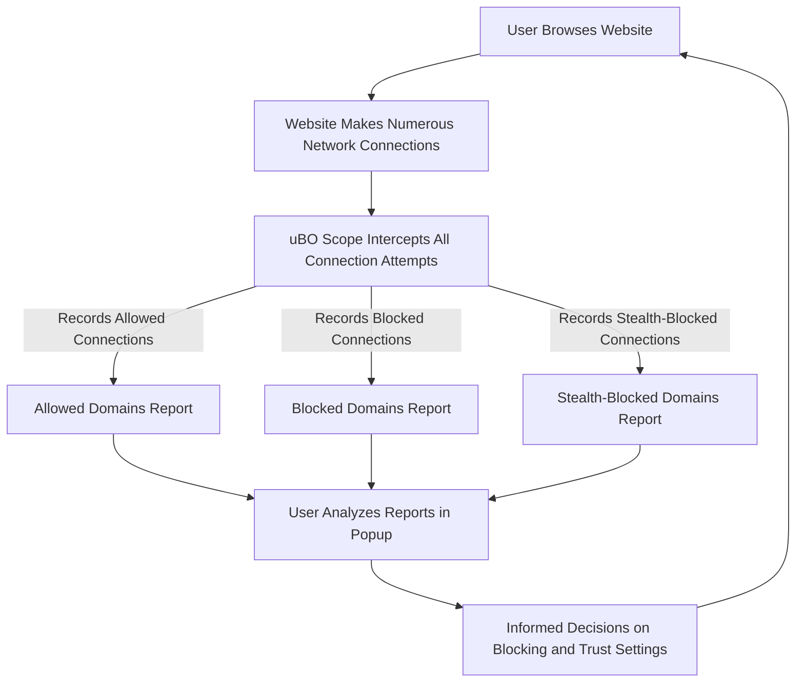

# Why Use uBO Scope?

Discover the true landscape of your browser's network activity with uBO Scope. This tool goes beyond surface-level blocking to provide unmatched transparency into every connection your browser attempts, helping you make confident, informed decisions about your online privacy and content filtering.

## Understand What Your Browser Is Really Doing

When you visit a website, dozens—or even hundreds—of network connections may happen behind the scenes. Many of these involve third-party servers that collect data or serve ads and trackers. uBO Scope exposes all these connections, regardless of whether a blocker or filter has hidden or blocked them.

This transparency empowers you to:

- See exactly which domains your browser contacts.
- Understand which third-party connections are successfully allowed, stealth-blocked (hidden but attempted), or fully blocked.
- Evaluate the trustworthiness and relevance of connected domains.

Unlike traditional blockers that simply stop requests, uBO Scope provides an unbiased, detailed report of network behavior, giving you the evidence needed to adjust blocking rules or trust decisions effectively.

## Bust Myths About Privacy and Blocking

Privacy tools can sometimes create a false sense of security or obscure what’s truly happening. By delivering raw data on network connections, uBO Scope:

- Debunks assumptions that all blockers catch every unwanted connection.
- Reveals stealth-blocked domains you didn’t even know were contacted.
- Shows maintainers and users which requests pass through and which are blocked, supporting better filter rule maintenance.

With uBO Scope, you get the full story, not just a filtered view.

## Empower Both Users and Maintainers

Whether you’re a privacy-conscious user or a filter list maintainer, uBO Scope is invaluable:

- **Users** can audit their browsing sessions to spot unexpected connections, uncover hidden trackers, and optimize their blocker settings with confidence.
- **Maintainers** get crucial insights into real-world behavior of filter lists, enabling them to fine-tune rules for greater effectiveness without overblocking.

This collaborative insight drives improved privacy tools and stronger user control.

## How uBO Scope Reporting Supports Informed Decisions

The extension categorizes connection outcomes into three clear groups shown in its popup window:

- **Not Blocked:** Connections that were allowed through.
- **Stealth-Blocked:** Connections attempted but hidden, i.e., blocked but not visible to the page.
- **Blocked:** Connections that were actively prevented.

This reporting structure allows you to:

- Quickly gauge the activity on the current webpage.
- Identify problematic third parties that consistently evade traditional blockers.
- Test the impact and coverage of your blocking configurations.

Example: If a popular social media domain appears in "stealth-blocked," it might indicate trackers operating invisibly, prompting you to decide whether to tighten your blocking or whitelist for functionality.

## Real-World Scenario: Auditing a News Site

Imagine visiting a popular news site. While you read articles, dozens of third-party domains load:

- Some deliver ads.
- Others collect analytics data.
- A few serve legitimate content like images or videos.

Using uBO Scope, you see:

- The count and names of all third-party connections made.
- Which were blocked, which allowed, and which stealth-blocked.
- Insights that help you tweak your filters to block invasive trackers while permitting necessary content.

This clarity transforms vague privacy concerns into actionable understanding.

## Practical Tips for Using uBO Scope

- Use it alongside your existing blockers to uncover hidden connections.
- Regularly review the popup's categorized reports after visiting sites.
- Combine findings with best practices in content blocking to enhance your browsing security.
- Share reports with filter list maintainers to help improve blocker efficacy.

## Common Pitfalls and What to Avoid

- Don’t assume all stealth-blocked domains are malicious; some are essential to site functionality.
- Avoid blanket blocking without understanding the impact—use uBO Scope reports to guide nuanced decisions.
- Remember that some domains may appear repeatedly; cross-reference with trusted sources before blocking.

## Next Steps

Ready to see what your browser really connects to? Start by installing uBO Scope as outlined in the [Installing uBO Scope](../../guides/getting-started/installing-ubo-scope) guide. Then, dive into [Auditing Third-Party and Remote Server Connections](../../guides/core-workflows/auditing-third-party-connections) for detailed workflows on interpreting data.

---

For technical enthusiasts interested in the underlying architecture and terminology, see [Core Concepts and Terminology](../../overview/core-concepts-architecture/core-concepts-terminology).

---

## Visual Overview

Here is a simple conceptual flow of how uBO Scope enhances user insight:

This cycle empowers users by closing the gap between what is attempted and what is seen.

---

##### Related:
- [What is uBO Scope?](../intro-value/what-is-ubo-scope): An introduction to the tool's mission and capabilities.
- [Who is uBO Scope For?](../intro-value/target-audience-usecases): Identifies users and scenarios.
- [Auditing Third-Party and Remote Server Connections](../../guides/core-workflows/auditing-third-party-connections): Guides on how to interpret and act on data.

---

## Summary

This page clarifies why using uBO Scope is essential for true browser privacy transparency. It highlights how the tool exposes hidden network interactions, supports myth-busting around blockers, and empowers both end-users and filter maintainers to make data-driven decisions about privacy and content trust.

---

<Tip>
To maximize your privacy, combine uBO Scope with a robust content blocker but use the insights from uBO Scope reports to refine and understand the real impact of your blocking rules.
</Tip>

<Note>
uBO Scope is not a content blocker but a transparency and auditing tool that complements content blockers by exposing all connection attempts.
</Note>

<Warning>
Do not ignore stealth-blocked domains in your privacy audits—these hidden requests can be sources of tracking or undesired data sharing.
</Warning>

<Check>
After installation, validate functionality by observing the uBO Scope popup after browsing various sites to familiarize yourself with allowed, stealth, and blocked domains.
</Check>
