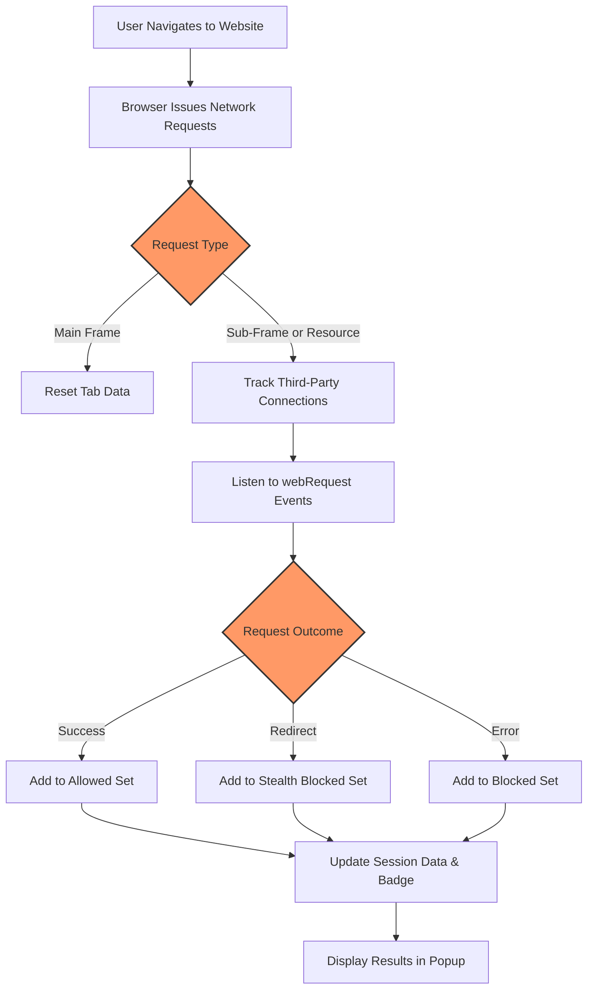

# What is uBO Scope?

## Discover: See What Websites Connect To

Imagine visiting a website and instantly knowing every third-party server your browser reaches out to—without needing to dive into complex developer tools or network logs. uBO Scope is a lightweight browser extension designed exactly for this purpose. It transparently reveals all remote third-party connections websites attempt, providing unmatched clarity into what happens behind the scenes when you surf the web.

Unlike traditional content blockers that focus on which requests they block, uBO Scope shifts the spotlight to what actually connects. By doing so, it empowers you to understand real privacy impacts rather than relying on raw block counts that can be misleading.

### The Power of Transparency

- **Unmask the network activity:** See every remote third-party connection a website attempts, successful or blocked.
- **True privacy insight:** Focus on which remote servers your browser accesses, not just the number of requests blocked.
- **Demystify badge counts:** The toolbar badge reports how many distinct third-party servers connected—lower is better.
- **Complement content blockers:** Works with any content blocker or DNS filtering solution by listening to browser network events.
- **Simple yet powerful:** Lightweight, with a clean popup display, making privacy data accessible instantly.

### Designed For

uBO Scope is for privacy-conscious users, filter list maintainers, security researchers, and anyone curious about the invisible web connections happening as they browse. Whether you're an advanced user debugging stealth blocking or a newcomer wanting clarity on online privacy, uBO Scope provides actionable insights.

---

## What Is uBO Scope?

uBO Scope is a browser extension that listens to your browser’s network activity and reports the outcome of all requests to third-party remote servers. It monitors every HTTP(S) and WebSocket connection attempt initiated by websites and categorizes them into allowed, stealth-blocked, or blocked.

### Core Purpose

The extension’s primary goal is to help users understand which third-party servers are actually contacted while browsing and to provide a meaningful measure of privacy impact. It moves beyond simplistic block counts that don't necessarily reflect true privacy outcomes, spotlighting the essential fact:

> The fewer distinct third-party remote servers your browser actually connects to, the better your privacy.

### How It Works (At a Glance)

- Uses browser-provided webRequest API listeners to monitor network requests in real time.
- Records the outcome of each connection attempt: success, error (blocked), or redirect (stealth blocking).
- Associates these outcomes with the originating browser tab to provide context.
- Updates a badge count reflecting the number of distinct allowed (successful) third-party domains.
- Displays a categorized list of third-party domains and their connection counts in the popup UI.

This approach ensures transparency into network activity regardless of any other content blockers or DNS filters in place.

### What Makes uBO Scope Unique?

- **Outcome-Focused Tracking:** It distinguishes between allowed, stealth-blocked, and blocked connections, rather than merely counting blocked requests.
- **Tab-Context Association:** Reports connection data specifically per browser tab for user-relevant insights.
- **Persistent Session Data:** Maintains session data for ongoing visibility and analysis.
- **Minimal Overhead:** Focuses purely on connection outcomes to keep the extension lightweight.

---

## Key Features & Capabilities

### Real-Time Visibility into Third-Party Connections
Monitor which remote servers pages attempt to contact, with clear categorization:
- **Allowed:** Connections that succeeded.
- **Stealth-Blocked:** Redirects or filtered requests hidden from normal detection.
- **Blocked:** Requests that failed due to blocking or errors.

### Informative Toolbar Badge
The extension's icon badge shows the count of distinct allowed third-party domains connected to from the active tab, providing an at-a-glance privacy metric. This count always reflects the true number of distinct remote servers your browser connected to.

### Intuitive Popup Interface
Open the popup to see detailed breakdowns:
- Domain names displayed in Unicode format for easy recognition.
- Counts of connection attempts per domain.
- Sections for allowed, stealth-blocked, and blocked domains.
- Summary of total distinct connected domains.

### Works with Any Content Blocker
uBO Scope captures network request outcomes after any filtering, making it a universal tool for evaluating the actual third-party connections regardless of your blocker setup.

### Transparency for Filter List Maintainers
Filter list developers can use uBO Scope to validate the effectiveness of their lists, ensuring they reduce third-party connections as intended—even in challenging stealth blocking scenarios.

---

## Why Should You Care?

### Measure What Truly Matters to Privacy
Block counts can be deceptive, but uBO Scope reveals the critical reality: how many unique third-party servers your browser actually accesses. This is the direct privacy footprint.

### Debunk Misconceptions
Many users and filter maintainers are misled by high block counts or artificial ad blocker test sites. uBO Scope cuts through this noise by exposing real-world network behavior.

### Empower Your Browsing Decisions
Understanding third-party connection outcomes enables you to:
- Identify unexpected or excessive remote connections.
- Gauge the impact of content blocking strategies.
- Detect stealthily blocked or redirected connections.

### See Immediate Impact
Before uBO Scope, understanding all remote server connections required technical expertise. Now, with a quick glance, you grasp the third-party network landscape of any website.

### Use Cases
- Privacy-conscious users want to verify their protective tools actually reduce exposed connections.
- Researchers analyze stealth blocking behavior and network request outcomes.
- Filter list maintainers track the effectiveness of their rules in real-time.

---

## Getting Started Preview

### What to Expect When You Install
Once you add uBO Scope to your browser:
1. An icon with a badge appears on your toolbar.
2. Visit any website and click the icon.
3. The popup presents a live report of all third-party domains the page attempted to connect to, categorized into allowed, stealth-blocked, and blocked.
4. The badge updates to reflect successful distinct connections.

### Prerequisites
- Supported on Chromium-based browsers (Chrome, Edge) minimum version 122.0, Firefox 128.0, and Safari 18.5 or later.
- Requires permissions for activeTab, webRequest monitoring, and storage for session data.

### Next Steps
- Explore the popup interface and observe connections on your favorite websites.
- Read the guide "Who Should Use uBO Scope—and Why?" to understand user scenarios.
- Learn how to interpret popup UI metrics in the "Understanding the UI" documentation.

---

## Troubleshooting & Tips

- **Why does my badge count differ from my content blocker's block count?** uBO Scope reports distinct allowed third-party connections, not the number of blocked requests.
- **Can uBO Scope see connections blocked outside the browser?** It detects network requests only as reported by the browser's webRequest API.
- **What if no data shows up in the popup?** Ensure the extension has the required permissions and the active tab has loaded network requests.

<Check>
Keep in mind that a lower badge count indicates fewer third-party connections, and thus better privacy outcomes.
</Check>

---

## Visualizing uBO Scope Workflow

---

For more on how to install and use uBO Scope effectively, see the Getting Started and Guides sections in this documentation.

With uBO Scope, take control and visibility over your browsing privacy — see exactly what’s connecting behind the scenes and make informed decisions.