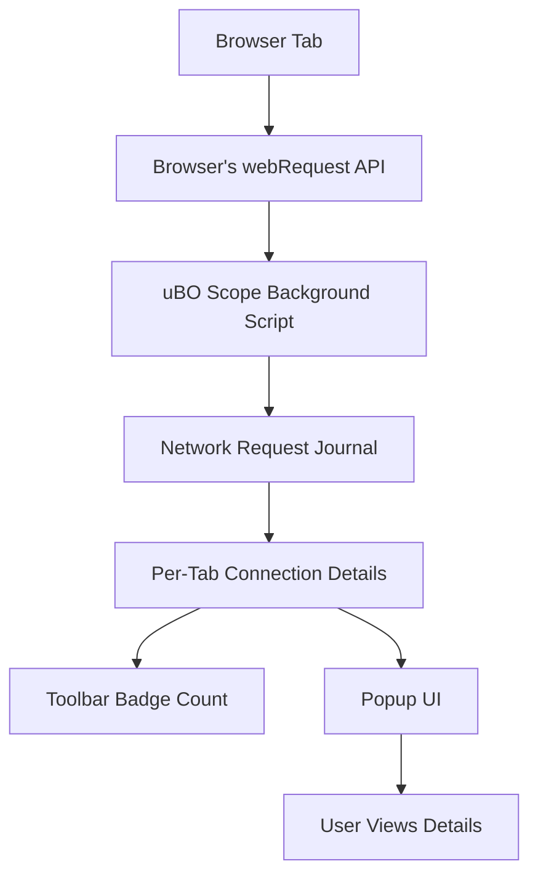

# What is uBO Scope?

## Discover Every Connection Your Browser Makes, Without Exception

uBO Scope is a lightweight browser extension built to expose all remote server connections that a webpage either attempts or successfully establishes. Unlike typical content blockers that can hide or block connections, uBO Scope reveals every connection regardless of blocking rules in place. This makes it an essential tool for privacy-conscious users and filter list maintainers who need a clear, transparent view of the network activity behind every website.

### Why This Matters

Every time you visit a webpage, your browser reaches out to numerous remote servers—some necessary, some potentially tracking you or loading unwanted content. Many content blockers hide which connections have been blocked or allowed, leaving users uncertain about what actually happens. uBO Scope takes away the guesswork by reporting **all** these connection attempts in real-time, making your browser's network activity fully visible.

### What You Gain with uBO Scope

- **Complete Visibility:** See every remote connection a webpage tries or makes, even those hidden from other blockers.
- **Independent of Blockers:** Works alongside all content blockers—whether on or off—and reveals network requests regardless of filtering.
- **Privacy Insight:** Know exactly which third-party servers your browser communicates with, promoting informed privacy decisions.
- **Filter List Maintenance:** Provides critical data to filter list maintainers for fine-tuning blocking rules.

### Who Should Use uBO Scope?

- **Privacy-Minded Users:** If you want to understand and control your exposure to third-party connections.
- **Filter List Developers and Maintainers:** To analyze the true network requests behind websites and improve blocking precision.
- **Researchers and Security Analysts:** For auditing web traffic and detecting unexpected or stealthy network behavior.

---

## What is uBO Scope?

### A Transparent Lens on Web Traffic

uBO Scope is a browser extension companion to uBlock Origin that leverages browser APIs to report all remote server connections initiated by webpages. It does so by listening to the browser's native `webRequest` interface, capturing network requests before they are subject to content blockers or DNS filters.

Unlike conventional content blockers that focus on blocking requests, uBO Scope's core purpose is **measurement and reporting**. It tracks each request’s outcome—whether it was allowed, blocked, or stealth-blocked—and aggregates this information per webpage tab.

### How It Stands Apart

- **Exposes Stealth-Blocked Connections:** Some blockers stealth-block requests, making them appear successful but silently blocking content. uBO Scope reveals these subtle behaviors.
- **Cross-Blocker Transparency:** It works independent of what other blockers are installed or enabled.
- **Real-Time Counts & Details:** Provides a badge count of distinct remote domains connected to, and detailed domain lists in its popup interface.

### How It Works (High-Level)

At its core, uBO Scope listens for every network request generated by your browser—including HTTP, HTTPS, and websocket connections—and records the outcome:

- **Allowed:** Requests completed successfully.
- **Blocked:** Requests that failed due to blocking or errors.
- **Stealth:** Requests redirected or hidden by blockers.

This data is then linked to the currently active browser tab and presented via a toolbar badge and a detailed popup showing connected domains and counts.

Here's a simple flow of what happens internally:

---

## Benefits & Use Cases

### What Outcomes to Expect

- **Accurate Privacy Insights:** Empower yourself by knowing exactly which third-party servers a webpage contacts.
- **Assess Content Blockers Effectively:** Evaluate blockers not by how many requests they block, but by how many unique third-party connections they allow.
- **Filter List Improvement:** Use actual network data to refine filter lists, catching stealthy or missed connections.

### Real-World Scenarios

- You visit a news website and want to know how many and which third-party advertisers or trackers it silently contacts.
- A filter list maintainer monitors the connections across popular sites to identify new tracking domains for blocking.
- A privacy researcher debunks the myth that more blocked connections mean better privacy by revealing actual allowed connections.

### Before and After uBO Scope

| Without uBO Scope                         | With uBO Scope                                       |
|-----------------------------------------|-----------------------------------------------------|
| Guesswork about which connections occur | Concrete, verified data on all connection attempts  |
| Rely on block counts from blockers only | Understand true third-party exposure beyond blocks  |
| Hidden stealth-blocked connections       | Visibility into stealth-blocked and redirected requests|

---

## Getting Started Preview

### Quick Intro

Once installed, the extension immediately begins listening to your browser’s network requests. When you visit or reload a page:

- The badge on the browser action icon updates with the count of distinct remote domains connected.
- Clicking the icon opens a popup listing detailed domains and categorizing them by outcome: not blocked, stealth-blocked, and blocked.

### Prerequisites

- A modern browser supporting the webExtensions API with access to the `webRequest` interface and session storage.
- Permissions to access network requests (granted during extension install).

### Next Steps

- Install uBO Scope from your preferred browser store.
- Visit the **Understanding the Badge & Popup** documentation to interpret results.
- Explore **Using uBO Scope for Filter List Maintenance** to leverage the tool for advanced use.

---

## Practical Tips

- Use uBO Scope alongside your preferred content blocker—it will not interfere but provide complementary insight.
- Pay close attention to the "stealth-blocked" category—it reveals requests that are subtly handled and might otherwise mislead.
- Regularly check the distinct domain count badge to monitor your browsing exposure over time.

## Troubleshooting

- If the badge shows no count, confirm the extension has the necessary permissions and that your browser supports `webRequest`.
- For sites heavily using websockets or non-HTTP protocols outside the scope of `webRequest`, some network activity may not appear.

---

## References

- [GitHub Repository](https://github.com/gorhill/uBO-Scope) – Full source code and license.
- [Browser Compatibility & Installation](../../getting-started/introduction-overview/system-requirements)
- [Understanding the Badge & Popup](../../getting-started/using-ubo-scope/interpreting-badge-popup)

---

Experience full transparency of your browser's network activity today with uBO Scope — the trusted companion to empower your privacy and network understanding.
