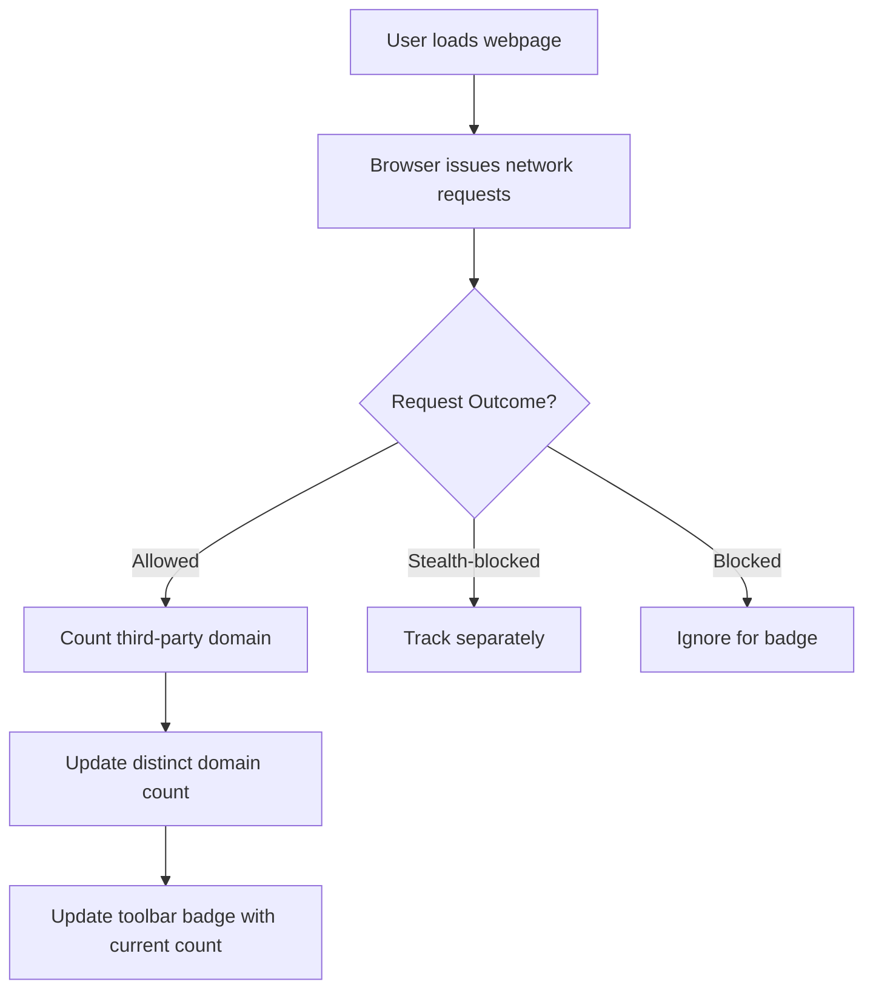

# Understanding the Toolbar Badge

The toolbar badge in uBO Scope offers a streamlined, meaningful snapshot of your webpage's remote server connections. It reports the **number of distinct third-party remote servers** a page has connected to, rather than simply counting blocked requests. This approach provides a clearer lens into your browsing privacy and network activity.

---

## Why the Toolbar Badge Matters

Many users instinctively equate a block count with good privacy, but uBO Scope flips this notion on its head. The badge counts unique third-party remote servers your browser communicated with—not blocked requests. A lower badge number signals that fewer third parties have successfully connected, reflecting better privacy and less data exposure.

This matters because:

- **Connections Are the Key**: What ultimately affects your privacy is who your browser talks to, not just what it tries to block.
- **Block Counts Can Be Misleading**: A high block count could coexist with more connections, indicating some connections are slipping through.
- **Real-World Insight**: The badge captures distinct third-party domains successfully connected, helping you understand the true web of remote servers involved.

In short, a low badge count means your browser and content blockers are minimizing exposure to outside servers, reducing potential tracking or data leakage.

---

## What Does the Badge Represent?

The badge shows the number of distinct third-party domains for which network requests were **allowed—either directly or through stealth mechanisms**. It does not count blocked requests.

To clarify:

- The extension tracks **all network requests** made by the current tab.
- Every request’s outcome is categorized as **allowed**, **stealth-blocked** (redirected or intercepted in a way that isn’t fully visible), or **blocked**.
- The badge increments only for **allowed requests** to distinct third-party domains.

This means the badge reflects actual connections established, the real exposure beyond just what was attempted or blocked.

---

## How to Interpret the Badge Count

Consider this common user scenario:

> You visit a news article. uBO Scope badge shows `8`.

This tells you that the page connected to eight unique third-party remote servers (for content like ads, analytics, CDNs).

If a different extension claims to block many requests but you see a larger badge count here, it indicates more distinct servers may have been contacted, suggesting less strict privacy protection.

Conversely, a badge showing a **small number or zero** means your browser avoided connecting to many unnecessary third parties, enhancing your privacy.

---

## Practical Tips for Users

- **Don't chase high block counts.** Focus on keeping the badge count low.
- **Look for patterns.** Pages with unusually high badge counts could be leaking more data or loading many third-party resources.
- **Use the badge as a privacy indicator.** It’s your quick insight into third-party connections without diving into detailed logs.

---

## Common Questions

<AccordionGroup title="Frequently Asked Questions">  
<Accordion title="Does the badge count blocked or failed connections?">  
No. The badge only counts distinct third-party domains to which network requests were actually successful or stealthily redirected. Blocked or failed requests are excluded from the badge count.  
</Accordion>  
<Accordion title="Why does a lower count mean better privacy?">  
Fewer distinct third-party connections mean fewer avenues for tracking, data leakage, or unwanted content. A low badge count indicates less contact with external servers.  
</Accordion>  
<Accordion title="Can the badge count include first-party domains?">  
No. The badge counts only **third-party** remote servers — domains different than the main page's domain.  
</Accordion>  
<Accordion title="What about stealth-blocked connections?">  
Stealth-blocked requests are tracked separately but do not increment the badge count for allowed connections. They help highlight requests that are intercepted or redirected invisibly but aren't considered allowed third-party connections.  
</Accordion>  
<Accordion title="How often does the badge update?">  
The badge updates dynamically as network requests are processed and analyzed. Typically, it refreshes every few seconds to reflect ongoing browsing activity.  
</Accordion>  
</AccordionGroup>

---

## Behind the Scenes (High-Level Flow)

When you load a webpage, uBO Scope observes every network request issued by the browser on that page. It categorizes each request according to its outcome (allowed, stealth, or blocked). The toolbar badge then displays the number of unique third-party domains involved in allowed connections for the active tab.

This process ensures the badge reflects actual remote server contact, providing an accurate, privacy-focused metric.

---

## Next Steps

To deepen your understanding and effectively use uBO Scope’s data:

- Explore the [Product Overview](/overview/introduction-and-value/product-overview) for a broader understanding.
- Review [Core Value Proposition & Target Users](/overview/introduction-and-value/core-value-proposition) to see who benefits most from this insight.
- Start using uBO Scope in your browser and observe badge counts on various sites to learn about their third-party connections.

<Tip>
For privacy-conscious browsing, aim to keep the toolbar badge count low across your frequent sites. It’s a direct, clear indicator of third-party connection exposure.
</Tip>

---

## Summary

Understanding the toolbar badge empowers you to assess your browsing privacy quantitatively. By focusing on the count of distinct third-party remote servers connected, you gain meaningful insight into how much external exposure occurs behind the scenes. Use this knowledge to make informed decisions about content blocking and site trust.

---

© Raymond Hill, uBO Scope project

---