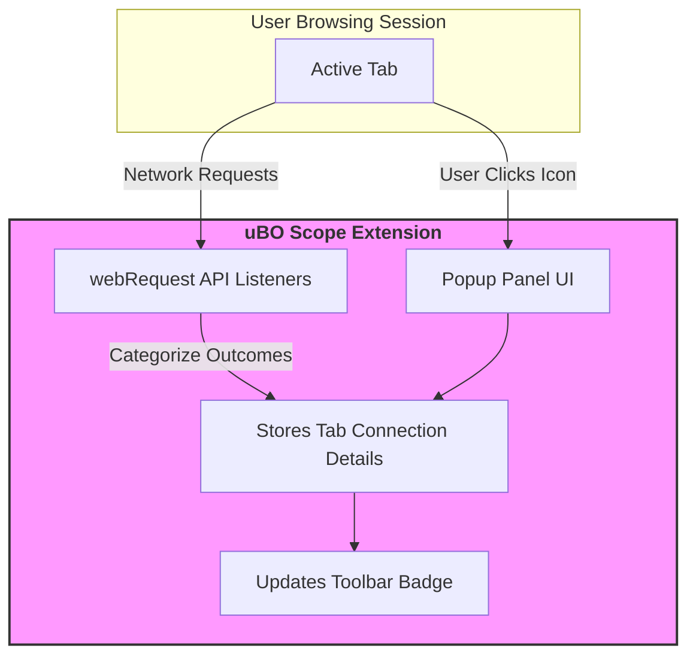

# Key Features & Value Proposition

uBO Scope brings unparalleled clarity to the network connections made by web pages in your browser, exposing the stealthy communications that most other tools miss. This page breaks down its main functionalities, how it reports connection statuses, and why it surpasses traditional measurement approaches.

---

## Clear Reporting on Third-Party Connections

At its heart, uBO Scope reveals all remote domains that your browser attempts to connect to during web browsing, categorizing these network requests based on their outcome:

- **Allowed**: Domains from which resources were successfully fetched.
- **Blocked**: Domains where requests were explicitly blocked by content-blocking mechanisms.
- **Stealth-Blocked**: Domains where blocking was done in a way that's transparent to the web page, often invisible to other measurement methods.

This comprehensive categorization offers you a complete picture of network activity, helping you understand exactly who your browser is talking to and which connections are prevented.

## Toolbar Badge: Instant Connection Snapshot

The toolbar icon badge delivers a constantly updating count—the number of distinct third-party domains your current tab has connected to successfully. This badge is not merely a numeric display; it serves as a quick privacy metric:

- A **lower count** indicates fewer third-party connections, typically reflecting tighter privacy.
- A **higher count** suggests more external domains being contacted.

This immediate feedback helps you gauge the browsing session's exposure to third parties without opening the popup panel.

## Bypassing Limitations of Other Measurement Methods

Unlike many content blockers and diagnostic tools, uBO Scope leverages the browser's `webRequest` API to obtain detailed outcomes about network requests regardless of which blocking method is in play, including:

- Content-blocking extensions
- DNS-based blocking

This means uBO Scope can reveal blocking performed "stealthily," bypassing the common blindspots in conventional counters or webpage-based ad block tests.

## Intuitive Popup Panel: Detailed Domain Reports

When you click the uBO Scope icon, the popup panel presents a neatly segmented summary:

- Number of connected domains
- Lists of allowed, stealth-blocked, and blocked third-party domains, each with connection counts

Domains are displayed using their true Unicode representation for readability, thanks to built-in handling of internationalized domain names.

### Example Scenario

Imagine you visit a news website. uBO Scope reports:

- Allowed domains like your main news site and CDN providers
- Some stealth-blocked analytics domains that tried to load but were quietly blocked
- Blocked advertising networks prevented by your content blocker

This breakdown lets you quickly understand the real level of third-party tracking and blocking happening in the background.

## Unique Advantages for Power Users and Privacy Advocates

- **Complete transparency**: uBO Scope exposes connections that "block counters" on blockers or webpages can't detect.
- **Accurate third-party domain counting**: The badge eliminates misunderstandings caused by counting individual requests or blocked elements instead of distinct third-party domains.
- **Stealth-block awareness**: Detects blocking that stealthily prevents connections without alerting the loaded page.
- **Supports filter list maintainers and privacy auditors**: Provides reliable observations even when browser tool access is limited.

## Practical Tips for Using uBO Scope

- Use the badge count as your quick privacy exposure indicator per tab.
- Open the popup panel to dive deeper into the third-party landscape for the active tab.
- Recognize that some third parties are legitimate, like CDN providers, so focus on unexpected or suspicious connections.
- Rely on uBO Scope to debunk misleading claims about blocker effectiveness based on block counts.

<Check>
Remember, a **lower badge count means fewer third-party connections**, signaling stronger privacy.
</Check>

<Warning>
Do not trust "ad blocker test" webpages to measure blocking effectiveness; uBO Scope shows real-world connection behavior.
</Warning>

---

## Summary

| Status           | Description                                   |
|------------------|-----------------------------------------------|
| Allowed          | Domains successfully connected                |
| Blocked          | Domains explicitly blocked                     |
| Stealth-Blocked  | Domains blocked invisibly to web pages        |

---

## How the Features Work Together

This diagram illustrates the flow of browser network requests being captured by uBO Scope, which categorizes outcomes, updates the badge with distinct successful third-party domains, and displays detailed insights in the popup panel.

---

## Next Steps

To get started with uBO Scope, see the [Getting Started](../getting-started/foundation-setup/installation-instructions) page for installation and initial configuration. For deeper understanding of how the extension works behind the scenes, visit the [How uBO Scope Works (Architecture Overview)](/overview/architecture-concepts/system-architecture).

Additionally, explore:

- [Interpreting Badge Counts and What They Mean for Privacy](../guides/analyzing-network-connections/interpreting-badge-counts)
- [Common Use Cases: Auditing and Troubleshooting Network Requests](../guides/analyzing-network-connections/real-world-use-cases)

---

## References

- [uBO Scope GitHub Repository](https://github.com/gorhill/uBO-Scope)
- [Public Suffix List](https://publicsuffix.org/) used for domain parsing and identification

---

uBO Scope gives you a comprehensive, actionable view of your browser's third-party connections—helping you understand network trust and privacy status clearly and confidently.