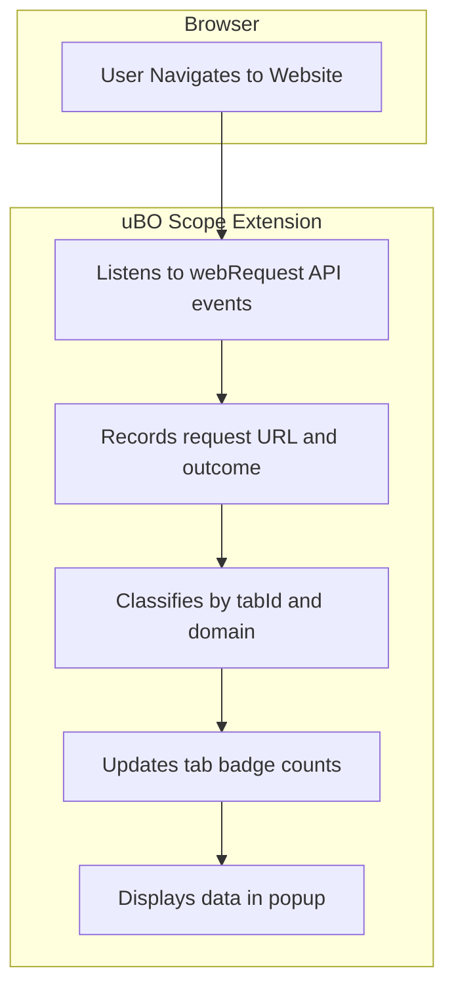

# What is uBO Scope?

## Overview
uBO Scope is a lightweight browser extension designed to provide **transparent, real-time visibility into all connections — both attempted and successful — that your browser makes to remote servers**. Unlike traditional content blockers which primarily focus on blocking unwanted content, uBO Scope specializes in revealing exactly *where* your browser is reaching out, empowering you with insights into your web traffic that go beyond simple blocking statistics.

## Why This Matters
Every webpage you visit can potentially connect to numerous third-party servers—some necessary (like content delivery networks), others less transparent (such as trackers or invasive advertising networks). While content blockers often show you how many requests were blocked, they rarely disclose the distinct number of different remote servers your browser connected to, which is a more telling metric of exposure.

uBO Scope fills this gap by:
- Reporting the **number of distinct third-party remote servers your browser communicates with**.
- Differentiating between **allowed, stealth-blocked, and fully blocked connections**.
- Functioning independently, regardless of which content blocker you use or how it operates.

Its badge icon count specifically indicates the number of unique third-party domains accessed, providing a clear, easily understandable gauge of your browsing exposure.

---

## What Is uBO Scope?

### Core Definition
uBO Scope is a browser extension that listens for network requests fired by webpages and reports their outcomes—in real time—across all tabs. It tracks every remote connection your browser attempts, whether these connections succeed, are blocked stealthily (undetected by the webpage), or are outright blocked.

### Core Purpose
Its main goal is to **offer complete visibility into your browser’s network activity at the domain level**, giving users accurate insight into which remote servers are being accessed when visiting webpages. This transparency helps you spot unexpected or suspicious third-party connections and evaluate the effectiveness of any content blockers you have activated.

### How uBO Scope Stands Apart
- **Not a blocker:** It does not block or modify network traffic; it only reports.
- **Independent of blocking method:** It reports connections regardless of how or if they were blocked—by DNS, extensions, or other means—so long as the browser reports them.
- **Focus on distinct third-party domains:** Instead of raw block counts or individual requests, it counts unique domains, a more meaningful privacy metric.

---

## Key Features & Capabilities

### 1. Real-Time Connection Visibility
Using browser APIs, uBO Scope listens to all outgoing network requests, capturing their status immediately. This allows users to see a live tally of distinct remote domains for each tab.

### 2. Detailed Outcome Categorization
Connections are classified into three categories:
- **Allowed:** Connections that were successful.
- **Blocked:** Connections that were explicitly blocked by the browser or extensions.
- **Stealth-Blocked:** Connections prevented in a manner invisible to the requesting webpage (e.g., silently intercepted).

This nuanced outcome reporting helps users understand the precise behavior of network interactions beyond simple block/no-block.

### 3. Tab-Specific Reporting
Each browser tab maintains its own isolated session data tracking domains accessed. This allows granular inspection of domain connectivity on a per-site basis.

### 4. Summary Badge for Quick Insight
The toolbar icon badge shows the count of distinct third-party remote servers contacted by the active tab, giving immediate feedback on exposure level.

### 5. Support for Modern Browsers
uBO Scope is available for Chromium-based browsers (like Chrome and Edge), Firefox, and Safari, supporting contemporary web standards and ensuring broad compatibility.


<AccordionGroup title="How uBO Scope Works Under the Hood">
<Accordion title="Network Request Listening and Categorization">

uBO Scope leverages the browser's `webRequest` API to monitor network events:
- Captures redirects, errors, and response starts for all network requests.
- Uses this data to classify requests as 'allowed', 'blocked', or 'stealth-blocked'.
- Maintains domain-based aggregates nested by tab.

</Accordion>
<Accordion title="Domain and Hostname Resolution">

Domains are identified through the Public Suffix List, ensuring accurate extraction of registrable domains from hostnames, helping avoid conflating subdomains or unrelated hosts.

</Accordion>
<Accordion title="Data Presentation">

The collected data is rendered in the extension popup:
- Domains are listed with counts of how many requests were made.
- The interface separates outcomes distinctly, improving readability.

</Accordion>
</AccordionGroup>

---

## Why Should I Care?

### Outcomes You Can Expect
- **Enhanced Privacy Awareness:** Know exactly which third-party servers your browser contacts, exposing trackers or unwanted services.
- **Transparency Over Content Blockers:** See beyond block counts and verify if your blockers actually prevent connections from reaching their targets.
- **Debunk Myths:** Understand why high block counts don’t always mean better blocking and why certain ad-blocker test pages can be misleading.
- **Filter List Maintenance:** Filter list developers gain an observational tool to collect network request data even in environments with limited developer tools access.

### Real-World Scenarios Where uBO Scope Excels
- While browsing, if you suspect a site is invoking trackers or loading resource-heavy third-party content, quickly verify the domains contacted.
- Test and compare different content blockers or custom filter lists by examining their real-world effectiveness in preventing remote connections.
- Investigate unusual network behavior on corporate or public networks that may intercept or redirect requests stealthily.

### Before & After
Before uBO Scope: You rely on block counts or vague extension reports, not seeing the actual extent of third-party connections.

After uBO Scope: You see a concrete list and counts of distinct third-party domains, enabling more informed privacy choices and troubleshooting.

### Return on Investment (ROI)
- Save time by detecting privacy risks quickly.
- Avoid false assumptions about blockers’ effectiveness.
- Empower yourself with clear, actionable network visibility without complex tools.

---

## Getting Started Preview

### Quick Start
- Install uBO Scope from your browser’s extension store.
- Click the toolbar icon when browsing any webpage.
- Instantly view the number of distinct third-party domains connected.
- Drill down into allowed, stealth-blocked, and blocked domains in the popup.

### Prerequisites
- Uses modern browsers supporting `webRequest` API (Chromium 122+, Firefox 128+, or Safari 18.5+).
- Requires permission to observe network requests on all HTTP/HTTPS URLs.

### Next Steps
- Visit the [Installation Instructions](https://github.com/gorhill/uBO-Scope) for detailed setup guidance.
- Explore [Getting Started: Your First Analysis](../getting-started/basic-usage-and-troubleshooting/first-steps-usage) to learn how to interpret the data uBO Scope provides.

---

## Tips and Best Practices

- Remember that not all third-party connections indicate tracking or risk: many are essential services like CDNs.
- Use the difference between allowed and blocked counts to evaluate your current content blocking setup’s effectiveness.
- Avoid relying on ad-blocker test pages—they can be misleading. Trust uBO Scope’s real-world data instead.

---

## Troubleshooting Common Issues

- **No badge count visible:** Confirm the extension permissions are granted and the browser version supports necessary APIs.
- **Low or zero domains reported on sites you expect connections:** Check if the content blocker or DNS-level block is preventing network requests from being reported.
- **Popup does not show data:** Try refreshing the tab or reopening the popup after page load.


---

## Additional Resources
For detailed usage instructions and advanced scenarios, visit the following guides:
- [Who Should Use It & Why?](../introduction-and-value/target-audience-use-cases)
- [Core Concepts & Terminology](../concepts-architecture/core-concepts-and-terminology)
- [Real-world Usage: Analyzing Third-Party Connections](../../guides/real-world-usage/analyzing-3rd-party-requests)


---

## Example: How uBO Scope Displays Connection Data

When you click the uBO Scope icon in your browser, the popup shows:

```
domains connected: 5

not blocked
 - example-cdn.com (3 requests)
 - trusted-analytics.net (2 requests)

stealth-blocked
 - suspicious-tracker.io (1 request)

blocked
 - known-adserver.org (4 requests)
```

This clear layout helps you instantly understand which domains are fully allowed, which were silently blocked, and which were explicitly blocked.


---

## Diagram: Data Flow within uBO Scope




---

## Where to Get uBO Scope
- For Chromium-based browsers, install from the [Chrome Web Store](https://chromewebstore.google.com/detail/ubo-scope/bbdpgcaljkaaigfcomhidmneffjjjfgp).
- For Firefox, find it on [Firefox Add-ons](https://addons.mozilla.org/firefox/addon/ubo-scope/).
- For Safari, install via the [App Store with Safari Web Extensions](https://apps.apple.com).


---

Harness the power of visibility. Understand and control your browser’s network footprint today with uBO Scope.


---

**For more detailed setup and usage, see the **[Getting Started](../../getting-started/installation-setup/installing-ubo-scope)** and **[First Use & Troubleshooting](../../getting-started/basic-usage-and-troubleshooting/first-steps-usage)** documentation.**