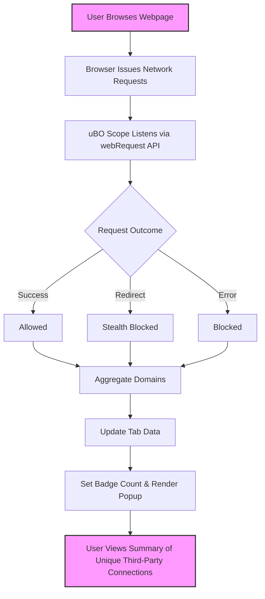

# What is uBO Scope?

## Revealing the True Privacy Exposure of Your Web Browsing

uBO Scope is a lightweight yet powerful browser extension designed to transparently reveal every outgoing connection initiated by a web page—whether those connections are allowed to complete or blocked by your current content blocker. Instead of focusing on individual requests, uBO Scope counts the unique third-party servers contacted, providing you with an immediate, clear measure of your actual privacy exposure.

### Why uBO Scope Matters:
- **Comprehensive**: It exposes all outgoing network requests, capturing attempted and successful connections alike, regardless of the content blocker in use.
- **Clarity Through Unique Counts**: By showing how many distinct third-party servers your browser interacts with, it cuts through the noise of request volume and block counts.
- **Blocker-Agnostic Insight**: Works transparently alongside existing blockers, observing outcomes without interference.
- **Myth-Busting Tool**: Helps debunk misleading notions about block counts and test-site results used to compare blocker effectiveness.
- **Minimalist UI**: Quickly see a summary and detailed breakdown in a user-friendly popup panel.

### Who Benefits from uBO Scope?
This extension is ideal for privacy-conscious users who want to understand at a glance how many third-party domains are contacted by their browsers during web sessions. It also serves filter list maintainers and advanced users needing validation tools for network request behaviors.

---

## What is uBO Scope?

uBO Scope is a browser extension that tracks and reports all network connections initiated by web pages you visit. It uses browser `webRequest` listeners to observe requests regardless of how or whether they are blocked, including those blocked at multiple layers such as DNS or content blockers.

By measuring the number of distinct **third-party remote servers contacted**, uBO Scope empowers you to identify the real extent of your browsing footprint, beyond just block counts or request numbers typically shown by content blockers.

### Core Purpose

- To provide a clear, actionable understanding of your privacy exposure on the web.
- To reveal connections that succeed or fail, indicating both allowed and blocked activity.
- To help users make informed decisions about their security and privacy setup.

### What Makes uBO Scope Unique?

- **Counts Unique Third-Party Domains**: Instead of tallying each request, it focuses on distinct domains contacted.
- **Works Independently of Content Blockers**: Passively observes network events, compatible with any blocking solution.
- **Debunks Common Myths**: Clarifies that a higher block count doesn't directly translate to better protection.

### How It Works at a High Level

- The extension uses the browser's `webRequest` API to monitor network requests.
- It categorizes these requests into three outcomes:
  1. **Allowed**: Requests that successfully connected.
  2. **Stealth Blocked**: Requests blocked silently, often through redirects.
  3. **Blocked**: Requests explicitly blocked due to errors or failures.
- For each active tab, it aggregates this data, grouping counts by hostname and domain.
- The popup panel then displays this data as a user-friendly summary.

---

## Key Features & Capabilities

### 1. Real-Time Connection Summary
- See the exact count of unique third-party domains your browser contacted on the current tab.
- Breakdowns of allowed, stealth-blocked, and explicitly blocked connections.

### 2. Browser-Agnostic Compatibility
- Supports major browsers (Chrome, Firefox, Safari) leveraging the browser's `webRequest` API.

### 3. Transparent and Lightweight UI
- A minimal popup panel shows domain lists per outcome category, updated live.

### 4. Durable Session Tracking
- Network request data is aggregated per tab and persists during browsing sessions.

### 5. Proxy to Filter List Maintenance
- Assists filter list maintainers by exposing actual network behavior, even on restricted devices.

### Real-World Example
Suppose you visit a news website. uBO Scope may reveal it contacted 28 unique third-party servers. Of those, 5 were blocked, 3 were stealth-blocked, and 20 succeeded. This reveals your real privacy exposure, regardless of your content blocker's block count.

---

## Why Should I Care?

### Understand Your Browsing Privacy Exposure
Most content blockers provide block stats or counts that don’t translate directly into understanding which third-party servers actually receive your data. uBO Scope cuts through this by focusing on **how many and which third-party domains your browser connects to.** Lower distinct third-party counts mean smaller privacy footprints.

### Avoid Misleading Block Count Comparisons
Many believe that higher block counts imply better privacy. uBO Scope shows the truth: it is entirely possible for a blocker with lower block events to block better by yielding fewer third-party contacts.

### Validate Your Content Blocker’s Effectiveness
Use uBO Scope alongside other blockers to verify how many connections you truly allow versus block.

### Use Cases
- **Privacy-Conscious Users**: Instantly gauge privacy exposure on any visited page.
- **Filter List Maintainers**: Identify leaks of unwanted domains or assess stealth blocking behavior.
- **Developers and Researchers**: Analyze web requests for auditing and security analysis.

### Before and After Using uBO Scope
| Without uBO Scope                      | With uBO Scope                            |
|--------------------------------------|------------------------------------------|
| Rely on block counts or opaque tools  | See actual distinct third-party domains contacted |
| Confused by noisy block event counts  | Clear insight into browser network behavior    |
| Unable to debunk blocker myths         | Evidence-backed understanding of privacy impact |

---

## Getting Started Preview

### Quick Start
Once installed, simply click the uBO Scope extension icon in your browser toolbar to open the popup panel. It instantly displays the number of unique third-party domains contacted by the active tab, divided by outcome category.

### Prerequisites

- Compatible browsers supporting the `webRequest` API (Chrome 122+, Firefox 128+, Safari 18.5+).
- No special configuration required; works alongside existing content blockers.

### Next Steps

- Proceed to the [Why Use uBO Scope?](/overview/introduction-and-value/product-value) page to deepen your understanding of its value.
- Explore [Popup Panel and Badge Explained](/overview/feature-overview-usage/popover-and-badge) to learn how to interpret the UI.

---

## Tips for Success

- Keep in mind that not all third-party connections are harmful; many are legitimate resources such as CDNs.
- Use uBO Scope’s insights to balance usability and privacy.
- Regularly check for stealth-blocked connections to tune your filter lists for optimal protection.

## Common Pitfalls

- Don't confuse the badge count with block count; it counts distinct domains, not blocked requests.
- The extension cannot monitor requests outside the realm of the browser's `webRequest` API.

---

For source code, updates, and community discussions, visit the [uBO Scope GitHub repository](https://github.com/gorhill/uBO-Scope).

---

<AccordionGroup title="Additional Information">
<Accordion title="Understanding the Badge Count">
The badge on the extension icon reports the number of unique third-party domains contacted in the current tab. A lower badge count indicates better privacy.
</Accordion>
<Accordion title="Blocked vs. Stealth Blocked Connections">
- **Blocked**: Requests explicitly stopped and reported as errors.
- **Stealth Blocked**: Requests silently redirected or manipulated to avoid detection by the webpage.

uBO Scope separates these categories to give more granular visibility.
</Accordion>
<Accordion title="Limitations">
uBO Scope relies on browser `webRequest` APIs and cannot report on connections made outside this scope, such as some browser-integrated services or OS-level network restrictions.
</Accordion>
</AccordionGroup>

---

## Visual Diagram of uBO Scope Data Flow

---