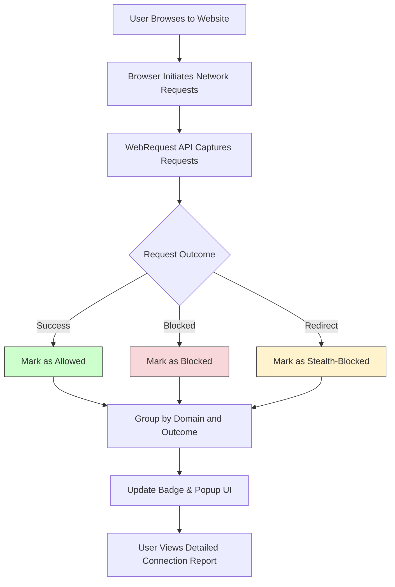

# What is uBO Scope?

## Discover Every Remote Server Connection Right from Your Browser

uBO Scope is a lightweight browser extension designed to expose all connections your browser attempts or successfully makes to remote servers during your web browsing. Unlike traditional content blockers that rely on block counts to claim effectiveness, uBO Scope empowers you with precise visibility into network activity, giving you a clearer picture of the third-party connections happening behind the scenes.

- **Reveal all remote connections:** Understand every distinct third-party server your browser talks to, whether connections are allowed or blocked.
- **See actual network outcomes:** Access accurate connection status — success, failure, or stealth-blocked — to grasp network behavior fully.
- **Debunk misleading metrics:** Move beyond block-count myths by focusing on unique server counts instead of arbitrary request numbers.
- **Supports multiple browsers:** Works on Chromium-based browsers, Firefox, and Safari with consistent performance.

**Ideal for:** Privacy-conscious users, filter list maintainers, and anyone curious about the real network footprint of their browsing.

---

## Understanding uBO Scope: Why It Matters

uBO Scope isn't just another content blocking tool. It focuses entirely on transparency by revealing *what* remote servers websites connect to and *whether* those connections were blocked, allowed, or stealthily blocked (hidden or redirected). This insight answers core questions users often face:

- Which third-party servers does this website communicate with?
- Are connections genuinely blocked, or do they appear blocked while still occurring?
- How accurate are popular 'block count' metrics often displayed on toolbar badges?

Many content blockers inflate block counts which may mislead users into thinking a higher number means better protection. uBO Scope cuts through this confusion, showing that fewer allowed distinct third-party servers indicates tighter, more effective blocking.

---

## How uBO Scope Works

At its core, uBO Scope leverages the browser's `webRequest` API to listen to all network requests transmitted as you browse. It records each request's URL, the outcome (allowed, blocked, stealth-blocked, or redirected), and the originating tab.

The extension groups these connections by domain and categorizes the network outcomes. It tracks connection attempts regardless of the content blocker or DNS settings involved, as long as the browser reports the traffic via the `webRequest` API.

Key considerations:
- It covers both HTTP(S) and WebSocket (WS/WSS) communications.
- Network requests outside the browser's `webRequest` scope cannot be captured.

This approach guarantees precise insights without interfering with your browsing experience.

---

## Core Features and Capabilities

### Comprehensive Connection Reporting
uBO Scope displays every remote server connection attempt by your browser, categorizing them as:

- **Allowed (Not Blocked):** Connections successfully allowed by your browser.
- **Stealth-Blocked:** Requests that were redirected or failed in subtle ways often invisible to other tools.
- **Blocked:** Connections explicitly blocked, typically by content blockers.

This granular reporting enables you to understand not just what is blocked but what manages to slip through.

### Accurate Domain and Hostname Aggregation
Using advanced domain handling techniques, uBO Scope consolidates hostnames into registered domains. For example, `assets.examplecdn.net` and `media.examplecdn.net` aggregate under `examplecdn.net` so you gain clearer insights into how many distinct parties your browsing involves.

### Real-Time Badge Indicator
A browser toolbar icon badge dynamically reflects the **number of distinct third-party domains allowed** for your current browsing tab. This count helps you quickly gauge your browsing exposure indirectly:

- Lower numbers typically denote tighter privacy.
- Higher numbers can indicate more third-party content being fetched.

### Lightweight, No-Frills User Interface
The popup view organizes connection data into three categories—Allowed, Stealth-Blocked, and Blocked—each listing the associated domains with occurrence counts. This layout lets you analyze network behavior at a glance.

---

## Why You Should Care About uBO Scope

### Gain Unprecedented Transparency
Most users are unaware of the multitude of remote connections sites initiate. uBO Scope brings this hidden activity into sharp focus, boldly surfacing data normally obscured by browser internals or content blocking tools.

### Correct Misconceptions with Data
Many equate block counts to protection quality, but uBO Scope reveals:

- A high block count can correlate with *more* third parties allowed, not fewer.
- Popular 'ad blocker test' webpages produce unrealistic network behaviors and do not reflect real-world protection.

By showing the actual distinct servers contacted, uBO Scope helps you make informed judgments.

### Support Filter List Maintenance
Filter list maintainers can leverage the detailed insights to identify false negatives or stealth tactics used by trackers, refining their lists more accurately.

### Preserve Browser Performance
Because uBO Scope works purely by monitoring network requests passively without blocking or modifying traffic, it keeps your browsing fast and unaffected.

---

## Real-World Example: How uBO Scope Changes Your Perspective

Imagine visiting a news website. Conventional content blockers report a high block count on their icon badge. You might think you’re well protected. However, uBO Scope exposes that the site still connects to a dozen third-party advertising servers undetected, visible in the Allowed list.

This transforms your understanding from "I have lots of blocks" to "Here’s exactly which third parties my browser talks to and in what manner."

---

## Getting Started with uBO Scope

1. **Install the extension** from your browser’s official store (e.g., Chrome Web Store, Firefox Add-ons). 
2. **Browse as normal.** uBO Scope will monitor network traffic in the background.
3. **Click the toolbar icon** to view the detailed popup, showing domains categorized by connection outcomes.
4. **Observe the badge count,** representing distinct allowed third-party domains for the active tab.

For detailed installation instructions and deeper usage tips, visit [Installing uBO Scope](/getting-started/installation-quickstart/installation-multiplatform) and [Understanding the Badge & Popup](/getting-started/setup-usage/interpreting-results).

---

<Tip>
The badge count lower is better: it reflects the number of distinct third-party servers your browser connected to successfully. Use this insight to better evaluate and compare your content blocking setup.
</Tip>

<Warning>
uBO Scope cannot monitor network requests happening outside the scope of the browser’s webRequest API. Some browser internals or DNS-level blocking may not be fully reported.
</Warning>

---

## Summary

uBO Scope is your window into the unseen web—a simple yet powerful extension that reveals every remote server connection your browser attempts or makes, regardless of blocking configurations. It refutes misleading badge metrics and equips you with real data to make smarter privacy decisions.

Make uBO Scope a part of your browser toolkit for clear, actionable insights into your web traffic.

---

## Additional Resources
- [uBO Scope GitHub Repository](https://github.com/gorhill/uBO-Scope)
- [Public Suffix List Project](https://publicsuffix.org/)
- [Content Blocking Myths Debunked](https://github.com/gorhill/uBO-Scope#purpose)

---

## Visual Workflow: How uBO Scope Processes Browser Requests

---