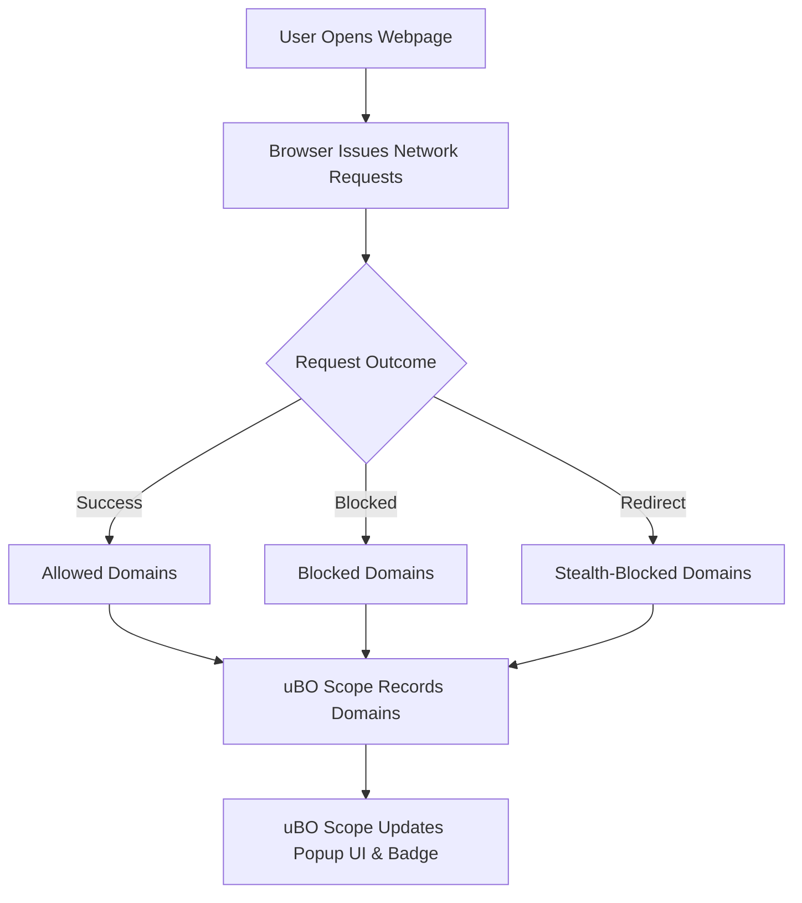

# What is uBO Scope?

## Discovering the Invisible Web Connections

When you load a webpage, it doesn’t just pull content from that single site. Often, it contacts dozens of third-party servers—sometimes for images, fonts, ads, trackers, or other resources—happening silently behind the scenes. uBO Scope is a lightweight browser extension designed to **lift the veil on these network connections**, revealing every attempted or successful contact a webpage makes with remote servers.

This page introduces you to uBO Scope, explaining what it is, why it matters, and how it empowers you to understand exactly which third parties are interacting with the websites you visit.

---

## What is uBO Scope?

uBO Scope is a simple yet powerful companion extension for your browser that monitors and reports **all network connections initiated by webpages**, including connections that are blocked, stealth-blocked, or successfully established.

It operates silently in the background and provides you a clear, real-time view of these connections through its popup interface and toolbar badge, helping you understand and control your online privacy footprint.

### Core Purpose

- **Reveal all remote server connections:** uBO Scope shows every third-party server contacted by the page, whether the connection succeeded, was blocked, or was stealthily redirected.
- **Increase transparency:** Users gain insight into what likely goes unnoticed by default browser tools or content blockers.
- **Support filter list maintainers:** By providing detailed information about third-party connections, it aids those maintaining filter lists to better understand the landscape of network requests on webpages.

### Key Differentiators

- Unlike generic network monitors, uBO Scope combines **visibility with privacy awareness**, focused on revealing the real third-party interactions.
- It reports connection outcomes regardless of any content blocking method in place — including DNS blocking — as long as the browser exposes these requests via its webRequest API.
- The badge count on its toolbar icon reflects the **number of distinct third-party domains connected**, prioritizing meaningful privacy metrics rather than raw block counts.

### Supported Browsers

uBO Scope is available for Chromium-based browsers (Chrome, Edge), Firefox, and Safari, adapting to each platform’s modern extension architecture.

---

## How Does uBO Scope Work?

Without delving into internal code, here’s an overview of what happens behind the scenes in user terms:

1. **Listening to network requests:** As you browse, uBO Scope listens to all HTTP(s) and WebSocket network requests the browser processes.
2. **Categorizing connections:** Each request is categorized into three main outcomes:
   - **Allowed (not blocked):** Requests that successfully reach a remote server.
   - **Blocked:** Requests that were stopped or failed to connect.
   - **Stealth-blocked:** Requests that were redirected or blocked stealthily, often invisible to webpages.
3. **Tracking unique domains:** The extension keeps track of the unique domains contacted per tab, filtering down to the primary domains using a public suffix list to count third-party entities accurately.
4. **Updating UI & badge:** The popup UI presents current connection data categorized by outcome, including the hostname and domain counts, while the toolbar badge dynamically shows the count of allowed third-party domains.

This workflow ensures you get an accurate snapshot of the network connections from each tab, making hidden relationships visible.

---

## Why Should You Care?

### Empower Your Privacy Awareness

Understanding exactly which third-party servers your browser is contacting exposes the invisible threads web pages use, from benign content delivery networks to tracking or advertising services. This visibility lets you:

- **Spot trackers and unwanted connections** in real time.
- **Make informed decisions** about content blockers or privacy settings.
- **Verify if content blockers are effective** based on actual network connections, not misleading block counts.

### Combat Common Misconceptions

uBO Scope helps users and filter list maintainers debunk misleading narratives such as:

- Higher block counts don't necessarily mean better content blocking.
- "Ad blocker test" websites often fail to reflect realistic browser behavior and network interactions.

By showing the true number of unique third-party domains contacted, users can see beyond superficial statistics.

### Real-World Use Cases

- **Everyday Users:** Monitor and understand what third parties websites connect to, enhancing trust and privacy.
- **Privacy Advocates:** Gain insight into the efficacy of content blockers and identify stealthy network requests.
- **Filter List Maintainers:** Analyze web requests to refine and update blocking rules based on real-world data.

---

## Getting Started Preview

To experience uBO Scope firsthand, install the extension from your browser's official store. Once active:

- Look for the uBO Scope icon in your toolbar.
- Click it to open the popup and immediately see which domains the current page has connected to, categorized by connection outcomes.
- Notice the badge count reflecting the distinct number of allowed third-party domains — the lower, the better for privacy.

Explore further documentation to learn about installation, interpreting data, and advanced uses.

---

## Practical Tips & Best Practices

- **Focus on the badge count:** It represents unique third-party connections allowed, a direct measurement of your exposure.
- **Use uBO Scope alongside content blockers:** It complements blockers by revealing their effect in practice.
- **Remember not all third-party connections are bad:** Some, like legitimate CDNs, are essential for web functionality.

---

## Troubleshooting Common Scenarios

- If you don't see connection data for a tab, ensure the tab is active and has loaded recent web content.
- Some network requests made outside the browser’s webRequest API may not be visible due to browser limitations.
- Badge counts may sometimes lag momentarily; refreshing the tab or waiting a few seconds usually resolves this.

---

## Visualizing the Connection Flow

---

For detailed guidance on installation, usage, and interpreting results, explore the accompanying documentation sections designed to maximize your understanding and control of web connections.

---

# Additional Resources
- [Installing uBO Scope]( /getting-started/installation-setup/installing-extension )
- [Analyzing Third-Party Connections on a Website]( /guides/core-workflows/analyzing-connections )
- [Debunking Block Count Myths]( /guides/core-workflows/mythbusting-block-counts )
- uBO Scope project on [GitHub](https://github.com/gorhill/uBO-Scope)

---