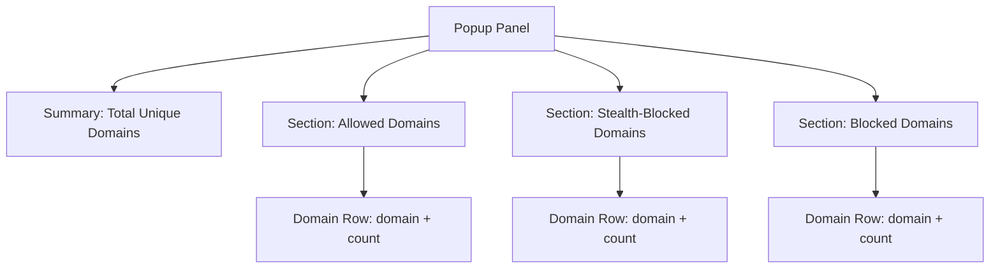

# Feature Overview

## Discover the Power of Live Network Insights

When you want to truly understand how websites interact with external servers — especially those third-party connections crucial to privacy and performance — uBO Scope’s Feature Overview gives you an immediate, digestible snapshot.

This page introduces three of uBO Scope’s standout capabilities:

- Real-time tracking of third-party server connections
- Intuitive badge counts of unique domains
- Robust reporting unaffected by your choice of content blocker

Armed with this knowledge, you can swiftly identify and assess remote connections your browser makes, helping you make confident, privacy-savvy decisions.

---

## What uBO Scope Tracks and How You Benefit

At its core, uBO Scope listens to all the network requests initiated by the active tab, then classifies and counts connections based on their outcome:

- **Allowed**: Connections successfully moved through without blocking.
- **Blocked**: Connections prevented by any means — extension, DNS, or otherwise.
- **Stealth-Blocked**: Connections that were redirected or suppressed quietly by stealth techniques.

Rather than just raw request counts, the extension aggregates unique third-party domains associated with these outcomes — the data you really care about.

Why does this matter?

- You see how many distinct external server domains your current tab actually connects to, not just how many requests happen. This helps identify the true scope of third-party tracking.
- You gain insight into how different content blockers or DNS-level blocking affect connections without being misled by simple block counts.

### Key Advantage:
Your browser's toolbar icon displays a badge count representing the number of unique allowed third-party domains — a clear, actionable privacy metric.

---

## Key Features Explained

### 1. Real-Time Third-Party Domain Tracking

As you browse, uBO Scope monitors all network requests initiated by the active tab. It identifies the remote server’s hostname from each request and extracts its registered domain using an up-to-date public suffix list.

This means each new third-party domain connected to is counted exactly once, providing an instantaneous overview of tracking exposure.

### 2. Badge Count of Unique Domains

The toolbar badge acts as a privacy compass by showing the count of unique allowed third-party domains connected from the page you are viewing. A higher number means more third-party interaction.

For example, if you visit a news site that loads scripts from four different ad networks, the badge shows "4".

If you move to a stricter content blocking environment reducing allowed third parties to one or none, you immediately see it reflected in the badge.

### 3. Reporting Independent of Content Blocker Technology

uBO Scope does not rely on or interfere with the content blockers themselves. Instead, it listens directly to browser network events via the WebRequest API. This design:

- Ensures your connection reporting is accurate even if blocking occurs outside of browser extensions (e.g., DNS-level blocking).
- Decouples the reporting from any extension's internal blocking implementation.

In essence, uBO Scope gives an unfiltered view of network activity as visible to the browser, authentically reflecting actual allowed, blocked, and redirected connections.

---

## How the Feature Overview Panel Empowers You

When you click the uBO Scope toolbar icon, a popup panel instantly displays categorized results for the current tab in three sections:

- **Not blocked (allowed)** — domains your browser reached successfully
- **Stealth-blocked** — domains where requests were silently redirected
- **Blocked** — domains where connections were outright prevented

Each section lists:

- Domain names in Unicode (human-readable) format,
- The count of hostname connections behind each domain,
- The total unique connected domain count at the top summary.

This immediate visibility helps you quickly:

- Detect unexpected or suspicious third-party trackers.
- Understand block effectiveness across different techniques.
- Validate privacy tools’ impact beyond mere block counts.


---

## Practical Scenarios

### Scenario 1: Evaluating a News Website

You visit a popular news site. The badge shows "7" — indicating connections to seven unique third-party domains.
Opening the popup, you see the allowed domains include common CDNs and a few ad-related domains labeled under "not blocked".

You recognize the domains you trust — perhaps a CDN and analytics provider — but notice an unfamiliar ad network domain. Armed with this insight, you can adjust your content blocker or filter lists to further tighten control.

### Scenario 2: Comparing Content Blockers

You switch between two content blockers to see which better protects your privacy.
While one blocker shows a higher block count, uBO Scope reveals it still allows connections to more unique third-party domains.

The badge count and categorized domain listing help you understand that block count alone is not a meaningful privacy metric — what matters is the number of allowed distinct third-party connections.

---

## Tips to Get the Most from This Feature

- Refresh the popup by clicking the toolbar icon on any tab to get real-time updates.
- Pay attention to the badge count as a quick gauge of third-party exposure.
- Use the categorized domain lists to research unfamiliar domains.
- Leverage domain counts to debug or verify filter list impacts.

---

## Common Pitfalls and How to Avoid Them

- **Mistaking block counts for privacy strength:** A higher block count sometimes means that more connections were allowed initially and then blocked later, possibly after leaking data. Trust the unique allowed domain count as your real indicator.

- **Ignoring stealth-blocked domains:** These represent redirections or silent blocking; knowing about these can reveal subtle tracking attempts.

- **Assuming all third parties are bad:** Some third-party domains, like CDNs and essential service providers, are necessary. Focus on unfamiliar or unexpected domains.


---

## Summary

The Feature Overview page unlocks the core power of uBO Scope: delivering clear, real-time insights into the third-party domains your browser actually connects to. It bridges the gap between abstract block counts and meaningful visibility.

Use this insight to maintain tight privacy, understand network activity, and make informed decisions about which connections you allow or block.

---

## Next Steps

- Learn how to interpret the badge counter and popup panel in detail in the [Interpreting the Badge Counter and Popup Panel](../guides/getting-started-usage/interpret-badge-and-popup) guide.
- Explore the [Architecture & Data Flow](../overview/architecture-core-concepts/system-architecture) documentation to understand how uBO Scope collects and processes network data.
- Install and activate uBO Scope following the [Installing uBO Scope](../getting-started/installation-setup/installing-ubo-scope) guide to start monitoring your browsing activity today.


---

## Code Snippet: Sample Domain Row Template

Here’s how uBO Scope prepares each domain entry in the popup panel, showing the domain and connection count:

```html
<template id="domainRow">
    <div class="row"><span class="domain">example.com</span><span class="count badge">3</span></div>
</template>
```

This template is cloned and populated dynamically for each domain with its respective connection count.

---

## Visual: Popup Panel Structure



This structure emphasizes how data is segmented and presented for clear, actionable insights.

---

For more details and practical applications, visit related sections in this documentation or the project’s GitHub repository at [https://github.com/gorhill/uBO-Scope](https://github.com/gorhill/uBO-Scope).