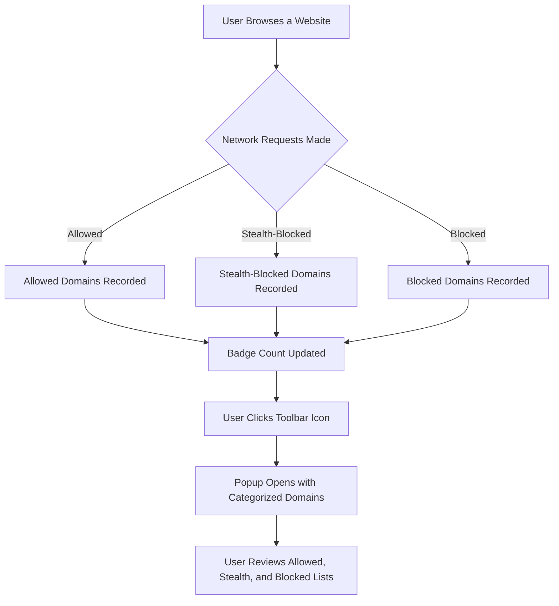

# Key Features at a Glance

Discover how uBO Scope empowers you to uncover and understand the full scope of network interactions happening behind the scenes when you browse. This page offers a focused walkthrough of the core user interface elements and key features that make analyzing connection data intuitive and insightful.

## Instant Insight with Badge Counts

At the heart of uBO Scope's user experience is the toolbar icon badge. This badge dynamically displays the number of distinct third-party domains with which the current browser tab interacts. 

- **What it represents:** The count reflects every unique third-party remote server contacted during page load or interaction.
- **Why it matters:** A lower badge count generally means fewer external connections, often indicating better privacy and less potential tracking.

This simple visual cue helps you quickly gauge the extent of third-party connections without needing to sift through complex network logs.

## The Popup Interface: Clear Visualization of Connection Outcomes

Clicking the toolbar icon opens the popup panel, your dashboard for detailed connection telemetry. Organized into three clear sections, the popup categorizes domains based on your browser’s network interactions:

### 1. Not Blocked (Allowed)
This section lists third-party domains whose network requests were successful and allowed by your content blocker or browser policies. Each domain is accompanied by a count indicating how many requests succeeded.

### 2. Stealth-Blocked
Domains that were subject to stealth-blocking appear here. These are connections that were redirected or silently intercepted, typically by privacy tools or the browser itself, to prevent detection by the webpage without breaking site functionality.

### 3. Blocked
Here you see domains for which requests were explicitly blocked by content blockers or network-level filtering, with counts showing the number of blocked attempts.

Each section displays domains with concise badges showing connection counts, making it easy to understand not only which domains interact with your browser but also the outcome of those interactions.

## User Workflow for Reviewing Connection Telemetry

1. **Observe the badge count** on the extension icon to quickly estimate third-party exposure for the active tab.
2. **Open the popup panel** to dive deeper into connection details categorized by allowed, stealth-blocked, and outright blocked domains.
3. **Scan domain lists and badges** to identify suspects or legitimate service providers, guided by the counts to prioritize attention.
4. **Interpret patterns** — for example, numerous stealth-blocked domains may indicate strong stealth protections at work, while many allowed domains might reveal tracking that content blockers missed.

### Practical Example
Imagine visiting a news website. The badge shows "7". Clicking it, you find:

- **5 domains under Not Blocked** — mainly content delivery networks (CDNs) serving images and scripts.
- **1 domain in Stealth-Blocked** — a tracking domain quietly rerouted to preserve user privacy.
- **1 domain in Blocked** — an ad server actively prevented from loading.

This immediate insight helps you understand which connections succeeded and which protections engaged, informing decisions about your privacy setup.

## Tips for Effective Use

- **Regularly monitor the badge counts** across your browsing sessions to track changes in third-party connections.
- **Use the popup’s domain lists to identify unexpected connections,** which can highlight tracking or unwanted content.
- **Combine uBO Scope with content blockers** for comprehensive insight into what is allowed, stealth-blocked, or explicitly blocked.

## Common Pitfalls to Avoid

- Don’t equate a higher block count with better privacy. Instead, focus on how many distinct third-party domains are allowed, as this reflects real exposure.
- Avoid relying on ‘ad blocker test’ pages as benchmarks, since they often simulate unrealistic scenarios and do not reflect real-world connection patterns.

---

<u>uBO Scope’s interface centers on actionable, transparent insights — the badge and popup work together to translate complex network behavior into clear summaries and meaningful lists. Armed with this overview, users can confidently assess their browsing privacy and connection exposure in real time.</u>

## Next Steps

To dive deeper into interpreting badge counts and popup details, explore the guides on [Making Sense of Badge Counts and Domain Lists](/guides/workflows/interpreting-badge-counts) and [Analyzing Connections Made by Websites](/guides/workflows/analyzing-network-connections).


---

## Appendix: Popup Panel Structure Example

This simplified structure illustrates the categories visible in the popup:

```plaintext
+-----------------------------------------------------+
| Tab Host: example.com                               |
+-----------------------------------------------------+
| Domains connected: 7                                |
+-----------------------------------------------------+
| NOT BLOCKED                                         |
| example-cdn.com                  3                 |
| images.hosting.net              2                 |
|                                                     |
+-----------------------------------------------------+
| STEALTH-BLOCKED                                     |
| tracker.example.net             1                 |
+-----------------------------------------------------+
| BLOCKED                                            |
| ads.example.org                 1                 |
+-----------------------------------------------------+
```

This layout supports quick visual scanning and prioritization.


---

## References
- For detailed core concepts behind these features, see [Core Concepts & Terminology](/overview/architecture-concepts/core-terminology).
- Technical details on the badge count updates can be found in the [Background Script Overview](/overview/architecture-concepts/integration-browser-apis).


---

## Code Snippet: Badge Count Update (Conceptual)

```javascript
// Pseudocode for updating the badge count per tab
function updateBadgeCount(tabId, allowedDomains) {
  const count = allowedDomains.size; // unique third-party domains connected
  if(count > 0) {
    browser.action.setBadgeText({ tabId, text: count.toString() });
  } else {
    browser.action.setBadgeText({ tabId, text: '' });
  }
}
```

This snippet reflects the live updating of the badge that helps users gauge connection exposure at a glance.


---

## Diagram: User Interaction Flow with uBO Scope



This flow captures the core practical experience presented on this page.