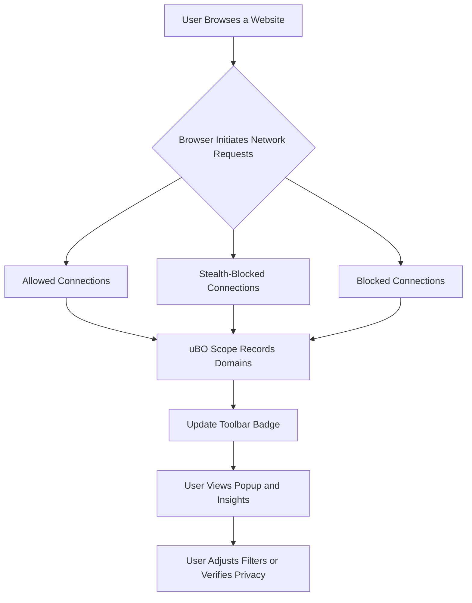

# Target Audience & Use Cases

## Unlocking Transparent Network Insight for Everyone

uBO Scope is designed with a clear mission: provide **transparent, real-time visibility into all outgoing third-party network connections** your browser attempts or completes. This page clarifies who benefits most from uBO Scope and explores real scenarios demonstrating its impact, from privacy-conscious users to filter list maintainers and developers.

---

## Who Is uBO Scope For?

- **Privacy-Minded Users**  
  If you're vigilant about your digital footprint and want to understand exactly which third-party servers your browser talks to, uBO Scope offers unprecedented transparency. It reveals connections that standard content blockers may obscure, empowering informed decisions on your web security and privacy.

- **Filter List Maintainers**  
  Those who curate or test content-blocking filter lists find uBO Scope invaluable. It exposes network requests regardless of the blocking mechanism, helping validate whether filters effectively reduce unwanted third-party connections.

- **Developers and Security Analysts**  
  Professionals who dissect web traffic and browser behavior benefit from granular insights into network request outcomes, including redirects, blocks, and successes, to troubleshoot or optimize web interactions.

- **Users on Platforms with Limited DevTools Access**  
  Many browsers or environments restrict developer tools capabilities. uBO Scope functions independently to surface network activity transparently even where in-browser tools fall short.

---

## Real-World Scenarios: How uBO Scope Adds Value

### 1. Validating Content Blocker Effectiveness

Imagine you've installed a new content blocker or updated your filter list. uBO Scope tracks all third-party connections attempted by your browser, clearly distinguishing between allowed, stealth-blocked, and fully blocked connections. Seeing these outcomes live enables you to verify:

- Which third parties are still connecting despite blocking rules.
- Whether stealth blocking is working as intended by hiding requests.
- The actual reduction of distinct remote servers contacted compared to before.

This goes beyond simplistic blocked counts, revealing the **true surface area of your web exposure**.

### 2. Mythbusting Misleading "Ad Blocker Test" Pages

Many users believe certain "ad blocker test" websites provide reliable benchmarks; uBO Scope challenges this misconception by:

- Demonstrating how such test pages often invoke artificial or unrealistic requests irrelevant to real-world browsing.
- Revealing that these pages can’t detect stealthy blocking techniques employed by modern blockers.
- Offering direct evidence of actual network behavior, shifting focus to measurable outcomes.

This clarity helps users make **privacy decisions based on actual data**, not flawed external tests.

### 3. Using the Tool When Browser DevTools Are Limited

On some platforms or browsers, the integrated developer tools might not report detailed web requests or may omit those affected by certain content blockers. uBO Scope fills this gap by:

- Leveraging browser `webRequest` API access to track every HTTP(S) and websocket request your browser initiates.
- Providing a simple popup interface with badge counts and domain breakdowns you can quickly inspect.

This means even on constrained environments, you gain visibility into third-party connections that impact your privacy.

---

## Typical User Flow

1. **Install uBO Scope** on your preferred browser (Chromium, Firefox, Safari).
2. **Browse as usual**, knowing uBO Scope silently tracks third-party connections.
3. **Click the toolbar icon** to instantly see how many unique third-party domains connected.
4. **Inspect detailed breakdowns** in the popup categorizing connections into allowed, stealth-blocked, and blocked.
5. **Use this insight** to adjust your content blockers, assess privacy risks, or troubleshoot behaviors.

---

## Tips & Best Practices

- **Interpret badge counts as exposure indicators:** Lower counts mean fewer third-party servers are contacted, which generally is better for privacy.
- **Regularly check after filter updates:** To verify that new or updated rules effectively reduce unwanted connections.
- **Do not rely on ad blocker tests:** Use uBO Scope’s real network data instead for assessment.
- **Combine with other privacy tools:** Use uBO Scope alongside trusted blockers and VPNs for layered protection.

---

## Common Pitfalls to Avoid

- **Assuming all third-party connections are bad:** Some connections (e.g., CDN services) are benign and necessary.
- **Confusing block count with network exposure:** High block counts don’t necessarily mean better blocking if more unique third-party domains are still contacted.
- **Expecting uBO Scope to block:** It only reports network activity; blocking is managed by your existing content blockers.

---

## Visualizing the Value

---

## Next Steps

Explore further how uBO Scope fits into your workflow by visiting:

- [What is uBO Scope?](overview/introduction-core-value/what-is-ubo-scope) — Understand the core purpose and basic overview.
- [Core Features & Benefits](overview/introduction-core-value/core-features-benefits) — Dive into key capabilities and user advantages.
- [Installing and Activating uBO Scope](guides/getting-started-essentials/install-activate) — Learn how to get started smoothly.

This multi-layered understanding ensures you maximize the benefits uBO Scope offers.

---