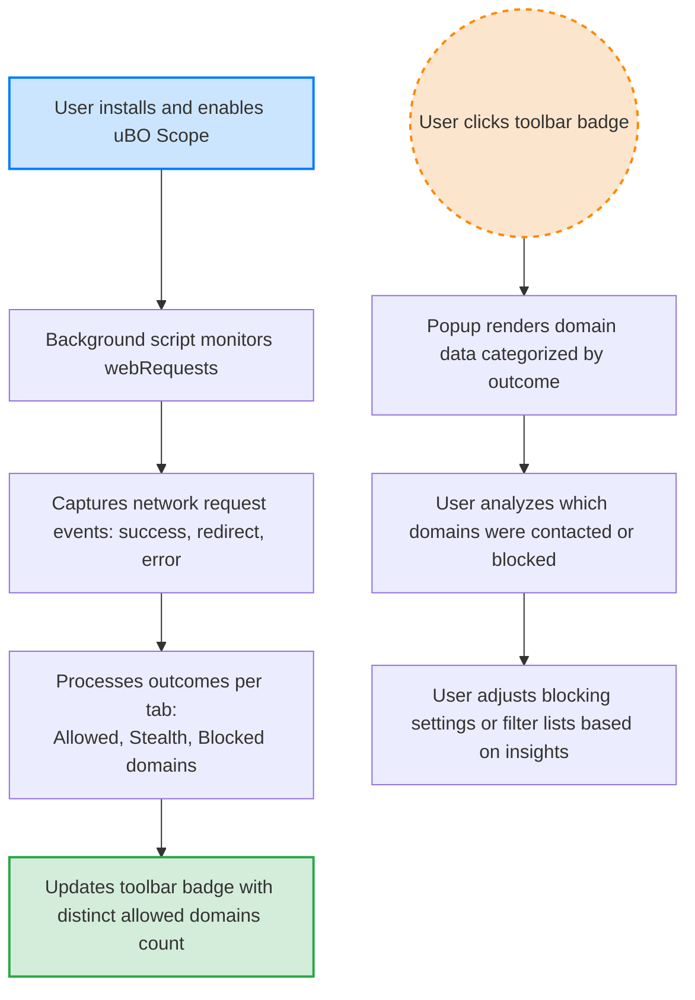

# Target Audience & Use Cases

## Who Benefits Most from uBO Scope?

uBO Scope is designed to serve a diverse group of users who prioritize a transparent and precise understanding of their web browsing connections. Whether your interest lies in privacy, content blocker evaluation, or maintaining filter lists, uBO Scope delivers clear insights to empower your decisions.

### Privacy-Conscious Users
If you want to know exactly where your browser connects when you visit websites, uBO Scope reveals every distinct third-party remote server your browser attempts or succeeds in contacting. This visibility helps you monitor your exposure to third-party tracking and understand how many external entities are involved in loading a page.

### Content Blocker Evaluators
Evaluating content blocker effectiveness can be challenging. Traditional block counts or test pages can mislead, but uBO Scope uses the count of unique third-party domains to provide an unambiguous metric. This helps you objectively verify how well content blockers prevent unwanted connections, debunk myths around block count metrics, and compare blockers in real-world browsing scenarios.

### Filter List Maintainers and Power Users
For those curating or maintaining filter lists, uBO Scope offers detailed observations about network connections that occur under various blocking conditions. It enables you to assess the actual impact of filters and spot connections that might require new rules, even on devices where browser tools or developer consoles are limited or unavailable.

## Practical Scenarios Where uBO Scope Excels

### Validating Content Blocker Effectiveness
Imagine you have multiple content blockers enabled at different times and want to confirm which one results in fewer third-party connections. Rather than relying on block count badges, which can be misleading, uBO Scope tracks distinct third-party domains dynamically. This gives you a grounded, real-time view of your exposure reduction.

### Debunking Myths About Block Counts
Many users assume that a higher block count means better protection. uBO Scope clarifies this misconception by showing that a high block count can coexist with more allowed third-party connections, revealing cases where a blocker may appear aggressive but is effectively less protective.

### Operating on Restricted Platforms
On devices or browsers lacking accessible developer tools or detailed network inspectors, uBO Scope functions as a lightweight companion that exposes the actual remote servers contacted. Whether for a power user or privacy advocate, it shines where other tools do not work.

### Supporting Filter List Tuning
Filter list maintainers can use uBO Scope to discover stealthy or hidden connections ignored by filter lists or identify cases where the blocker’s stealth mode activates. This feedback loop aids in strengthening filter rules and enhancing overall blocking efficacy.

## How Users Typically Engage With uBO Scope

The extension runs silently in the background, capturing network request outcomes for active browser tabs. The toolbar badge consistently displays the number of distinct third-party domains connected during a browsing session, emphasizing that fewer is better.

Clicking the badge opens the popup UI, where users can explore categorized domain data:

- **Not Blocked:** Connections allowed through, potentially legitimate third parties.
- **Stealth-Blocked:** Requests where stealth blocking mechanisms were triggered.
- **Blocked:** Connections actively blocked by content blocking.

This organization helps users quickly understand the nature of connections their browser has made.

By focusing on distinct remote domains—not total request counts—uBO Scope offers a meaningful metric that directly relates to privacy exposure and content blocker trustworthiness.

## Tips for Getting the Most From uBO Scope

- Use uBO Scope alongside your preferred content blockers to see actual third-party connections allowed or blocked.
- Regularly check the badge and popup when visiting privacy-sensitive websites to monitor unexpected third-party connections.
- For filter list maintainers, use the data to identify stealth or blocked connections that might not be fully accounted for by existing filters.
- Remember that legitimate third parties such as CDNs may appear in the count; a low number of distinct domains typically indicates better privacy hygiene.

## Common Pitfalls to Avoid

- Do not confuse block counts from other blockers with uBO Scope’s badge number; the latter represents distinct remote servers, a much clearer privacy metric.
- Avoid relying on “ad blocker test” websites as they produce artificial scenarios; uBO Scope's real-time network listening reflects actual browsing behaviors.
- Understand that uBO Scope depends on the browser’s webRequest API; network requests invisible to this API (e.g., some DNS-based blocking) will not be reported.

---

<uBO Scope empowers its users by placing accurate, actionable connection information right at their fingertips—bridging the gap between privacy theory and real-world browsing experience.>

---

### Related Documentation

- [What is uBO Scope?](./what-is-ubo-scope) — Understand the product’s core purpose and UI overview.
- [Value Proposition & Benefits](./core-value-proposition) — Learn why distinct domain counts matter.
- [Understanding Badge Counts & Domain Data](../../getting-started/first-run-usage/interpreting-badge) — Practical guidance on badge interpretation.
- [Comparing Content Blockers with uBO Scope](../../guides/advanced-usage/analyzing-content-blockers) — Deep dive on evaluating blockers.

### Next Steps

- Install uBO Scope on your browser: [Installation Guide](../../getting-started/setup-install/install-browser)
- Explore Live Data with the popup: [Using the Popup UI](../../guides/getting-started/understanding-the-popup)
- Troubleshoot common issues: [First-Run Problems](../../getting-started/troubleshooting/common-issues)

---  

# Visual Workflow of User Engagement with uBO Scope

This flow illustrates how uBO Scope continuously collects network data to empower users with real-time insights tied directly to their browsing behavior.

---

# Troubleshooting Common Use Cases

<AccordionGroup title="Troubleshooting uBO Scope Usage">
<Accordion title="Why is my badge showing zero despite browsing multiple sites?">
This typically occurs if the browser’s webRequest API is unavailable or limited, or if you are browsing sites with no third-party requests.

**Tips:**
- Confirm uBO Scope has necessary permissions (see installation docs).
- Ensure your browser supports `webRequest` for all protocols you visit.
- Visit popular websites with known third-party content to verify.
</Accordion>
<Accordion title="I see many blocked domains but the badge is still high. Why?">
The badge counts **allowed distinct third-party domains**, not blocked ones.

Even if many connections are blocked, if allowed connections involve several distinct third-party servers, the badge count remains high.

Use this insight to identify real exposure rather than block volume.
</Accordion>
<Accordion title="How can I reset the data if I want to start fresh monitoring?">
Closing browser tabs removes their session data automatically. To clear all data fully, restart the browser or clear session storage manually.

Note that uBO Scope preserves data per tab session and does not keep permanent history.
</Accordion>
</AccordionGroup>

---

# Additional Resources

For source code and contribution details, visit the official [GitHub repository](https://github.com/gorhill/uBO-Scope).

You can also review the [README.md](../README.md) for a high-level introduction and installation links for various browsers.

---

# Summary

This page identifies key user groups who gain the most from uBO Scope, emphasizing achievable benefits and common engagement patterns. It clarifies real-world user scenarios, highlights misconceptions exposed by the tool, and offers practical advice and troubleshooting guidance tailored to empower users in monitoring and controlling third-party connections during browsing.