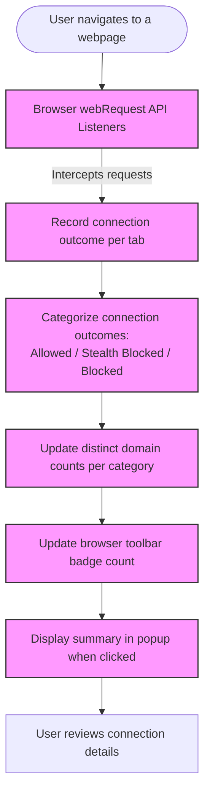

# What is uBO Scope?

## Introduction: Understand Your Web's Third-Party Connections Like Never Before

When browsing the internet, your browser quietly reaches out to numerous third-party servers—some you expect, others you might not even know exist. uBO Scope is a lightweight browser extension designed to shine a transparent light on all these behind-the-scenes network connections, whether they were blocked or allowed by your content blockers.

This extension empowers users with precise insight into every third-party remote server a web page tries to contact. By doing so, it reveals your true privacy exposure and the actual effectiveness of your content blocking tools as you browse.

### Why uBO Scope Matters

- **Transparent Network Visibility:** See every connection attempt to third-party servers, not just those your blockers report.
- **Reliable Privacy Assessment:** Understand how many distinct remote servers you're truly connecting to, helping evaluate your privacy exposure realistically.
- **Content Blocker Validation:** Gauge effectiveness beyond simplistic block counts by observing actual connections allowed or blocked.
- **Lightweight & Non-Intrusive:** Designed as a simple overlay to your browsing experience that doesn’t interfere but informs.
- **Supports Multiple Browsers:** Available for major browsers including Chromium, Firefox, and Safari.

### Who Benefits from uBO Scope?

- Privacy-conscious users seeking a clear view of remote data flows.
- Users wanting to verify if their content blockers really do what they claim.
- Filter list maintainers aiming to evaluate and improve blocking rules.
- Anyone curious about the network footprint of everyday web browsing.

---

## What is uBO Scope? 

uBO Scope is a companion browser extension originally developed alongside uBlock Origin. It **monitors and reports all network connections to third-party servers initiated by web pages you visit**, regardless of whether content blockers act on them.

It relies on browser `webRequest` APIs to listen to and record network requests transparently. Every connection that a page attempts—successful, blocked, or redirected—is logged and categorized. This approach ensures you gain a realistic picture of your browser’s network activity as it happens in the real world, not just what content blockers choose to show.

### Core Purpose

- **Reveal all third-party remote server connections** attempted or successful behind web pages.
- **Distinguish connections based on outcomes:** allowed (not blocked), stealth-blocked (blocked covertly), or outright blocked.
- **Summarize privacy exposure as a count of distinct remote server domains.**

### What Makes uBO Scope Unique

- **Independent of Content Blockers:** It reports connections regardless of which content blockers or DNS blocking are active, as long as the browser exposes them through the `webRequest` API.
- **Focus on Domains, Not Just Requests:** It counts distinct remote server domains, not just raw request counts, giving a meaningful measure of exposure.
- **Debunks Ad Block Myths:** By showing actual network activity, it invalidates false assumptions based solely on block count badges or synthetic ad blocker test pages.
- **Simplicity and Clarity:** Offers straightforward visual feedback via a toolbar badge and a detailed popup panel for exploration.

### How uBO Scope Works Under the Hood (Simplified)

- Listens to all web requests initiated by your browser.
- Categorizes each request by outcome — success, redirect, or error (blocked).
- Tracks distinct domains connected, updating counts per tab.
- Displays summarized counts and detailed lists via a popup interface and badge icons.

> _Note: Though this explanation touches on the underlying mechanism, users interact only with its summary displays and receive actionable privacy insights without technical complexity._

---

## Key Features & Capabilities of uBO Scope

### 1. Comprehensive Connection Monitoring
Tracks every network request using browser APIs, capturing:
- **Allowed Connections:** Servers that responded successfully.
- **Stealth-Blocked Connections:** Connections redirected or blocked invisibly.
- **Blocked Connections:** Requests failing due to active blocking.

### 2. Distinct Domain Counting
Rather than counting each request, uBO Scope tallies the number of **unique third-party domains** connected to, filtering out noise and providing clarity on your real exposure.

### 3. Toolbar Badge Indicator
Displays a count badge on the browser toolbar icon showing the **number of distinct third-party domains connected to** for the active tab. This count helps you quickly understand the privacy footprint of the current page.

### 4. Detailed Popup Panel
Clicking the toolbar icon reveals an easy-to-understand popup summary:
- The main site’s hostname and domain.
- Lists of domains categorized by connection outcomes:
  - **Not Blocked:** Third parties the page connected to successfully.
  - **Stealth-Blocked:** Connections blocked silently, e.g., via redirects.
  - **Blocked:** Explicitly blocked connections.

### 5. Persistence Across Sessions
Uses browser session storage to maintain connection details during browsing sessions, providing consistent tracking as users navigate across tabs.

### 6. Cross-Browser Compatibility
Available for Chromium-based browsers, Firefox, and Safari, ensuring wide accessibility.

---

## Why Should You Care?

### Real Privacy Awareness
With uBO Scope, you no longer have to rely on incomplete or misleading metrics about connections. You gain clear evidence of where your browser is reaching out, helping you make informed decisions about your browsing privacy.

### Better Content Blocker Evaluation
Stop being misled by block count badges or synthetic ad blocker tests. uBO Scope provides a **real-world connection perspective** that shows which and how many third-party servers actually communicate with your browser.

### Practical Use Cases
- **Assess new content blockers:** Are they really reducing your exposure?
- **Audit visited websites:** Find unexpected or excessive third-party connections.
- **Improve filter lists:** Identify connections stealthily allowed or blocked.
- **Educate and debunk:** Understand true network behavior behind the scenes.

### Before & After Example
Without uBO Scope, you might only see block counts or trust ads-blocker tests. With uBO Scope, you see the full list of distinct servers connected to, understanding the concrete effect of your privacy tools and browsing habits.

---

## Getting Started Preview

### Quick Start
Install uBO Scope from your browser’s extension store. After installation, browse as normal. Click the uBO Scope toolbar icon anytime to see a real-time summary of all third-party servers your open tab is contacting.

### Prerequisites
- Browser support for the `webRequest` API (Chromium 122+, Firefox 128+, Safari 18.5+).
- Basic browsing activity to generate meaningful connection data.

### Next Steps
- Explore the popup panel and familiarize yourself with the categorized domain lists.
- Consult related guides on **interpreting the toolbar badge** and **auditing third-party connections**.

---

## Troubleshooting & Best Practices

- **No data in popup?**
  - Confirm that the page is fully loaded.
  - Make sure uBO Scope is active and permissions are granted.

- **Badge count differs from expectations?** Remember that it counts distinct third-party domains connected successfully, not just blocked requests.

- **Why some expected connections don’t appear?**
  - uBO Scope depends on network requests made visible through the browser’s `webRequest` API. Requests outside its scope will not be captured.

- **For maximum insight:** Use alongside uBlock Origin or other blockers, but do not assume their internal block counts reflect your real exposure.

---

## Resources & Further Reading
- GitHub Repository: [https://github.com/gorhill/uBO-Scope](https://github.com/gorhill/uBO-Scope)
- Installation and supported platforms: see browser-specific extension stores
- Related Documentation:
  - [Who Should Use uBO Scope?](#)
  - [Core Features at a Glance](#)
  - [Understanding Toolbar Badge & Count](#)

---

_Discover the invisible network activity of your browsing experience. With uBO Scope, take control of privacy by seeing what your browser truly connects to._

---

# Diagram: Simplified Workflow of uBO Scope Capturing Network Requests

---