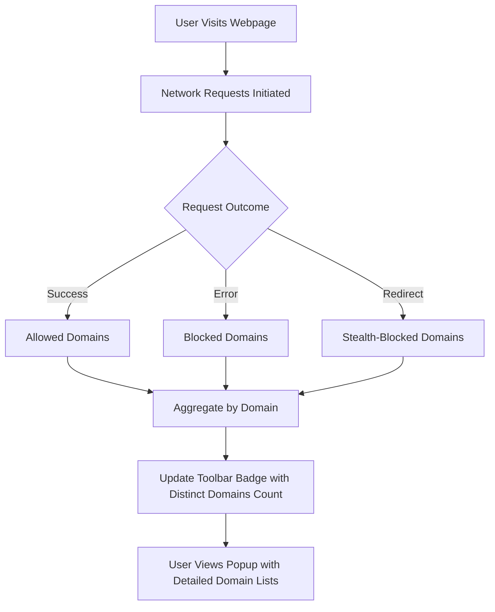

# What is uBO Scope?

## Introduction

In today's web landscape, every webpage you visit silently reaches out to multiple remote servers—some necessary, others potentially invasive. uBO Scope is a lightweight browser extension designed to lift the veil on these hidden connections by revealing every attempted or successful network call made by webpages. It transforms invisible background activities into clear, actionable insights, empowering you to understand exactly which third-party domains your browser communicates with.

## Why uBO Scope Matters

Web users and privacy advocates often face the challenge of discerning the true reach and impact of third-party trackers, content blockers, and network requests hidden in the shadows of webpages. Many content blockers report their effectiveness using block counts or "ad blocker test" sites, but these metrics can be misleading or incomplete. uBO Scope approaches this challenge differently:

- **Clarity on Third-Party Connections:** It reports the **distinct third-party remote servers** contacted, providing a precise count displayed as a badge on the browser toolbar.
- **Independent of Blockers:** It monitors all network requests, regardless of which content blocker or DNS blocking method is in use, as long as the browser's `webRequest` API exposes these events.
- **Reality Check for Myths:** By accurately reporting actual connections, uBO Scope dispels misconceptions such as "higher block count means better blocking" or the validity of fabricated "ad blocker test" webpages.

## What is uBO Scope?

At its core, uBO Scope is a browser extension that monitors network requests initiated by tabs and summarizes the outcomes of those connections to remote third-party servers. It does not block or modify requests — instead, it tracks and reports:

- Domains that connections were **allowed** to reach.
- Domains where connections were **blocked**.
- Domains where **stealth-blocking** occurred (requests redirected or hidden from detection).

By visualizing these outcomes, users gain an unprecedented visibility into the actual network footprint of what they browse.

## How Does uBO Scope Work?

uBO Scope leverages browser APIs, primarily the `webRequest` listener, to watch network traffic transparently:

1. **Monitoring Requests:** Every network request is observed for its destination, status, and outcome.
2. **Classifying Results:** Requests are classified into allowed, blocked, or stealth categories based on the final event — success, error, or redirects.
3. **Counting Domains:** It aggregates counts not just by hostnames but by their corresponding domains, highlighting unique third-party connections.
4. **Displaying Data:** The toolbar icon badge shows the count of distinct remote servers per active tab.

This reporting happens per active tab, enabling direct insights relevant to the site you’re currently browsing.

---

### Example Scenario:
Imagine visiting a news website. While reading articles, your browser silently fetches content from several external domains: some for images, some for analytics, and some for ads. With uBO Scope enabled, you immediately see how many third-party domains are contacted, which ones were blocked or stealth-blocked by your content blockers, and which are allowed, helping you make informed privacy decisions.

## Key Benefits of uBO Scope

- **Empowers Privacy Awareness:** Visualize the true network impact of webpages you visit, beyond what traditional blocker metrics show.
- **Boosts Content Blocker Validation:** Evaluate how effective your blockers are by understanding which third-party servers remain reachable.
- **Fuels Filter List Maintenance:** Provides filter list maintainers and advanced users with raw data about network outcomes, especially on restricted devices where developer tools aren't accessible.
- **Cross-Browser Support:** Available for Chromium-based browsers, Firefox, and Safari, maintaining consistent reporting experience.

## What uBO Scope is Not

- It is **not a content blocker**. It reports but does not interfere with connections.
- It does **not depend on any particular content blocker** to function.
- It does **not rely on ad blocker testing webpages** which often fail to represent real-world conditions.

## Visualizing uBO Scope’s Network Monitoring Flow

This flow encapsulates how uBO Scope observes and categorizes network requests, culminating in meaningful user feedback.

## Summary

uBO Scope takes the guesswork out of network connections made by webpages. By reporting distinct third-party domains and their request outcomes, it breaks down complex browser network activity into clear, actionable insights. This empowers users, filter list maintainers, and privacy advocates to understand and improve their browsing security posture in a transparent, straightforward way.

## Getting Started

To start harnessing this insight, install uBO Scope from the appropriate repository for your browser (available on the [Chrome Web Store](https://chromewebstore.google.com/detail/ubo-scope/bbdpgcaljkaaigfcomhidmneffjjjfgp) and [Firefox Add-ons](https://addons.mozilla.org/firefox/addon/ubo-scope/)). After installation:

- Click the toolbar icon to open the popup panel.
- See a categorized list of all domains connected to by the active tab’s webpage.
- Review the badge count to know how many distinct third-party remote servers your browser connected to.

For a deeper dive into using the popup UI and interpreting connection outcomes, check out the guides on [First Steps & Popup UI Overview](/guides-main/getting-started-ubo-scope/first-steps-and-ui-overview) and [Interpreting Allowed, Blocked, and Stealth Outcomes](/guides-main/everyday-use-patterns/interpreting-request-outcomes).

---

<Tip>
Understanding the number on the toolbar badge is key: a **lower number of connected third-party domains is usually better for privacy**. However, remember that legitimate CDNs and essential third parties might still appear.
</Tip>

<Warning>
Network requests made outside the browser's `webRequest` API scope (e.g., some WebSocket connections) will not be reported by uBO Scope.
</Warning>

---

*Next, explore why using uBO Scope enhances your security workflows in [Why Use uBO Scope?](/overview/introduction-core-value/value-proposition).*

---

## Additional Resources

- [uBO Scope Repository](https://github.com/gorhill/uBO-Scope)
- Browser compatibility details in the product manifest files for [Chromium](../platform/chromium/manifest.json), [Firefox](../platform/firefox/manifest.json), and [Safari](../platform/safari/manifest.json)
- Source code insights for deeper technical understanding can be found in [`js/background.js`](../js/background.js) and [`js/popup.js`](../js/popup.js).
