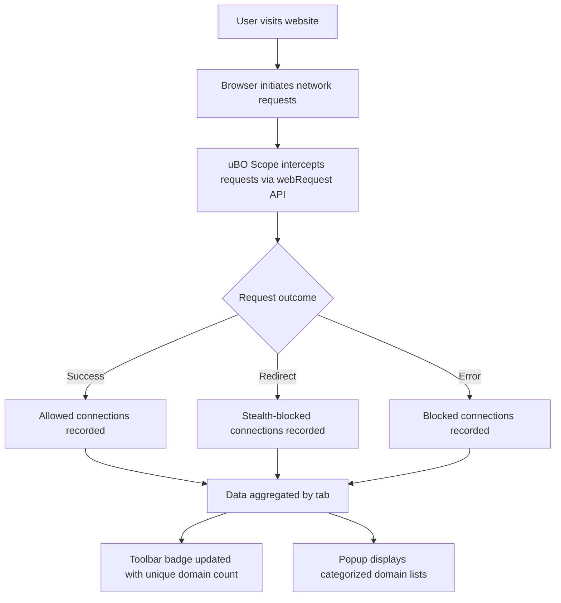

# What is uBO Scope?

## Discover Every Connection Your Browser Makes

When you browse the web, countless unseen connections happen behind the scenes. uBO Scope is the straightforward browser extension designed to reveal **every** network connection—whether it successfully loaded or was blocked—made by the websites you visit. It shines a light on which remote servers your browser tries to contact, giving you unmatched transparency into your web experience.

### Why Should You Pay Attention?

- **Identify third-party servers interacting with your browser.**
- **Understand what content and services are actually loaded or blocked.**
- **Gain control and insight over your online privacy footprint.**
- **Debunk common misconceptions about content blockers and ad blockers.**

### Who Benefits from uBO Scope?

Anyone curious about web privacy — from everyday users concerned about third-party trackers, security researchers diagnosing network activity, to filter list maintainers who want a clear picture of network requests.

---

## What is uBO Scope?

uBO Scope is a minimalist browser extension that monitors **all outgoing network requests** your browser initiates from websites you visit. It tracks attempted and successful connections to remote servers, reporting **distinct third-party domains** that your browser communicates with.

At its core, uBO Scope uses your browser’s native `webRequest` API to listen to network requests and records their outcomes, regardless of whatever content-blocking tool is currently active. It acts as a neutral observer, showing you the facts of what your browser tries to fetch.

### Core Purpose

uBO Scope solves the problem of **hidden network activity** which can be opaque, even with existing content blockers. Rather than showing just what is blocked or allowed, it gives you raw visibility into every target server your browser contacts — allowing you to:

- Detect if a website tries to connect to unexpected third-party servers.
- Verify the true effectiveness of your existing content blockers.
- Understand privacy implications of the web traffic generated by pages.

### What Makes uBO Scope Unique?

- It reports **distinct third-party servers**, giving a more meaningful privacy metric than generic block counts.
- It relies directly on browser-provided network events, so it reflects reality accurately regardless of DNS-based blocking or other methods.
- It works across popular browsers supporting the `webRequest` API, running silently with minimal user interface clutter.

---

## Key Features & Capabilities

- **Accurate Network Request Monitoring:** Tracks network requests for HTTP, HTTPS, WS, and WSS protocols as reported by browser internals.
- **Distinct Domain Counting:** Badge count on the toolbar icon shows the number of unique third-party domains connected.
- **Detailed Outcomes:** Differentiates requests by their outcome — allowed, stealth-blocked (redirects), or blocked — providing clarity on network behaviors.
- **Unbiased Measurement:** Independent of any particular content blocker; detects network requests regardless of other blocking layers.
- **Lightweight and Transparent:** Minimal background processing, focusing on delivering straightforward network visibility.

### Real-World Scenario

Imagine visiting a news website. With uBO Scope, you immediately see not only the main site’s domains but all third-party servers contacted — from ad networks to CDN providers. If you use a content blocker, uBO Scope reveals the difference between requests blocked and those quietly allowed, helping you make informed decisions about your privacy tools.

---

## Why Should You Care?

### Outcomes You Can Expect

- **Enhanced Web Privacy Awareness:** Know precisely what servers your browser talks to, avoiding hidden trackers.
- **Reliable Content Blocker Assessment:** Instead of relying on misleading block counts or dodgy online tests, you get a clear count of distinct servers allowed, the real privacy indicator.
- **Better Ad Blocker Myth Busting:** Understand that a higher block count doesn’t mean better protection; it might mask more permitted third-party connections.

### Common Use Cases

- **For Privacy-Conscious Users:** Monitor and limit exposure to third-party tracking.
- **For Security Analysts:** Track network connections during threat assessments.
- **For Filter List Maintainers:** Analyze real-world network requests to optimize block lists.

### Before and After Using uBO Scope

| Without uBO Scope                             | With uBO Scope                              |
|----------------------------------------------|---------------------------------------------|
| Blind trust in content blocker block counts  | Clear knowledge of unique third-party domains connected |
| Rely on unreliable 'ad blocker test' sites   | See real network request outcomes as browser reports |
| Uncertainty about unseen connections          | Confidence in browser’s network activity visibility |

### Efficiency Gains & ROI

- Saves time diagnosing content blocker effectiveness without complex tools.
- Empowers smarter privacy decisions based on observed data, not guesswork.

---

## Getting Started Preview

Starting with uBO Scope is simple:

1. **Install uBO Scope** from your browser’s official add-on store:
   - [Chrome Web Store](https://chromewebstore.google.com/detail/ubo-scope/bbdpgcaljkaaigfcomhidmneffjjjfgp)
   - [Firefox Add-ons](https://addons.mozilla.org/firefox/addon/ubo-scope/)

2. **Browse as usual.** The toolbar badge will update showing the count of distinct third-party servers your browser connects to.

3. **Click the icon** to open the popup and explore detailed lists of allowed, stealth-blocked, and blocked domains.

### Prerequisites

- A modern Chromium-based or Firefox browser supporting the `webRequest` API.
- No special configuration needed beyond installation.

### Next Steps

- Visit the **"Exploring the Popup"** page to learn how to interpret detailed connection data.
- Review **"Understanding the Toolbar Badge Count"** to make sense of the numbers.
- Discover how to use uBO Scope for advanced scenarios like filter list maintenance.

---

## How uBO Scope Fits Into Your Browser

uBO Scope integrates seamlessly with your browser’s native APIs to observe network activity without interfering. It leverages the `webRequest` listener to monitor requests in real-time and aggregates data per browser tab.

Here’s the basic flow:

This approach ensures transparent visibility without affecting your browsing experience or the performance of other blockers.

---

## Practical Tips and Best Practices

- A **lower badge count means fewer third-party connections**, which generally indicates a higher privacy level.
- Not all third-party domains are harmful; common CDN providers typically appear and are legitimate.
- Use uBO Scope alongside your preferred content blocker for full-spectrum insight.
- Avoid relying on ad blocker test pages; use uBO Scope’s metrics for accurate evaluation.
- Check the popup regularly to understand what’s been allowed or blocked per tab.

---

## Troubleshooting Common Issues

- **No badge count appears?** Ensure the extension is enabled and your browser supports the `webRequest` API.
- **Data seems outdated?** The extension caches session data, but it refreshes regularly as you browse.
- **Discrepancies in block counts?** Remember uBO Scope shows distinct third-party servers, not raw block counts.

For more troubleshooting, refer to the Troubleshooting section in the Getting Started documentation.

---

## Summary

uBO Scope equips you with factual, actionable knowledge about every network connection your browser attempts. It brings clarity and control to your web privacy journey — shedding light on hidden trackers, verifying blockers, and debunking myths with hard data.

Install it today and take back control of your browsing transparency.

---

For full installation details and troubleshooting, see the [Installation Instructions](/getting-started/installation-setup/installation-instructions) and [Quick Validation guide](/getting-started/usage-validation/quick-validation).
