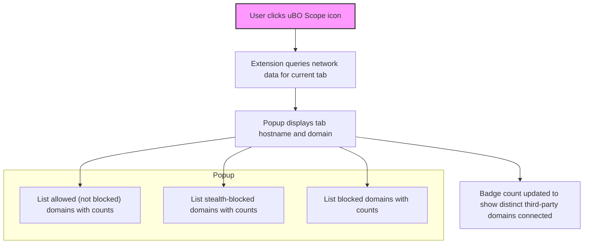

# Key Features at a Glance

Discover at a glance why uBO Scope stands apart as an invaluable network connection reporting tool for privacy-conscious users, filter list maintainers, and technical evaluators alike. This page highlights the core capabilities that empower you to see the true footprint of webpages, debunk common myths, and gain granular real-time insight into network activity.

---

## Transparent Network Connection Reporting

uBO Scope brings clarity where complexity and misinformation often cloud your understanding of web browsing. It meticulously tracks and reports every network connection attempt made by a webpage, categorizing them into three distinct outcomes:

- **Allowed Connections:** Network requests that succeed and are permitted to communicate with remote servers.
- **Stealth-Blocked Connections:** Requests silently redirected or blocked without visible traces, often by stealth techniques used by some content blockers.
- **Blocked Connections:** Network attempts explicitly prevented from reaching their destination.

All this data is displayed in an intuitive popup interface with distinct sections, providing an immediate visual summary of network activity for the active tab.

### Example:

When visiting a webpage, you can see how many third-party domains were connected to, which were blocked, and which were stealthily blocked – giving you a factual basis to assess your privacy stance.

---

## Cross-Browser Support

uBO Scope supports **all major browsers**—including Chrome, Firefox, and Safari—leveraging each browser’s `webRequest` API to report network activity accurately. This ensures consistent, reliable insight no matter your browsing environment.

Its multi-browser compatibility means you don’t have to switch tools when switching browsers, keeping your analysis consistent.

---

## Granular Badge Counts

The toolbar icon dynamically displays a badge indicating the **number of distinct third-party remote servers actually connected to** during browsing. This count excludes internal or first-party domains and focuses on third parties that potentially impact your privacy.

- A **lower badge count** signifies fewer distinct third-parties connected, which typically equates to better privacy and less exposure.
- The badge updates in near real-time as you navigate.

Unlike simple block counters, this metric focuses on meaningful privacy impact rather than just listing block attempts, helping users understand the real network footprint.

---

## Debunking Common Misconceptions

This tool addresses two persistent myths in content blocking:

1. **Block Count Isn't Always Better:** A higher block count badge (like those shown by other blockers) does not guarantee better privacy or blocking effectiveness. uBO Scope focuses on how many distinct third-party servers you actually connect to, which matters more for privacy.

2. **Ad Block Tester Pages Are Misleading:** Many so-called "ad blocker test" websites create spoofed network requests and cannot reliably measure stealth blocking or real-world content blocking.

uBO Scope cuts through these misconceptions by reporting factual, network-layer data rather than relying on heuristics or scripted tests.

---

## Intuitive Popup Interface

Upon clicking the uBO Scope toolbar icon, users see a clean, organized popup panel summarizing network connection states for the current tab. Key elements include:

- Hostname and domain associated with the current page
- Summary count of connected domains
- Separate panels for **not blocked (allowed)**, **stealth-blocked**, and **blocked** domains
- For each domain, a badge count displays how many requests were associated with it

This design helps users quickly assess third-party exposure and the effectiveness of their content blocking setup.

---

## Real-World Scenarios

- **Privacy-Conscious Browsers:** Instantly know how many and which external domains a site connects to, beyond what your content blockers report.
- **Filter List Maintainers:** Validate the true outcome of network requests independent of content blockers in use or DNS-level filtering.
- **Technical Evaluators:** Cross-check stealth blocking and actual network activity under different blockers or configurations.

---

## Best Practices & Tips

- Use the badge count as a privacy impact metric — fewer distinct third parties generally means less tracking.
- Consult the popup regularly on critical or sensitive sites to verify if stealth blocking or unexpected connections occur.
- Cross-reference with your content blocker’s block list for comprehensive privacy auditing.

---

## Next Steps

To get hands-on:

- Review the **[Getting Started](../getting-started/essentials/prerequisites)** page to meet system requirements.
- Follow installation guides for your preferred browser on **[Installation on Chrome, Firefox, and Safari](../getting-started/essentials/installation)**.
- Learn to interpret the badge counts and domain lists effectively via **[Interpreting Badge Counts Effectively](../../guides/practical-use-cases/interpreting-badge-counts)**.

 

---

## Visual Summary: uBO Scope Popup Data Flow

This flow reflects how the popup UI intuitively combines data to inform you of all connection outcomes.

---

## Summary

This page summarized the essential features that make uBO Scope a powerful transparency and privacy tool:

- Transparent and categorized network connection reporting
- Broad browser support with consistent behavior
- Meaningful badge counts focusing on distinct third-party connections
- Busting common myths about blocking and testing
- Intuitive and actionable user interface

Leverage these features to gain clear, factual insights into the network behavior of any webpage you visit, empowering better privacy decisions.

---

For detailed usage tips, see the **[Guides section](../../guides/practical-use-cases/)** and to deepen your understanding of how uBO Scope fits into your privacy toolkit, browse the **[What is uBO Scope?](../introduction-value/what-is-ubo-scope)** and **[Who Should Use uBO Scope?](../introduction-value/who-should-use)** pages.

---

[GitHub Repository](https://github.com/gorhill/uBO-Scope) | [Installation Instructions](../getting-started/essentials/installation) | [Interpreting Badge Counts](../../guides/practical-use-cases/interpreting-badge-counts)