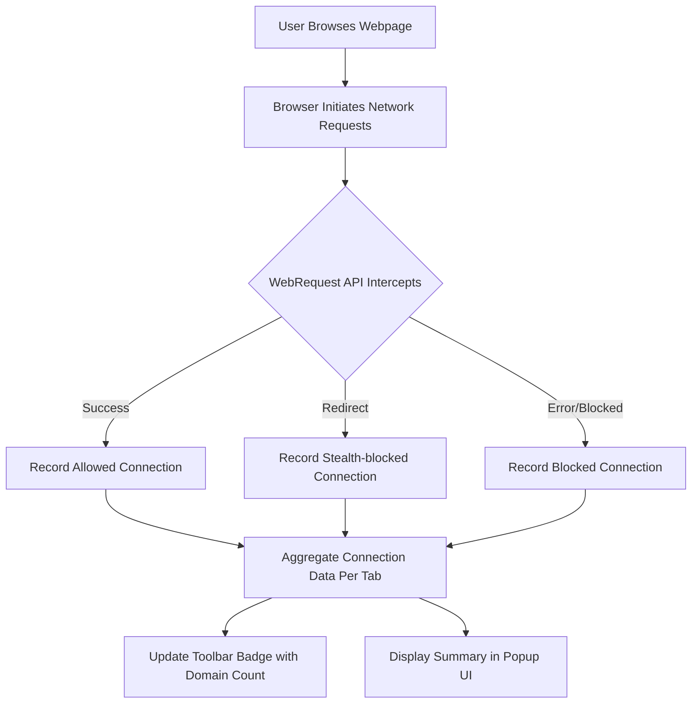

# What is uBO Scope?

## Discover Every Connection Your Browser Makes — Transparently and Reliably

uBO Scope is a streamlined browser extension designed to reveal all network connections—from every web page you visit—that are either attempted or successfully made to remote servers. Regardless of which content blocker you use or even if DNS-based blocking is in place, uBO Scope provides you with a clear, unbiased window into every third-party connection initiated from your browser.

### Why This Matters

In today's web, websites automatically connect to numerous third-party servers—often without your knowledge. These connections can impact your privacy and security, as third parties might track user activity or serve unwanted content. While content blockers can hide or block many such requests, they don't always expose the full extent of a page's network activity.

uBO Scope cuts through this complexity by reporting all network request outcomes transparently, empowering privacy- and security-conscious users to see exactly which remote servers a page interacts with, regardless of how or whether those connections were blocked.

---

## What Is uBO Scope?

At its core, uBO Scope is a simple, companion browser extension to uBlock Origin and other blockers that leverages the browser's `webRequest` API to monitor and record every network connection attempt made by web pages.

- **Purpose:** To reveal all attempted or successful network connections to remote servers.
- **How It Works:** It listens to browser network events and classifies connection results into allowed, stealth-blocked, or blocked categories.
- **Result:** You get an accurate, real-time summary of all third-party network activity in an easy-to-read format.

Unlike traditional content blockers that focus on blocking unwanted content, uBO Scope’s goal is *transparency* rather than enforcement.

---

## Core Value Propositions

- **Complete Visibility Over Network Connections:** See every connection attempted by web pages, including those made stealthily or blocked by your content blocker.
- **Content Blocker Agnostic:** Works alongside any content blocker or DNS-based system, offering an independent audit of network activity.
- **Privacy & Security Insight:** Understand exactly which third-party domains your browser communicates with, highlighting potential privacy risks.
- **Badge Count Indicator:** The toolbar icon shows the number of distinct third-party domains contacted, helping you quickly assess the network scope of the current page.

---

## How uBO Scope Helps You

### Real-World Scenario
Imagine browsing your favorite news site. While the visible content loads seamlessly, behind the scenes dozens of third-party servers may be contacted to fetch ads, trackers, or analytics data. Your content blocker might silently allow some of these connections or block others, but without a clear overview.

With uBO Scope installed, you open its popup interface at any time to see a breakdown of:

- **Allowed connections:** Domains your browser successfully connected to.
- **Stealth-blocked connections:** Requests that were quietly intercepted or redirected.
- **Blocked connections:** Connections your content blocker or browser prevented.

This kind of insight helps you:

- Audit your content blockers’ effectiveness.
- Identify potentially suspicious domains.
- Make informed decisions about your privacy settings.

### Busting Common Misconceptions

- **Higher Block Counts Don’t Always Mean Better Blocking:** A blocker reporting high numbers of blocked requests might still allow connections to a wide range of third-party servers. uBO Scope’s focus on distinct connected domains clarifies the real network impact.
- **Fake 'Ad Blocker Tests' Are Misleading:** Many test sites use contrived network request patterns. uBO Scope shows you what happens in real browsing scenarios.

---

## How uBO Scope Fits Into Your Workflow

1. **Install the Extension:** Supports major browsers like Chrome, Firefox, Safari, and Chromium-based browsers.
2. **Browse Normally:** uBO Scope passively listens in the background without altering page behavior.
3. **Open the Popup:** Click the extension icon anytime to open a summary of remote server connections associated with the current tab.
4. **Interpret the Data:** Use the organized breakdown (not blocked, stealth-blocked, blocked) to understand your network footprint.

---

## Inside the Extension Interface

When you open uBO Scope's popup UI, you’ll find:

- **Domain Count Summary:** How many distinct third-party domains were contacted.
- **Sections for Connection Outcomes:** Separate lists for connections that were allowed, stealth-blocked, or blocked.
- **Domain Frequency Indicators:** Showing how many times each domain was requested.

This structured presentation allows quick assessment of the network behavior of the active webpage.

---

## Practical Tips & Best Practices

- **Use Alongside Your Content Blocker:** uBO Scope complements, it does not replace blocking tools. Use it to validate what your blocker is really doing.
- **Monitor Suspicious Domains:** If you see unexpected or unknown domains making connections, investigate or adjust your blocker settings.
- **Keep in Mind Browser Limitations:** uBO Scope relies on the browser’s `webRequest` API. Network activity invisible to this API (like some native DNS resolutions) will not be reported.

---

## Troubleshooting Common Scenarios

- **No Data in Popup:** Ensure the extension has appropriate permissions and the active tab is loaded and making network requests.
- **Unexpectedly High Counts:** Some legitimate sites contact multiple CDNs—this is normal. Focus on distinct third-party domains, not just raw counts.

---

## Summary

uBO Scope empowers you with *full transparency* into your browser’s network activity. It's an essential tool for anyone serious about privacy, security, or understanding the complex web of third-party requests modern webpages generate.

Enjoy uncompromising insight that works regardless of your choice of content blocker.

---

## Additional Resources

- [Installing uBO Scope](https://github.com/gorhill/uBO-Scope#getting-started-installation)
- [Using uBO Scope Alongside Content Blockers](https://github.com/gorhill/uBO-Scope#integration-and-compatibility)
- [Understanding Badge Counts and Outcomes](https://github.com/gorhill/uBO-Scope#guides-core-workflows-understanding-badge-and-outcomes)

---

## Diagram: How uBO Scope Monitors Network Connections

This flow shows how uBO Scope passively tracks network activity and presents it back to the user.

---