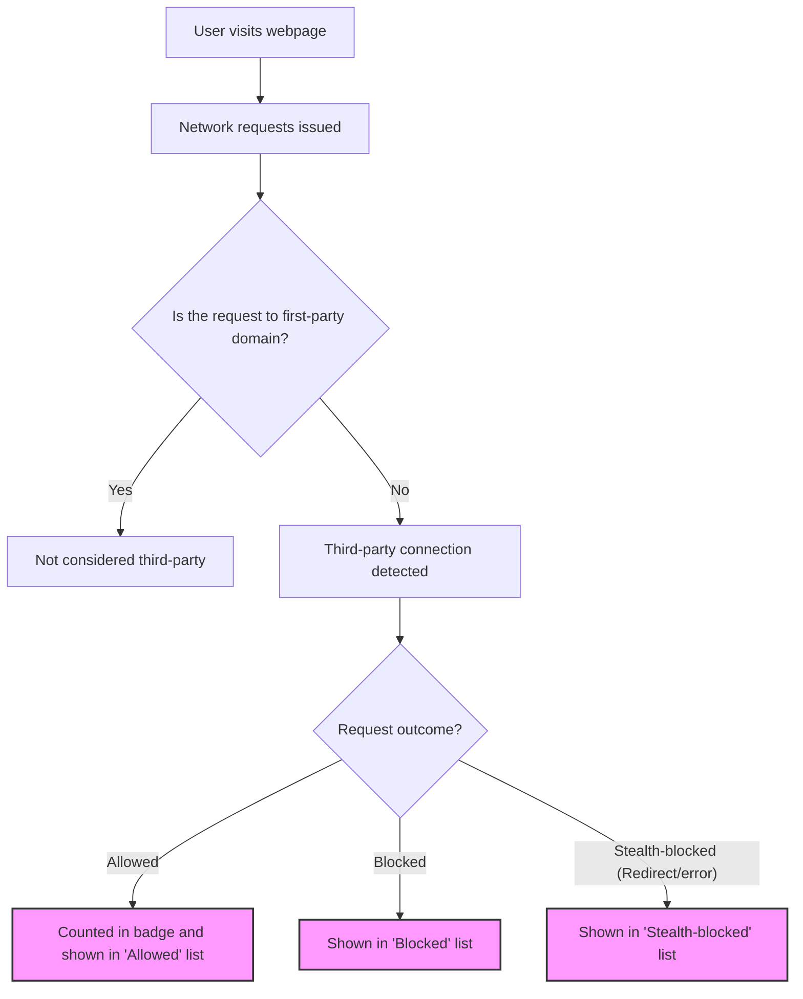

# Core Concepts & Terminology

Understanding the core terminology behind uBO Scope is essential to fully grasp the insights it provides about your web browsing activity. This page clarifies key concepts such as what a 'third-party connection' means, how the toolbar badge count reflects remote server interactions, and explains the categories of network request outcomes: allowed, blocked, and stealth-blocked. Mastering these terms empowers you to interpret uBO Scope’s data correctly and make informed privacy decisions.

---

## What Is a Third-Party Connection?

A 'third-party connection' in the context of uBO Scope refers to a network request made by a webpage to a domain other than the main website domain you are visiting. This is often where content blockers focus their control because third-party domains frequently serve ads, tracking scripts, or other external resources.

### Key Points:
- **First-party:** The domain of the main page you visit (e.g., example.com).
- **Third-party:** Any other domain contacted by the page (e.g., cdn.example.com is third-party if the main domain is example.com; google-analytics.com is also third-party).

uBO Scope monitors these third-party connections, revealing both those that succeed and those that are prevented, to give you comprehensive visibility into external interactions.

---

## Understanding the Badge Count

The badge on the toolbar icon is a distinctive feature of uBO Scope. It displays the **count of distinct third-party remote servers to which your browser has established or attempted connections for the active tab**.

### What It Represents:
- It counts **unique third-party domains**, not individual requests.
- A **lower badge number is better**, indicating fewer external servers are contacted, which often signifies better privacy.
- The badge does **not** count how many requests were blocked or allowed but focuses on the diversity of third-party connections.

### Practical Example:
If you visit a news site and see a badge count of "5", it means the webpage reached out to five different third-party servers.

---

## Categories of Network Request Outcomes

uBO Scope classifies each third-party connection into one of three outcome categories based on the network request’s fate:

### 1. Allowed
- These are connections that were **permitted and successful**.
- Resources from these domains loaded completely (e.g., images, scripts).
- Typical legitimate third parties here include CDNs or essential analytics services.

### 2. Blocked
- These connections were **explicitly denied or failed**.
- Blocked requests could be by your content blocker settings or network errors.
- Blocking reduces tracking but not all blocked domains are harmful.

### 3. Stealth-Blocked
- These are connections that were **redirected or canceled in subtle ways**.
- These do not appear as conventional blocked requests and may bypass visible blocker tallies.
- Stealth blocking is important to catch connections that evade normal detection.

By differentiating these states, uBO Scope gives users a more nuanced picture than simple block/allow stats.

---

## Why These Concepts Matter

Knowing these core terms helps you:

- **Interpret the badge count properly**: understand it reflects domain diversity, not raw block counts
- **Make sense of the detailed popup view**: categorize and analyze allowed, blocked, and stealth-blocked domains
- **Evaluate third-party risk with nuance**: not all connections are bad, and some might be stealth-blocked to preserve privacy
- **Assess content blocker effectiveness** beyond simply counting blocked requests

---

## How uBO Scope Uses These Concepts Together

When you visit a webpage:

- uBO Scope tracks every network request using the browser’s `webRequest` API.
- It identifies the hostname and derives the effective domain using the **public suffix list**.
- Requests are classified into allowed, blocked, or stealth-blocked based on their events (success, error, redirect).
- This data is aggregated for the tab:
  - Counting distinct third-party domains contacted
  - Separating them by outcome
- The badge updates with the count of all distinct allowed third-party domains
- The popup displays detailed lists in three sections by category

---

## Practical Tips

- Use the badge count as your quick privacy health indicator—less is better.
- Explore the popup to see which domains your current tab talks to.
- Recognize that a stealth-blocked request means a sneaky prevention, often invisible elsewhere.
- Don't be alarmed by all third parties; many are essential (e.g., CDNs).

---

## Common Misunderstandings

- **"Higher block count means better blocking"**: uBO Scope proves this false by focusing on distinct third-party domains rather than block numbers, highlighting situations where a blocker having many block events can correspond with more allowed third-party connections.

- **"Ad blocker test pages show accurate blocker performance"**: These tests are unreliable because they use fabricated scenarios and can't detect stealth blocking mechanisms. uBO Scope's data reflects actual real-world connections.

---

## Summary Diagram: uBO Scope Terminology Workflow

---

By mastering these foundational concepts, you gain the clarity and power to use uBO Scope effectively for privacy insight, filter list tuning, and understanding web tracking in your daily browsing.

---

For more in-depth understanding, consider visiting the following pages:
- [What is uBO Scope?](../introduction/what-is-ubo-scope)
- [Why Use uBO Scope? Key Value & Use Cases](../introduction/value-prop-usecases)

Additional guides on installation and usage flow can be found under the "Getting Started" and "Guides" sections of this documentation.

---

*This documentation references the Public Suffix List to accurately identify effective domain boundaries, enabling precise aggregation of third-party connections.*

---