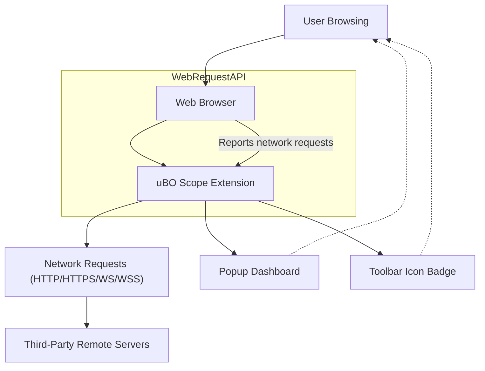

# What is uBO Scope?

## Empowering Users with Transparent Web Connection Insights

**uBO Scope** is a browser extension developed as a companion tool to uBlock Origin. Its mission is clear and crucial: to reveal every connection a webpage attempts or successfully makes to remote servers, irrespective of content blockers or DNS configurations in place. This commitment to transparency offers users a direct window into the web's network activity, empowering them with trustworthy, actionable insights about third-party requests.

### Why uBO Scope Matters

On the modern web, pages often load resources from multiple third-party domains, which may impact privacy, security, and performance. Users want to know exactly which remote servers are contacted — but existing content blockers and DNS filtering can obscure that reality. uBO Scope breaks through this opacity by providing an accurate, unfiltered view of all network requests made by your browser, including those allowed, blocked, or stealthily redirected.

---

## What Is uBO Scope and What Does It Do?

At its core, uBO Scope is a lightweight extension that listens to your browser's network activity via the `webRequest` API and measures all outbound connections initiated by the webpages you visit. It detects these connections even if other blockers or filters intervene, as long as the browser itself registers the request. 

This reveals:

- **Successful Connections:** Requests that your browser allowed.
- **Blocked Connections:** Requests that were prevented from loading.
- **Stealth-Blocked Connections:** Requests redirected or interfered with in subtle ways.

By presenting this data clearly, uBO Scope lets you see exactly which third-party domains engage with your browsing sessions.

### What Problems Does It Solve?

- **Transparency:** Overcomes the lack of visibility caused by various content blockers and DNS filters.
- **Trustworthy Measurements:** Provides objective counts of third-party connections, showing the actual number of distinct remote hosts contacted.
- **Myth Debunking:** Clarifies common misconceptions about blocker reliability based on block counts or test sites.

### How Is It Different?

- Unlike many content blockers, uBO Scope does not change or intervene in your browsing experience. It solely **measures and reports**.
- It tracks network requests with precision, sidestepping inaccuracies caused by stealth blocking techniques.
- Works seamlessly with any existing content blocker, serving as an independent, reliable auditor.

## Key Features of uBO Scope

- **Comprehensive Connection Tracking:** Records all outgoing HTTP, HTTPS, WS, and WSS connections from active tabs.
- **Domain-level Aggregation:** Groups requests by domains and hostnames, showing clear counts of attempts.
- **Real-time Badge Reporting:** Displays the number of distinct third-party domains connected to directly in the toolbar icon.
- **Clear Outcome Categorization:** Distinguishes connections into allowed, blocked, and stealth-blocked sets for easy understanding.
- **Persistence Across Sessions:** Saves connection data during your browsing session to maintain continuity.

## Real-World Benefits

Imagine you want to audit a website you frequent or a new service you plan to use. uBO Scope instantly tells you how many third-party services it contacts and whether those requests are being successfully blocked or allowed. This empowers you to:

- Protect your privacy by identifying unexpected or excessive third-party activity.
- Verify the effectiveness of your existing blockers.
- Understand network behavior without needing to be a network expert.

## Using uBO Scope: What to Expect

When you install and open uBO Scope, its popup dashboard summarizes:

- The hostname and domain of the current tab.
- Counts and lists of domains with requests that were allowed, blocked, or stealth-blocked.
- A concise total of distinct connected domains shown directly on the extension icon badge.

All this is presented in a clean, easy-to-read interface, making complex browser network activity understandable at a glance.

## Tips for Success

- Use the badge count as a guide: a **lower number** indicates fewer distinct third-party connections, which generally means better privacy.
- Recognize that not all third parties are harmful—some are essential CDNs.
- Combine uBO Scope with your preferred blockers for an optimal mix of visibility and protection.

## Troubleshooting & Common Scenarios

- If uBO Scope shows no data, ensure the extension’s permissions are granted and you're viewing an active tab.
- A high count of stealth-blocked domains may indicate filters or blockers that redirect requests.
- Unexpectedly low counts might stem from network requests made outside the browser’s webRequest API (rare but possible).

## Getting Started

- Install uBO Scope from your browser’s extension store.
- Activate it on tabs of interest.
- Open the popup to view current connection insights.

For detailed installation instructions and first-use experience, see [Installing uBO Scope on Your Browser](../getting-started/introduction-and-installation/installation-instructions) and [Getting Results: Your First Run](../getting-started/first-use-and-validation/first-run-experience).

---

## Diagram: How uBO Scope Fits into Your Browsing Workflow

This flow outlines how uBO Scope passively monitors and reports your browser’s outbound connections, giving you real-time feedback.

---

For more advanced explanations, configuration guidance, and usage scenarios, explore related documentation pages:

- [Product Value Proposition](/overview/introduction_value/value_proposition)
- [Tracking All Remote Connections on a Webpage](/guides/core-workflows/tracking-remote-connections)
- [Debunking Badge Count Myths](/guides/core-workflows/debunking-badge-count-myths)

For installation details, prerequisites, and troubleshooting advice, please visit the Getting Started section.

---

**Discover the unseen. Trust your connection insights. Choose uBO Scope.**

---