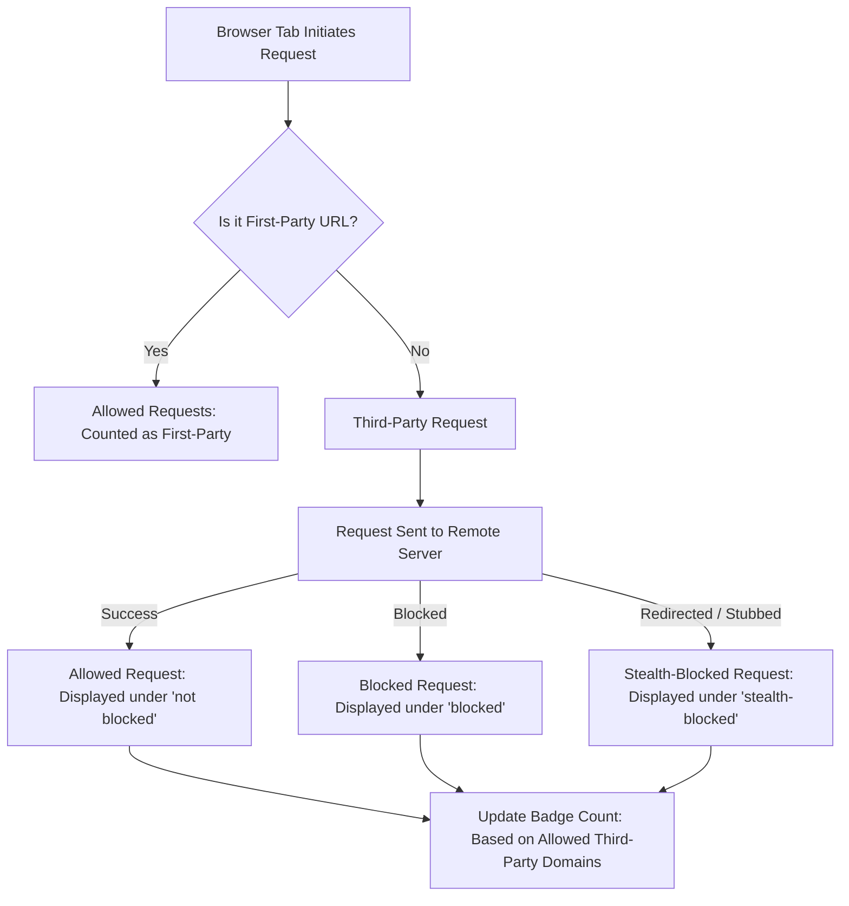

# Core Concepts and Terminology

Understanding the foundational language of uBO Scope unlocks the power to make sense of its insights and metrics. This page defines crucial domain-specific terms and explains key mechanisms such as how distinct third-party remote servers are identified, the significance of the toolbar badge count, what "webRequest API visibility" entails, and the differences between allowed, stealth-blocked, and blocked requests. Establishing this shared vocabulary equips you to fully grasp what uBO Scope reveals about your browsing activity.

---

## Distinct Third-Party Remote Servers

At the heart of uBO Scope lies the concept of *distinct third-party remote servers.* These are the unique network domains contacted by your browser's active tab, excluding the main first-party domain you are visiting.

- **Why third-party?**
  Because third-party connections typically represent external services such as advertising networks, trackers, CDNs, or analytics providers that your visited website triggers.
- **How unique?** 
  Each domain is counted only once regardless of how many resources or requests come from it, giving a more meaningful picture of exposure than raw block or request counts.
- **Example:**
  If you visit `example.com` and your browser connects to `cdn.example.com` (first-party) and also `ads.adnetwork.com` and `analytics.tracker.io`, there are **2 distinct third-party servers** counted: `adnetwork.com` and `tracker.io`.

This unique domain count is the number displayed as the toolbar badge on the extension icon, helping you quickly assess the breadth of external connections.

---

## Badge Count: What Does It Represent?

The badge count on uBO Scope's toolbar icon shows the **number of distinct third-party remote servers actually connected** during the current tab's session.

- A *higher count* means your browser has connected to more unique external domains.
- A *lower count* generally indicates fewer external connections, which is usually favorable for privacy.

Unlike other content blockers that often display only the number of blocked requests, uBO Scope’s badge focuses on what connections succeeded, giving a direct measure of your effective exposure to third parties.

---

## webRequest API Visibility

uBO Scope leverages the browser's `webRequest` API to monitor and report network activity for each tab. Understanding this visibility is key:

- **What is webRequest API?**
  A browser interface that allows extensions to observe and analyze network requests made by web pages.
- **Why is it essential?**
  uBO Scope depends entirely on this API to detect when connections are attempted and their outcomes.
- **Limitations:**
  Network requests that occur outside the API's reach (for example, some browser internals or requests made by other system components) are invisible to uBO Scope.

Because all content blockers rely on the browser's networking stack, uBO Scope ensures that it measures *all* network requests the browser handles, regardless of DNS or other filtering layers, as long as the `webRequest` API reports them.

---

## Understanding Request Outcomes: Allowed, Blocked, and Stealth-Blocked

Network requests monitored by uBO Scope are categorized into three distinct outcomes based on what actually happened:

### Allowed Requests

- Requests that completed successfully and loaded resources from remote servers.
- Domains behind allowed requests are listed under “not blocked”.
- These represent third-party connections your browser accessed during the tab session.

### Blocked Requests

- Requests that failed because they were actively blocked by content blockers or network policies (e.g., DNS blocking).
- These domains appear in the “blocked” category.
- Blocked requests indicate external servers your browser attempted to contact, but which were prevented.

### Stealth-Blocked Requests

- Requests intentionally hidden or redirected by blockers to avoid detection by web pages.
- These are recorded by uBO Scope as “stealth-blocked.”
- Such stealth blocking techniques help maintain site functionality while blocking undesired content silently.

This triad categorization enables users to differentiate between the requests that got through, those fully blocked, and those stealthily blocked — providing a comprehensive privacy snapshot.

---

## Shared Vocabulary for Users

Establishing common terms unites users in understanding what uBO Scope reports. Here are critical definitions:

| Term                    | Definition                                                                                   |
|-------------------------|----------------------------------------------------------------------------------------------|
| *First-party domain*    | The main domain of the tab's loaded webpage.                                                 |
| *Third-party domain*    | Any domain different from the first-party domain, representing external servers contacted.    |
| *Domain*                | The registered domain plus public suffix, e.g. `example.com` derived from a hostname.        |
| *Hostname*              | The complete host address, e.g. `media.example.com`.                                        |
| *Allowed request*       | A network request that succeeded and loaded content.                                        |
| *Blocked request*       | A network request blocked by a filter or network policy.                                    |
| *Stealth-blocked request* | A request prevented in a way invisible to the web page, often by redirecting or stubbing.  |
| *Badge count*           | Number of unique third-party domains successfully connected during the tab session.          |
| *webRequest API*        | The browser API used by uBO Scope to observe network requests.                               |

---

## Practical Examples

Imagine you open a news site:

- Your browser requests the main domain `news.example.com` — this is your first-party.
- The page loads images and scripts from `cdn.news.com` (first-party CDN) - **not third-party**.
- Simultaneously, it connects to ad networks: `ads.adserver.com` and analytics services: `stats.analytics.net`.
- Some ad requests are blocked.
- Some trackers are stealth-blocked and remain hidden from the page.

uBO Scope will:

- Count `ads.adserver.com` and `stats.analytics.net` as distinct third-parties if allowed.
- Show them under allowed or stealth-blocked or blocked lists accordingly.
- Display the badge count as the total of allowed distinct third-party domains.

This clear segmentation helps you understand exactly which third-party servers your browsing session reached and how effective the blocking is.

---

## Best Practices & Tips

- Use the **badge count** as your primary privacy metric; aim for a lower number.
- Recognize that some third-party domains are legitimate (e.g., CDNs) and not all third parties are harmful.
- Refresh a tab after enabling or updating filters to see accurate changes in counts.
- The **stealth-blocked** category reveals hidden blocking; don't ignore it as it impacts privacy perception.
- If you see an unexpectedly high **allowed** count, investigate the domains to assess privacy exposure.

---

## Troubleshooting Common Confusions

<AccordionGroup title="Common Questions on Core Terminology and Metrics">
<Accordion title="Why doesn't the badge count match my content blocker's block count?">
Block counts often represent individual requests blocked, which can be numerous per domain. uBO Scope reports distinct third-party domains actually connected. A high block count may coexist with a higher or lower distinct domain count.
</Accordion>
<Accordion title="What if I see many stealth-blocked domains?">
Stealth-blocking is a technique to silently block requests while preserving webpage behavior. Seeing them means your blocker maintains stealth, which is typical and often preferable.
</Accordion>
<Accordion title="Does uBO Scope count first-party domains in the badge?">
No. The badge count excludes the central first-party domain and any first-party subdomains. Only unique third-party domains count towards the badge.
</Accordion>
<Accordion title="What if some third-party connections never appear?">
uBO Scope depends on the browser's webRequest API. Network requests outside the API’s visibility won’t be reported, which is rare but possible, especially for browser internals or system extensions.
</Accordion>
</AccordionGroup>

---

## Diagram: Request Flow and Outcome Categorization

This flow illustrates how requests are processed and categorized, clarifying each outcome's placement within the extension.

---

By mastering these core concepts and terminology, you are equipped to interpret every number and list uBO Scope presents, making your journey toward stronger browser privacy clear and informed.

For a broader introduction to uBO Scope and its benefits, see the [What is uBO Scope?](about-ubo-scope) page.

To understand why these metrics matter and the real-world use cases, review the [Why Use uBO Scope? Key Value & Use Cases](value-prop-use-cases) documentation.

For detailed examples on allowed, blocked, and stealth connections, consult [Understanding Allowed, Blocked, and Stealth Connections](understanding-domain-connections).

---

### Next Steps

- Navigate to the **Why Use uBO Scope? Key Value & Use Cases** to understand the impact of these concepts.
- Explore the **Your First Insights: Interpreting the Popup** guide to see these terms in action.
- Familiarize yourself with the **System Architecture** for a deeper technical appreciation.

---

## References

- Mozilla Public Suffix List: https://publicsuffix.org/
- Browser webRequest API Documentation (Chromium & Firefox)
- uBO Scope Source Code & Project Repository: https://github.com/gorhill/uBO-Scope

---