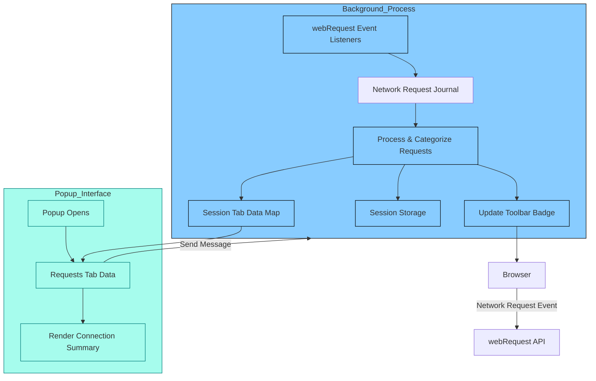

# System Architecture of uBO Scope

Understanding how uBO Scope operates under the hood helps you appreciate its precision and reliability in reporting third-party network connections. This page explores the extension's system architecture, demonstrating how it leverages browser capabilities to observe, categorize, and present network request data clearly. A visual Mermaid.js diagram further clarifies the flow of information from the browser's network layer through data processing and finally to user display interfaces.

---

## Overview: How uBO Scope Monitors Network Activity

At its core, uBO Scope is designed to observe all network requests your browser makes to remote servers. It uses the browser's `webRequest` API, a powerful interface that exposes detailed information about each network request event, including when requests start, redirect, complete successfully, or fail.

uBO Scope's background process listens to these network events continuously and associates them with the relevant browser tab. It categorizes each third-party connection based on the outcome—whether allowed, stealth-blocked, or blocked—and aggregates this information per tab.

This categorization enables two main user-facing features:

- **Toolbar Badge:** Displays the count of distinct third-party domains connected to, offering a high-level snapshot of external connections per tab.
- **Popup Panel:** Provides a detailed breakdown of these connections classified by their status, helping users investigate and understand what connections their browser actually makes.

## Core Components and Data Flow

1. **Browser Network Events**
   - uBO Scope hooks into `webRequest` events such as:
     - `onBeforeRedirect`
     - `onErrorOccurred`
     - `onResponseStarted`
   - These events provide real-time updates on network requests.

2. **Background Script (`background.js`)**
   - Aggregates and processes the stream of events.
   - Maintains a session-based map associating each browser tab with the domains it connects to and their status categories.
   - Utilizes domain parsing libraries like the Public Suffix List and Punycode to correctly determine domain and hostname data.
   - Updates the browser action badge with the number of distinct allowed third-party connections.
   - Saves state data into session storage to preserve information between extension lifecycle events.

3. **Popup Interface (`popup.js` and `popup.html`)**
   - When opened, the popup requests the background script for the current tab's network data.
   - The popup displays categorized lists of connected domains (allowed, stealth-blocked, blocked) with counts.
   - Uses Unicode-aware rendering to provide domain names in user-friendly formats.

## User-Centric Workflow

Whenever you navigate to a website, uBO Scope starts monitoring all network requests triggered by the page and associated frames:

- For every request, it determines the hostname and domain.
- Main-frame requests reset previous counts for that tab to reflect new context.
- Requests are classified according to outcomes:
  - **Allowed:** Successfully connected third-party domains.
  - **Stealth-blocked:** Redirected requests considered stealth-blocked.
  - **Blocked:** Failed or explicitly blocked requests.

Once processed, aggregated data is stored and surfaced via the toolbar badge and popup.

## Architecture Diagram

This diagram visualizes the flow of network events starting at the browser level, moving through uBO Scope's background script where data is logged, categorized, and stored, and finally presented to the user in the popup interface. The toolbar badge updates asynchronously as new data is processed.

## Practical Insights

- **Robust Domain Parsing:** Using the Public Suffix List ensures domains are accurately identified, avoiding misclassification especially with complex domain patterns.
- **Session-Based Tracking:** Keeps tracking specific to tabs for precise counts, cleaning data when tabs are closed.
- **Delayed Processing:** Network requests are queued briefly to batch processing efficiently.
- **Popup Query on Demand:** Data refreshing happens when the popup is opened, ensuring users see the latest summary.

## Troubleshooting and Tips

- If the toolbar badge does not update, ensure the browser supports the `webRequest` API and that uBO Scope has permission to observe network requests.
- Closing a tab clears its network history, so the badge and popup reflect new tab activity only.
- Some network requests outside browser control (e.g., certain service workers or DNS-level blocks) may not appear.

## Next Steps

To dive deeper and effectively use uBO Scope:

- Visit [Popup Usage Guide](/guides/getting-started/using-popup-view) to explore how to interpret connection details.
- See [Quick Feature Overview](/overview/key-concepts-and-architecture/quick-feature-overview) to understand more features.
- Learn about [Core Concepts](/overview/key-concepts-and-architecture/core-terms-concepts) for foundational terminology.

---

Understanding this architecture empowers you to leverage uBO Scope’s monitoring capabilities for better visibility, privacy, and control over your web connections.
