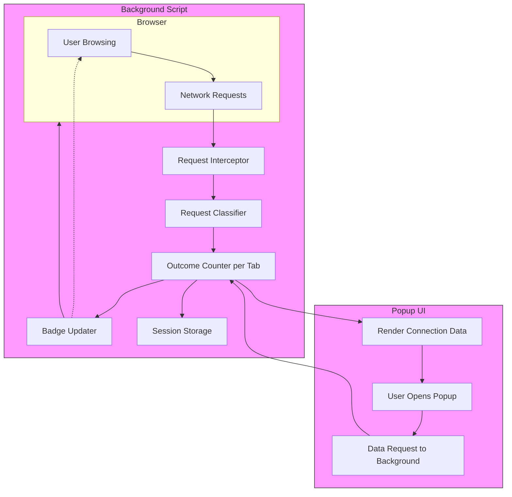

# How uBO Scope Works: Architecture Overview

Discover the inner workings of uBO Scope’s browser extension architecture through a clear diagram and explanation. This page unpacks how the extension captures, classifies, and counts network requests in the background script, then how those insights are presented to you via the popup UI and toolbar badges, empowering you with real-time visibility into your browser’s network activity.

---

## Understanding uBO Scope's Architectural Flow

At its core, uBO Scope is designed to monitor every network request your browser makes, categorize them based on their outcome, and provide an intuitive interface for easy inspection. This architecture is split between two main components:

- **Background Script:** The engine behind the scenes that intercepts all outgoing network requests, classifies each as allowed, stealth-blocked, or blocked, and keeps running counts of these connections per domain.
- **Popup UI:** The user-facing panel that fetches the aggregated data from the background process, then presents it in a categorized and count-based layout, including the badge text on the browser toolbar icon.

### Key Architectural Roles

| Component        | Role                                                                   | User Benefit                              |
|------------------|------------------------------------------------------------------------|------------------------------------------|
| Background Script| Intercepts and processes network request events via `webRequest` API, maintaining accurate counts for each connection outcome. | Real-time, reliable network activity tracking across open tabs. |
| Popup UI         | Retrieves processed data from the background script and displays it visually, showing detailed domain-level information and summaries. | Immediate understanding of connections with a clean, categorized snapshot. |
| Badge UI         | Shows a dynamic count of distinct third-party domains contacted on the current tab directly on the toolbar icon. | Quick glance visibility of network connection breadth per tab without opening the popup. |

---

## How Requests Are Intercepted and Classified

The background script serves as the core analytical hub:

### 1. Network Request Interception

- The script listens to multiple `webRequest` events:
  - `onBeforeRedirect` to detect redirects.
  - `onErrorOccurred` to catch failed requests.
  - `onResponseStarted` to identify successful responses.
- These listeners capture all requests matching host permissions (covering HTTP, HTTPS, WS, WSS).

### 2. Classification of Request Outcomes

- **Allowed:** Requests successfully fetched resources.
- **Stealth-Blocked:** Requests that triggered redirects indicative of stealth blocking.
- **Blocked:** Requests that ended in errors or failures.

### 3. Aggregation and Counting

- Details are recorded per active browser tab.
- Counts are maintained for both the hostname and its corresponding domain’s connections.
- On main frame loads, tab-specific data resets to ensure fresh counts.

### 4. Badge Updates and Session Management

- Badge text on the browser toolbar updates to reflect the count of distinct allowed third-party domains for the current tab.
- Session data is serialized and saved persistently to maintain state across browser sessions.

---

## Surfacing Results to the User: Popup UI & Badges

The popup panel is your direct interface to the extension's insights:

### Popup Panel Structure

- Displays the hostname and domain of the active tab prominently.
- Summarizes the total number of distinct connected domains.
- Categorizes domains into three sections with real counts:
  - `Not Blocked` (Allowed connections)
  - `Stealth-Blocked` (Redirected requests)
  - `Blocked` (Failed connections)

### User Experience Flow

- When opening the popup, it queries the background script for the current tab’s connection data.
- Data is deserialized and rendered dynamically, including converting domain names to Unicode for readability.
- Domains in each outcome category display alongside the count of times they appeared.
- The badge count offers at-a-glance info without needing to open the popup.

### Visual Styling

- Distinct color coding enhances clarity:
  - Allowed: Green hues
  - Blocked and Stealth-Blocked: Red hues
- Sections auto-hide if no domains belong to that category, keeping the interface clean and focused.

---

## Practical Scenario

Imagine browsing a new website. Behind the scenes, uBO Scope’s background script intercepts all the network calls the website initiates:

1. As the site loads, the main frame request triggers a reset of previous counts.
2. Each resource request is tracked and categorized:
   - Third-party analytics servers might be allowed.
   - Advertisers may be stealth-blocked or outright blocked.
3. The toolbar badge reflects the number of unique allowed third-party connections — a low number signals tight blocking.
4. Clicking the badge opens the popup UI where you see which domains fit into each category, empowering informed decisions.

---

## Architecture Diagram

---

## Tips for Users

- **Refresh Data:** Since counts reset on main frame navigations, navigate or reload a page to get updated data.
- **Interpret Badge Counts:** A lower badge number means fewer allowed distinct third-party domains, often indicating stronger privacy.
- **Popup Categories:** Pay attention to stealth-blocked domains, as these signal requests redirected to hide tracking attempts.

## Common Pitfalls

- **Missing Data:** The extension relies on the browser’s `webRequest` API; some newer browsers or private modes may limit this data.
- **Non-Reported Requests:** Requests initiated outside the browser (e.g., OS-level) won’t appear.
- **Assuming Blocked Number Equals Efficiency:** The badge counts allowed domains, not blocks, for correct privacy assessment.

---

## Next Steps

To see uBO Scope in action, explore the detailed [Using the Popup Panel guide](/getting-started/using-and-validating/using-popup) to master how to read and interact with the UI. For deeper understanding of terms, visit [Core Concepts and Terminology](/overview/key-concepts-architecture/core-terms-model). Learn how uBO Scope integrates with your browser and other extensions in [Integration With Your Browser & Other Extensions](/overview/key-concepts-architecture/integration-ecosystem).

---

*This architectural insight empowers you to trust and effectively leverage uBO Scope’s transparent view into your browser’s network behavior.*
