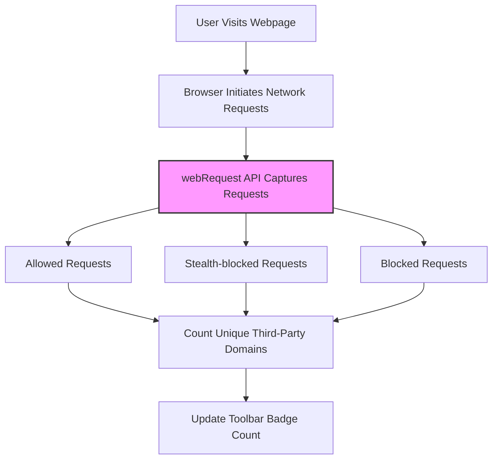

# Core Concepts and Terminology

Understanding the core terms used in uBO Scope is essential to fully appreciate how it measures and reports browser network connections. This page explains the fundamental concepts, helping you interpret what uBO Scope shows you, why these metrics matter, and how they relate to typical content blocking experiences.

---

## Why Core Concepts Matter

Imagine browsing the web as visiting a shopping mall. Many shops (websites) invite you in, but there are also numerous unseen interactions—vendors behind the scenes trying to connect with your browser, some permitted, others blocked or hidden. uBO Scope aims to reveal all these "vendors" by tracking network requests your browser makes, categorized by their outcomes.

The terminology introduced here helps distinguish between these interactions in a way that's easy to grasp and act upon.

---

## Key Terminology Explained

### Third-Party Remote Server
- **Definition:** Any server contacted by your browser that is different from the website (first-party) you are actively visiting.
- **Why It Matters:** Identifying third-party servers shows which external entities your browsing may involve—important for privacy awareness and security.

### Request Outcomes
uBO Scope categorizes network requests into three core outcome types, each representing a distinct interaction:

- **Allowed Requests:** These connections to third-party servers successfully fetched resources.
- **Stealth-Blocked Requests:** These requests were blocked silently, without the browser or webpage being fully aware, often to avoid breaking site functionality.
- **Blocked Requests:** These are network requests explicitly blocked by your content blocking settings or other mechanisms.

### Badge Count
- **What It Represents:** The number displayed on the extension's toolbar icon indicates the number of unique third-party domains your browser has connected to and successfully fetched resources from.
- **Why a Lower Count is Better:** A higher badge count means your browser connected to more third-party domains, which may represent more potential privacy exposure.

### webRequest API
- **Role:** This browser API lets uBO Scope listen to and record the fate of every network request.
- **Capabilities:** It captures events for redirects, errors, and successful responses, allowing uBO Scope to assign outcomes accurately to each request.
- **Limitation:** Requests outside the reach of this API—e.g., those made outside the browser's network stack—cannot be tracked.

### Counting Unique Connections vs. Total Blocks
- **Common Misconception:** Some think counting total blocked requests indicates content blocker strength.
- **uBO Scope's Approach:** It emphasizes counting *unique third-party connections* made instead.

> This approach aligns with privacy goals — fewer legitimate third-party connections mean less data exposure.

---

## How These Concepts Come Together

1. When you open a webpage, your browser generates a cascade of network requests.
2. uBO Scope uses the **webRequest API** to monitor each request's progress and outcome.
3. Each request is categorized as **allowed**, **stealth-blocked**, or **blocked** based on what actually happened.
4. The extension tracks these on a per-tab basis, associating domains and hostnames accordingly.
5. The **badge count** updates to reflect how many unique third-party domains connected successfully in that tab.

---

## Real-World Scenario

Consider visiting a news website:

- The main site is first-party.
- The site loads images from a Content Delivery Network (CDN), considered first-party or trusted third-party.
- Simultaneously, ad providers and trackers attempt to connect—some connections uBO Scope shows as blocked or stealth-blocked.
- uBO Scope's badge count shows only the distinct third-party domains successfully connected.

This transparency lets you see exactly what your browser is reaching out to—not just how many connections were blocked. It gives a clearer picture of your online exposure.

---

## Best Practices & Tips

- **Use badge counts as privacy indicators:** Focus on reducing unique third-party connections rather than obsessing over block counts.
- **Understand stealth-blocking:** Some blockers use stealth methods to avoid detection; uBO Scope can reveal these otherwise hidden operations.
- **Respect the limitation of webRequest API:** uBO Scope only reports requests processed by the browser's network stack accessible to the API.
- **Review connections per tab:** Since uBO Scope tracks per browsing tab, close unused tabs to clear old data.

---

## Common Misinterpretations to Avoid

- _"More blocks mean better blocking."_  
  Not necessarily—higher block counts can accompany more network calls allowed.

- _"Ad blocker test sites give accurate reliability results."_  
  Such sites often trigger fabricated requests, which do not reflect real-world browsing.

- _"All third-party connections are harmful."_  
  Some third-party domains, like CDNs, serve vital resources; a low badge count suggests limited exposure but doesn't imply zero third parties.

---

## Summary Diagram of Core Terms and Flow

---

## Next Steps

To deepen your understanding and practical use of these concepts:

- Explore **How uBO Scope Works: Architecture Overview** to see the high-level system design.
- Read **Using the Popup Panel** to learn how these terms manifest in the user interface.
- Review **Debunking Content Blocking Myths** to strengthen your knowledge and avoid common pitfalls.

---

For more info and source code, visit the [official uBO Scope GitHub repository](https://github.com/gorhill/uBO-Scope).

---

_You are now equipped with the fundamental language needed to interpret uBO Scope's reporting and make informed decisions about your browsing privacy and security._
