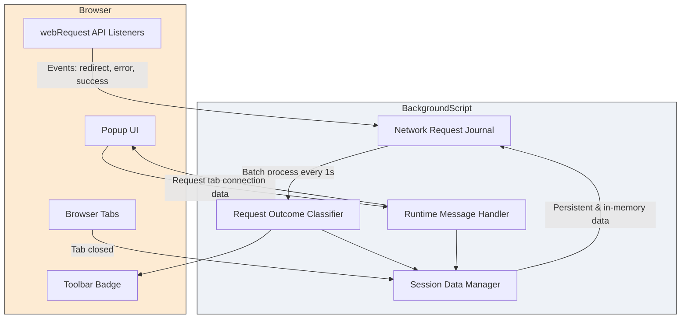

# Architecture and Data Flow

Discover how uBO Scope's core components work together seamlessly to track and classify network connections in real time. This page presents a high-level architecture overview that explains the flow of data from browser network events to the user interface, emphasizing the critical interactions and APIs that make uBO Scope effective.

---

## How uBO Scope Monitors Network Connections

At the heart of uBO Scope lies its **background script**, which continuously listens to browser network events using the `webRequest` API. This listener captures network activity—whether connections succeed, fail, or are redirected—and classifies these outcomes into clear categories: **allowed**, **stealth-blocked**, and **blocked**.

### Key User Goal
You want to understand in real time how many and what types of third-party remote servers your browser is connecting to when visiting websites.

### Flow of Monitoring
1. **Network Request Detection**: The background script registers listeners to capture three critical events via the `webRequest` API:
    - Redirects
    - Errors
    - Response starts (successful connections)

2. **Outcome Classification & Session Tracking**: Each detected request is recorded and processed in batches periodically. The extension associates requests to browser tabs and classifies them as:
    - **Allowed**: Connections that successfully fetched resources.
    - **Stealth-blocked**: Redirected but still leaving detectable traces.
    - **Blocked**: Failed or explicitly blocked requests.

3. **Badge Count Update**: The background script updates the browser action badge count to show how many distinct allowed third-party domains were contacted for each tab.

4. **Data Persistence**: Tab-specific connection data is regularly saved in session storage to maintain state across navigation events and tab lifecycle.

5. **Popup Communication**: When users open the extension popup, it queries the background script for the current tab’s connection data and renders a detailed categorized list.

---

## Components Overview

### Background Script
- **Monitors network events** with `webRequest` listeners.
- **Classifies requests** by outcome and associates them with tabs.
- **Maintains session data** for per-tab connection states.
- **Updates extension badge** with the count of allowed third-party domains.
- **Handles tab removal** events to clean up data.

### Popup Script
- **Requests tab data** from the background using `runtime.sendMessage`.
- **Deserializes session data** and renders the UI showing domains grouped by outcome.
- **Displays real-time summaries** helping users quickly grasp connection exposure.

### Browser Action Badge
- Reflects the **number of distinct allowed third-party domains** contacted.
- Offers an instant privacy exposure indicator directly on the toolbar.

---

## Visual Diagram of uBO Scope Data Flow

---

## Detailed Workflow Explained

### Step 1: Capturing Network Events
The background script uses `browser.webRequest` to monitor:

- **`onBeforeRedirect`**: Captures when a network request is redirected.
- **`onErrorOccurred`**: Captures failed or blocked requests.
- **`onResponseStarted`**: Captures successful responses.

Each event triggers queuing of request details into a network journal for deferred processing. This batching optimizes performance by processing many requests together every second.

### Step 2: Processing Network Requests
Every second, the background script:

- Processes the network journal entries.
- Determines connection outcomes based on event type and request data.
- Updates tab-specific session details to reflect allowed, stealth, or blocked domains.

This caters to complex request flows across multiple redirects and error states.

### Step 3: Updating Badge Counts
The badge count for each browser tab indicates the number of **distinct allowed third-party domains** connected for that tab. A lower count signals fewer external connections, which typically correlates with better privacy.

### Step 4: Interacting with the Popup UI
When users open the extension's popup:

- The popup script sends a message requesting connection data for the active tab.
- The background responds with serialized session data for that tab.
- The popup deserializes and renders this data, showing domains grouped as:
  - **Not blocked (allowed)**
  - **Stealth-blocked**
  - **Blocked**

This gives users an at-a-glance understanding of their browsing exposure.

---

## Practical Tips & Best Practices

- **Keep Browser Active**: Data updates rely on browser events; new network requests trigger session updates.
- **Understand Badge Context**: Badge counts less than actual requests indicate aggregated unique domains, focusing on distinct third parties.
- **Tab Lifecycle Awareness**: Closing a tab cleans session data, keeping memory usage optimal.
- **Interpreting Stealth-blocked**: Represents connections typically hidden or rerouted by blockers but still detectable by this extension.

---

## Troubleshooting Common Issues

<AccordionGroup title="Common Problems and Solutions">
<Accordion title="Badge Count Not Updating">
Ensure your browser and extension have appropriate permissions (`webRequest`) and no conflicting extensions interfere with webRequest events.
</Accordion>
<Accordion title="Popup Shows No Data for Active Tab">
Make sure the tab is fully loaded and has network activity. Some internal or new tabs may not generate connection data.
</Accordion>
<Accordion title="Unexpectedly High Domain Counts">
Check for tabs with multiple frame loads or heavy third-party content. Also, review stealth-block and blocked lists via the popup for detailed inspection.
</Accordion>
</AccordionGroup>

---

## Next Steps
- Explore the [Feature Quick Overview](../overview-features-architecture/feature-quick-overview) to understand the full range of capabilities.
- Review [What is uBO Scope?](../core-introduction/what-is-ubo-scope) for context on the product's mission.
- Try the [Monitoring Third-Party Connections Guide](../../guides/core-workflow/monitor-connections) to learn how to interpret and act on the data.

---

By understanding this architecture and data flow, you gain clear insight into how uBO Scope empowers you to visualize and manage third-party connection exposure, elevating your browsing privacy awareness to a higher, data-driven level.
