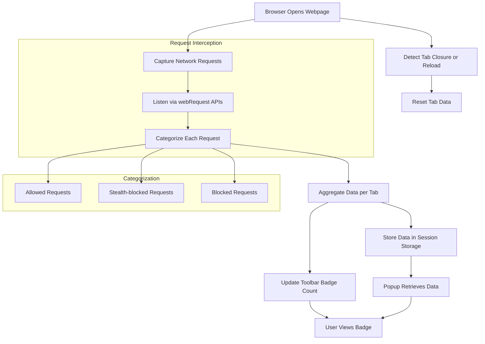

# How uBO Scope Works

## Understanding the Workflow Behind uBO Scope

Have you ever wondered how uBO Scope manages to reveal every remote server your browser connects to when you visit a webpage? This overview walks you through the essential behind-the-scenes flow—from capturing network requests to delivering real-time summaries—without diving into technical code details. By understanding this, you'll gain insight into how uBO Scope empowers you to track, categorize, and interpret network activity effortlessly.

---

## Intercepting Network Requests Seamlessly

At the core of uBO Scope is its ability to watch every network request your browser initiates when loading a webpage. It taps into the browser's native APIs designed for extensions to listen to events triggered by web requests—be it loading scripts, images, or fetching data. 

Here’s how the process flows:

- **Listening to Requests:** uBO Scope continually monitors requests made by the browser, ensuring it captures every outgoing connection, including those that content blockers may allow or prevent.
- **Capturing Request Outcomes:** Instead of just logging that a request was made, uBO Scope records the precise result for each request. Was it allowed without interference, stealth-blocked (blocked quietly by content blockers), or outright blocked?
- **Handling Special Cases:** Some requests may redirect before completing, or may fail due to errors. uBO Scope captures these cases, assessing their real network outcomes.

This interception happens automatically whenever you browse, with no manual setup needed, providing a reliable foundation of comprehensive network visibility.

## Categorizing Connections: Allowed, Stealth, and Blocked

Once requests are intercepted, uBO Scope categorizes them into three distinct outcomes:

1. **Allowed:** Connections that were successful and allowed by the browser without being blocked.
2. **Stealth (Stealth-blocked):** Requests that content blockers silently blocked in a way that these connections remain obscured from the webpage.
3. **Blocked:** Requests that were prevented explicitly due to errors or blocking policies.

For each allowed or blocked request, uBO Scope extracts the hostname and derives the main domain from it. This helps group similar connections (like different subdomains of the same root domain) to provide clearer insights.

This data is then aggregated in dedicated internal structures, separating these three states while tracking how many times connections to each domain occur.

## Real-Time Badge Updates for Immediate Insight

The extension actively keeps track of connections per browser tab. In particular, it maintains details on the number of distinct allowed third-party domains contacted during webpage browsing.

To keep you informed at a glance, uBO Scope updates its toolbar badge number dynamically:

- The badge number reflects the count of unique third-party domains from which connections were allowed.
- If no connections occur or all are blocked, the badge remains blank, signaling a "clean" network activity.

This immediate visual feedback helps privacy-conscious users quickly assess the scope of external connections their current tab is making.

## Detailed Popup: Summarizing Connection Data

Clicking the uBO Scope toolbar icon opens a popup that presents a detailed, organized picture of your tab’s network activity:

- **Domain Summary:** A total count of connected domains gives a quick overview.
- **Categorized Lists:** Domains are grouped under "Not Blocked," "Stealth-Blocked," and "Blocked," each showing of occurence counts to reflect how many requests linked to that domain.

This live summary is built by asynchronously fetching the recorded data from the extension’s background processes, then elegantly rendering it for easy reading.

Example:

```
domains connected: 5

not blocked
 - example-cdn.com (120)
 - analytics.org (3)

stealth-blocked
 - tracking.net (15)

blocked
 - ads.com (8)
```

## Efficient Data Management and Persistence

To maintain accuracy and continuity:

- uBO Scope keeps its data organized by browser tab, tracking requests individually.
- When a tab reloads or navigates to a new main webpage, the stored data for that tab resets, ensuring results are always relevant to the current page.
- Data is serialized and stored in browser session storage, enabling continuity even if you switch between tabs or temporarily close and reopen tabs.

This smart data lifecycle management guarantees you always see timely, accurate information.

---

## Putting It All Together

In summary, uBO Scope’s internal workflow can be envisioned like this:



This flow ensures that as you browse, you receive real-time, categorized insights into every remote connection your browser makes, empowering you to understand and control your web exposure.

---

## Tips for Success

- **Use the Badge as a Quick Indicator:** A low badge count signals fewer third-party connections, typically desirable for privacy.
- **Interpret the Popup Details:** Use the categorized lists to investigate domains you may want to block or allow.
- **Know That Stealth Means Silent Blocking:** Connections in "stealth-blocked" reflect blockers' behind-the-scenes work hidden from the webpage.
- **Remember Data Is Tab-Specific:** Each browser tab maintains its own network records.

---

With this overview, you can appreciate how uBO Scope operates transparently to reveal valuable network information while running smoothly in the background—making privacy and connection analysis effortless.


---

For a broader understanding of core concepts or how to interpret results, consider exploring these related documentation pages:

- [What is uBO Scope?](/overview/introduction-and-core-concepts/what-is-ubo-scope)
- [Core Concepts & Terminology](/overview/introduction-and-core-concepts/core-concepts-terminology)
- [Understanding the Badge & Popup](/getting-started/using-ubo-scope/interpreting-badge-popup)

These guides help you transition from understanding the internal workflow to mastering everyday usage and interpretation.


---

*This documentation is part of the uBO Scope product architecture and workflows section.*

---