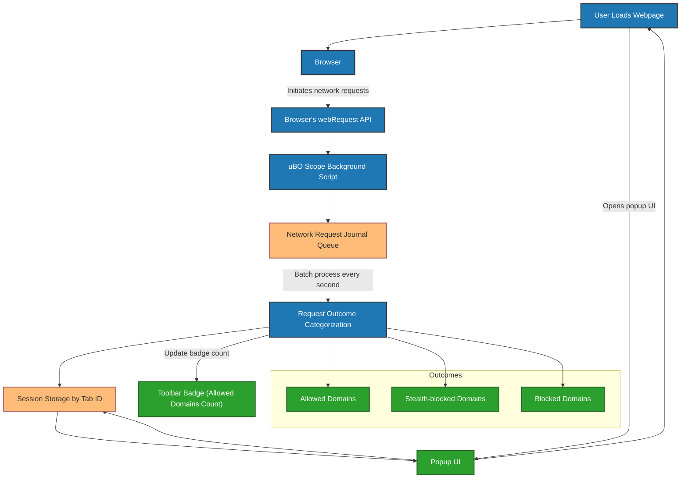

# System Architecture Diagram

## Unlocking Transparency: How uBO Scope Works Behind the Scenes

The **System Architecture Diagram** is your window into uBO Scope’s internal mechanism—a clear, visual guide that reveals how the extension tracks and categorizes web network requests, storing critical data and presenting it to you in the popup UI. This page focuses solely on the data flow between the key components that empower uBO Scope to deliver real-time insights into every third-party connection a webpage attempts.

---

## The Essence of uBO Scope’s Architecture

uBO Scope is a browser extension built to expose every remote server connection a webpage makes, bypassing any content blockers. To do this, it leverages browser APIs, efficiently processes network events, and delivers an instant and intuitive summary via its user interface.

The architecture consists of several interactively working modules:

- **Browser Network Interception:** Captures every web request initiated by webpages
- **Data Categorization:** Classifies connection outcomes as allowed, stealth-blocked, or outright blocked
- **Session Storage:** Persistently keeps details of observed requests per browser tab
- **Popup UI:** Displays a live, user-readable report of third-party connections

This page’s diagram and explanations illuminate how these components interconnect and share data, giving you a comprehensive understanding of uBO Scope’s operation.

---

## Core Components and Data Flow

### 1. **Browser Network Request Interception**

At the foundation, uBO Scope hooks into the browser’s `webRequest` API listeners (`onBeforeRedirect`, `onErrorOccurred`, `onResponseStarted`) to intercept every network request, including redirects and errors. This enables uBO Scope to observe all requests made by the active tabs.

### 2. **Network Request Journal Queueing**

Intercepted requests are queued temporarily in an in-memory journal. This batch processing gathers network events efficiently and triggers routine processing every second, preventing performance issues and ensuring timely data capture.

### 3. **Request Outcome Categorization**

Each network request is analyzed and categorized into one of three outcome buckets:
- **Allowed:** Requests that successfully completed
- **Stealth:** Requests that resulted in redirects not caught by the browser's webRequest API but identifiable through heuristics
- **Blocked:** Requests that failed with errors (likely blocked by content blockers)

By splitting requests into these categories, uBO Scope helps users distinguish what connections were permitted or denied.

### 4. **Session Storage Management**

uBO Scope maintains a detailed map of network data, keyed by browser tab IDs. For each tab, it records the hostname, base domain, and tracked third-party domains and hostnames along with counts, grouped by their request outcomes.

Data persistence uses the browser's session storage with fast serialization/deserialization, allowing recovery of state between browser restarts during the session without external dependencies.

### 5. **Badge Updates and Popup UI Rendering**

Following data processing, the extension updates the toolbar badge with the count of distinct allowed third-party domains for the active tab, giving an at-a-glance privacy indicator.

When you open the popup UI, it queries this session data for the current tab, then renders a clear, categorized list of domains, showing counts of requests made, grouped by outcome—offering real-time visibility into all remote connections.

---

## How Everything Connects: Data Flow Diagram

---

## Practical Insights

- The architecture prioritizes _user-focused outcomes_, ensuring that the popup UI reflects an accurate, easily comprehensible snapshot of all third-party connections.
- Efficient batch processing balances extension responsiveness with browser performance.
- The use of public suffix list parsing guarantees domain extraction accuracy, avoiding erroneously counting subdomains as distinct domains.
- The design allows the extension to work seamlessly with any content blocker and across all supported browsers.

---

## Tips and Best Practices

- **Interpreting Badge Counts:** The number on the toolbar badge represents unique allowed third-party domains only — a comprehensive privacy snapshot.
- **Session Data Per Tab:** Each browser tab has independent tracking, enabling granular analysis of network requests.
- **Component Extensibility:** The modular background script architecture allows future enhancements, such as more nuanced request details, without impacting the UI.

---

## Troubleshooting

- If you notice the badge is not updating, ensure your browser supports the `webRequest` API fully and that no browser-level restrictions block the extension.
- Occasionally, complex redirect chains might not be perfectly categorized under 'stealth'; this is a limitation due to how browsers report network events.
- Clearing the browser’s session storage or restarting the browser resets all recorded data.

---

## Next Steps

After familiarizing yourself with this architecture, consider exploring:

- [How uBO Scope Works](overview/product-architecture-and-workflows/how-ubo-scope-works) to understand the user-facing data flows in detail.
- [Core Concepts & Terminology](overview/introduction-and-core-concepts/core-concepts-terminology) for clarity on critical definitions.
- [Understanding the Badge & Popup](getting-started/using-ubo-scope/interpreting-badge-popup) for real-world usage guidance.

---

## References

- GitHub Repository: <https://github.com/gorhill/uBO-Scope>
- Browser Compatibility Manifests: Chromium, Firefox, Safari
- Public Suffix List used for domain calculations: <https://publicsuffix.org/>

---