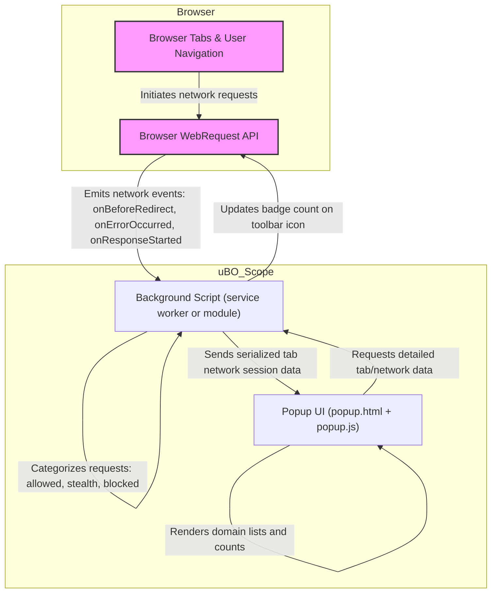

# How uBO Scope Works (Architecture Diagram)

## Visualizing uBO Scope's Core Architecture

Understanding how uBO Scope operates under the hood provides clarity on the seamless experience it delivers. This page visually illustrates the main components involved, showing how browser network events flow through the extension—from initial detection to insightful presentation within the popup interface.

Through a detailed Mermaid diagram and explanatory sections, you’ll see exactly how the background script, browser APIs, and popup UI interact to capture, analyze, and surface key information about remote server connections.

---

## Why This Matters

Many users want to know _how_ uBO Scope gathers the data that powers its badge counts and detailed domain reports. Rather than treating the extension as a black box, this architectural insight demystifies the process and reinforces trust by showing you the flow of data.

By knowing these interactions, filter list maintainers and privacy-conscious users gain a deeper appreciation for the extension’s accuracy and responsiveness.

---

## Core Components & Workflow

This overview centers on three primary components working in concert:

- **Background Script:** The heart of uBO Scope, running continuously to monitor all network requests using browser APIs.
- **Browser WebRequest API:** The official interface allowing uBO Scope to observe network requests, their outcomes (success, block, redirect), and relevant metadata.
- **Popup UI:** The visible interface users interact with, showing real-time insights into allowed, blocked, and stealth-blocked third-party connections.

### User Story Flow

1. **Network Request Observation:** As you browse, every HTTP(S) and WebSocket network request is captured by the background script through the `webRequest` API.
2. **Outcome Analysis:** The background script categorizes each request outcome — whether it succeeded, was redirected stealthily, or blocked — and organizes the data by domain.
3. **Badge Update:** The extension's toolbar icon badge dynamically reflects the count of unique third-party domains successfully connected.
4. **Data Delivery:** When you open the popup, it requests detailed session data from the background script.
5. **Insight Display:** The popup UI renders categorized lists of domains (allowed, blocked, stealth) including counts of connection attempts.

Readers find this transparent user flow useful to understand how quickly and reliably uBO Scope translates raw browser network activity into actionable information.

---

## Architecture Diagram

---

## Detailed Component Roles

### Background Script

This module forms the core engine of uBO Scope:

- Registers listeners on all relevant webRequest events (`onBeforeRedirect`, `onErrorOccurred`, `onResponseStarted`).
- Uses these events to build a granular journal capturing the fate of every network request.
- Processes the journal once per second to update the session data mapped to each browser tab.
- Maintains maps categorizing requests into **allowed** (successful connections), **stealth** (redirect attempts), and **blocked** (errors reported by the browser).
- Computes badge counts representing the number of distinct third-party domains with successful connections.
- Handles messaging from the popup UI for retrieving tab-specific network data.

### Browser WebRequest API

The WebRequest API is crucial because it exposes:

- URLs and headers of every network request initiated by a webpage.
- Response status, redirect targets, and error details.
- Frame and tab IDs enabling contextual grouping of requests per open page.

This API enables uBO Scope to observe network activity independently of content blockers or DNS filtering.

### Popup UI

The popup interface serves as the user’s window into what uBO Scope has observed:

- Upon opening, it queries the background script for serialized data on the currently active tab’s network connections.
- It deserializes this data and renders three distinct sections:
  - **Not Blocked:** Domains with allowed connection attempts.
  - **Stealth Blocked:** Domains related to redirects considered stealthy blocking.
  - **Blocked:** Domains for which network requests errored out.
- Presents domain counts alongside domain names, with domain names converted to Unicode for readability.

Besides detailed lists, it also prominently displays the total count of connected domains, matching the badge.

---

## Practical Example Scenario

Imagine you are visiting a news website:

- The main page request is logged, initializing a new tracking context.
- Embedded resources from CDNs or analytics providers trigger additional network requests.
- uBO Scope captures each request’s result. For example:
  - A request to a CDN succeeds and is added to the **Not Blocked** list.
  - An ad network request might be blocked or fail silently — marked accordingly.
  - Redirects occurring as part of some stealth techniques get classified under stealth-blocked.
- This live data is summarized into badge counts on your toolbar.
- When you click the uBO Scope icon, the popup provides a comprehensive breakdown, enabling you to assess exactly which third parties your browser connected to during this visit.

---

## Tips for Users

- **Refresh your tab** if the popup shows no data or stale results; it ensures fresh network events are captured.
- Remember the badge counts distinct third-party domains; a lower count generally means fewer external connections.
- Use the architecture understanding here to interpret how quick or delayed your popup data appears relative to your browsing.
- For filter list maintainers, this architecture enables reliable validation of blocking efficacy by focusing on domains, not just request counts.

---

## Troubleshooting Common Issues

<Accordion title="Popup Shows 'NO DATA' or Empty List">
This usually means the background script has not yet received network event data for the current tab, or the tab lacks recorded network activity.

**Possible Actions:**
- Reload the tab to trigger new network requests.
- Close and reopen the popup.
- Ensure permissions are granted for webRequest and host access.
</Accordion>

<Accordion title="Badge Count Doesn’t Update">
The badge updates asynchronously, typically shortly after network events are processed.

**Tips:**
- Wait a few seconds after browsing activity.
- Restart the browser or extension if updates never appear.
</Accordion>

<Accordion title="Data Missing for Internal or Special Tabs">
Tabs like about:blank, new tab pages, or internal browser pages often do not generate network events accessible via webRequest API.

**Note:** This is by browser design and not an extension malfunction.
</Accordion>

---

## Next Steps

Ready to explore how this architecture translates into daily usage?

- Visit [Exploring the Popup: Allowed, Blocked, and Stealth Domains](../guides/getting-started-usage/understanding-popup) for hands-on guidance.
- Dive into [Key Concepts & Terminology](./core-concepts) to familiarize yourself with the classifications used throughout uBO Scope.

For installation or first use, refer back to the [Getting Started capsule](../../getting-started/setup-introduction/about-ubo-scope).

Discover the full picture of uBO Scope’s value and use cases by browsing the related documentation in the navigation.

---

For source code dive or contribution, see the [GitHub repository](https://github.com/gorhill/uBO-Scope).

---

*End of Architecture Overview*