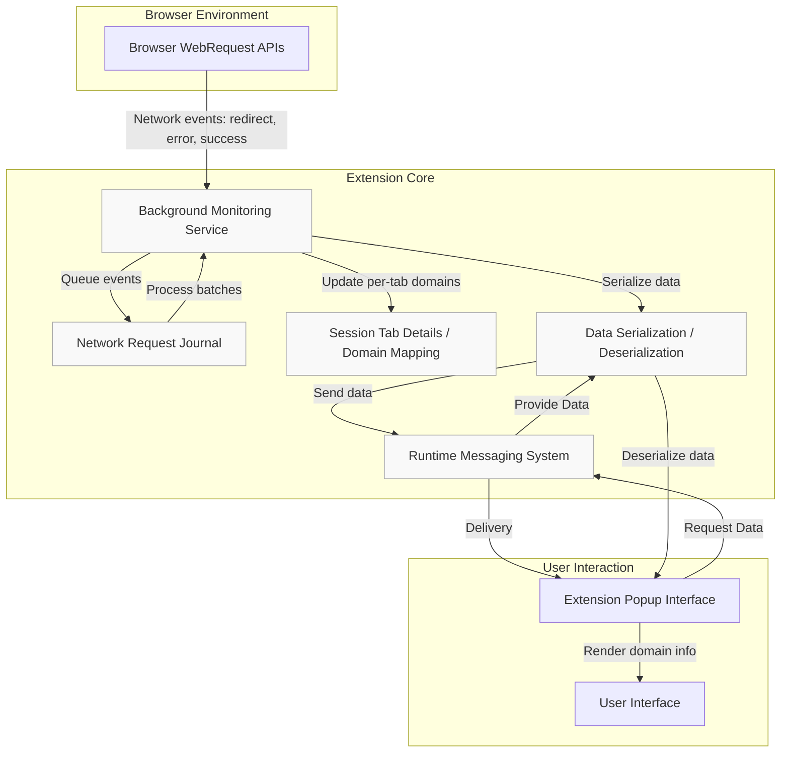

# How uBO Scope Works (Architecture Overview)

Experience a clear, visual breakdown of uBO Scope's core architecture, demonstrating how network requests are monitored, processed, and presented. This page details the seamless interaction between background monitoring, popup display, and data serialization—all designed to deliver real-time, transparent visibility into your browser’s third-party connections.

---

## What This Page Covers
This documentation offers a narrative and visual explanation of the main architectural components of uBO Scope:

- **Background Monitoring:** How uBO Scope detects and records network activity through browser APIs.
- **Popup Display:** How recorded data is presented to the user in the extension's popup interface.
- **Data Serialization:** How data is efficiently serialized and communicated between components.

Alongside the narrative, a Mermaid diagram illustrates the logical flow of information from network request detection to on-screen display, emphasizing the technology-agnostic design and integration with standard browser APIs.

---

## Understanding uBO Scope's Architecture

At its core, uBO Scope is engineered to provide accurate insight into all network connections initiated by web pages, with a focus on third-party domains. It achieves this by orchestrating three principal components:

### 1. Background Monitoring

This component runs silently in the background, powered by browser WebExtension APIs like `webRequest`. It listens for network events such as request redirects, errors, and successful responses across all monitored domains.

- **Continuous Observation:** Each network event is queued and cataloged by tab, tracking the source hostname and domain.
- **Dynamic Session Management:** Tab details are reset when a main frame navigation occurs, ensuring data relevance for the active page.
- **Public Suffix Awareness:** Utilizes a comprehensive public suffix list to accurately extract registrable domains from hostnames.

This background monitoring ensures users get a trustworthy, real-time picture of network activity unaffected by which content blocker (if any) is running, thanks to direct access to browser network events.

### 2. Data Serialization and Communication

Data collected from background monitoring must be presented efficiently and accurately:

- **Serialization of Complex Data:** uBO Scope employs a specialized serializer to convert complex Map-based structures (organizing domains and hostnames into allowed, blocked, and stealth-blocked categories) into compact strings.
- **Message Passing:** Serialized data flows from the background script to the popup interface through controlled messaging, maintaining synchronization and minimal latency.
- **Deserialization and Rendering:** Upon receipt, the popup page deserializes the data back into usable objects for visual display.

This approach guarantees rapid, consistent updates while keeping the extension responsive and lightweight.

### 3. Popup Display

The popup interface is where users interact with the data the extension has gathered:

- **User-Centric Presentation:** Domains are grouped by outcome categories—'not blocked', 'stealth-blocked', and 'blocked'—enabling immediate understanding of network exposure.
- **Readable Domain Names:** Uses punycode decoding to convert internationalized domain names into human-readable format.
- **Summary Insights:** Shows a quick count of distinct connected domains at a glance.

This component is designed for clarity and accessibility, focusing on helping users quickly grasp the network connections their browsing activities generate.

---

## How the Components Work Together: Workflow Overview

1. **Network Request Detected:** The browser triggers network events (`onBeforeRedirect`, `onErrorOccurred`, `onResponseStarted`) which uBO Scope listens to in the background.
2. **Event Queued:** Each network request’s outcome is queued in the network request journal for batch processing.
3. **Processing and Categorization:** After a short delay, queued requests are processed to update per-tab details, categorizing domains as allowed, blocked, or stealth-blocked.
4. **Badge Update:** The extension updates the tab's toolbar badge with the count of allowed distinct third-party domains.
5. **Data Requested by Popup:** When the user opens the popup, it requests the latest processed data for the active tab.
6. **Data Deserialized and Rendered:** The popup receives serialized data, deserializes it, and populates the interface with current connection details.

This cycle ensures users always see up-to-date, accurate insights without manual refresh or delays.

---

## Architecture Diagram

---

## Technology-Agnostic Design

uBO Scope relies on standard browser APIs available in Chromium, Firefox, and Safari, abstracting away browser-specific implementation complexities. This design:

- Maximizes compatibility and future-proofing.
- Allows uBO Scope to function reliably regardless of any content blockers installed.
- Uses one shared public suffix list for consistent domain parsing across platforms.

---

## Practical Tips & Best Practices

- Ensure uBO Scope has the required permissions (`webRequest`, `storage`) to monitor all relevant URLs.
- Keep the popup open or refresh it regularly to see the latest data updates.
- Understand that some network requests not reachable by `webRequest` (e.g., WebSocket handshakes post connection) may not appear.
- Use the badge number as a quick indicator of your browsing impact in terms of distinct third-party domains contacted.

---

## Troubleshooting Common Issues

<AccordionGroup title="Troubleshooting uBO Scope Architecture Components">
<Accordion title="Why am I not seeing network requests for some tabs?">
The background monitoring depends on the browser's `webRequest` API and permissions. If requests happen outside its scope or for protocol types not included, they won't be reported. Make sure uBO Scope has all necessary host permissions.
</Accordion>
<Accordion title="Popup shows 'NO DATA' or outdated information">
This may happen if data serialization or message passing encounters delays or errors. Reloading the popup or the browser tab often resolves this. Also ensure no extension conflicts interfere with messaging.
</Accordion>
<Accordion title="Badge count is zero despite browsing activity">
The badge reflects distinct allowed third-party domains. Content blockers or network conditions might prevent requests or network events from triggering. Check if other blockers or privacy settings impact network visibility.
</Accordion>
</AccordionGroup>

---

## Next Steps

Having understood uBO Scope's architecture:

- Explore the [Getting Started Guides](https://github.com/gorhill/uBO-Scope) for practical installation and usage.
- Dive into [Core Concepts and Terminology](../product-intro-core-value/core-terms-and-concepts) to understand network request outcomes and their implications.
- Use [Auditing Third-Party Network Connections](../practical-use-cases/auditing-connections) to apply this architectural knowledge in analyzing browsing exposure.

---

*For the source code that implements this architecture, explore the [`background.js`](https://github.com/gorhill/uBO-Scope/blob/main/js/background.js) and [`popup.js`](https://github.com/gorhill/uBO-Scope/blob/main/js/popup.js) files in the [uBO Scope GitHub repository](https://github.com/gorhill/uBO-Scope).*

---

## References

- [Browser Extension Manifest Files](../../platform/chromium/manifest.json)
- [Public Suffix List Used for Domain Extraction](../../assets/thirdparties/publicsuffix.org/list/public_suffix_list.dat)
- [WebRequest API Documentation](https://developer.mozilla.org/en-US/docs/Mozilla/Add-ons/WebExtensions/API/webRequest)

---