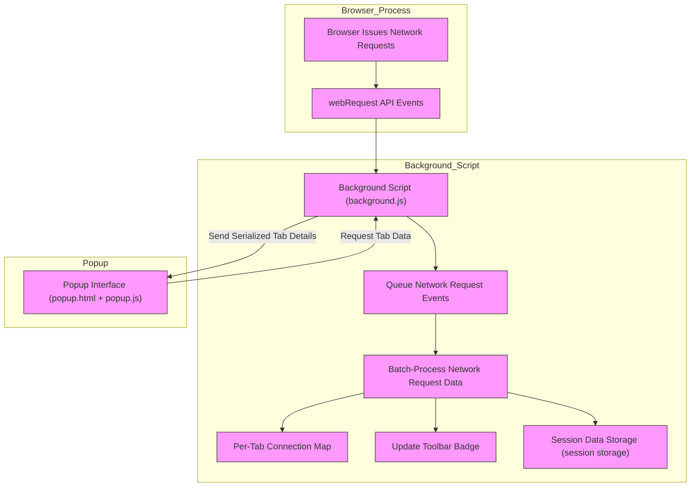

# System Architecture: How Connection Reporting Works

Discover how uBO Scope transforms real-time network activity into actionable insights by leveraging modern browser APIs. This guide breaks down the core architecture that powers connection reporting — from the browser’s network events, through efficient session data handling, to the intuitive popup interface you interact with.

---

## How uBO Scope Captures and Reports Remote Server Connections

At its heart, uBO Scope acts as a vigilant observer, closely monitoring each network request initiated by webpages in your browser. It harnesses native browser APIs to log and classify every connection attempt — revealing which remote servers were contacted, which requests succeeded, which were blocked, and which were stealthily redirected.

This architecture ensures transparent, trustworthy insights that work regardless of your installed content blockers or blocking methods.

---

### Core Components

- **Browser WebRequest API**: The foundational mechanism uBO Scope listens to for all network requests.
- **Background Script (`background.js`)**: Runs persistently (or as a service worker in Chromium) to collect, classify, and store connection outcomes.
- **Session Data Storage**: Temporarily caches network request details per tab, ensuring data is preserved across page navigations and browser sessions (session storage).
- **Popup Interface (`popup.html` + `popup.js`)**: Provides a real-time snapshot of connection data for the active tab, categorizing connections as allowed, stealth-blocked, or blocked.

---

## Detailed User Journey: From Network Request to User View

1. **Network Request Made**
   
   When you load or interact with a webpage, the browser issues countless network requests — for images, scripts, stylesheets, or API calls.

2. **Interception via `webRequest` Listeners**

   uBO Scope’s background script registers listeners on these requests using the browser's `webRequest` API events such as:

   - `onBeforeRedirect`  
   - `onErrorOccurred`
   - `onResponseStarted`

   These listeners capture the full lifecycle of each network request, including redirects, errors, and successful completions.

3. **Queuing and Debouncing Data Processing**

   To optimize performance and avoid overload, captured events are queued and processed in batches at one-second intervals. This approach allows efficient aggregation and classification without missing information.

4. **Classification of Request Outcomes**

   Each request is analyzed and categorized within the context of its browser tab:

   - **Allowed**: Requests that succeeded, indicating successful connections.
   - **Stealth-blocked**: Requests redirected or altered stealthily by content blockers.
   - **Blocked**: Requests that failed with errors or explicit blocking actions.

   Hostnames and their broader domains are tracked separately to help understand the scope of connections.

5. **Maintaining Per-Tab Connection Records**

   The background script maintains a `session.tabIdToDetailsMap` mapping each tab to its connection details, including distinct counts of domains and hostnames under each outcome category.

6. **Updating the Toolbar Badge**

   After processing a batch of network events, the badge count on the uBO Scope icon updates to reflect the number of allowed (successful) distinct third-party domains detected for the active tab.

7. **Exposing Data to the Popup**

   When you click the toolbar icon, `popup.js` requests detailed connection data for the current tab from the background script. The popup then renders this data, showing per-category domains with their associated connection counts.

---

## Practical Workflow Visualization

---

## Key Technical Insights for Users

- **Robust Monitoring**: By listening to multiple `webRequest` events, uBO Scope accurately tracks redirects, successful loads, and errors — providing a comprehensive connection picture.

- **Domain and Hostname Awareness**: Connections are grouped and counted both by full hostname and their registered domain, enabling users to detect distinct entities interacting with their browsing.

- **Session Persistence**: The extension persists session data, ensuring that connection insights aren’t lost when tabs reload or briefly disconnect.

- **Separation of Concerns**: The background script handles all tracking and data storage, while the popup is focused purely on rendering, offering a responsive and clean user experience.

- **Performance-Conscious**: Request events are processed asynchronously in timed batches to optimize resource usage and prevent UI freezes.

---

## Tips to Get the Most Out of uBO Scope

- Pay attention to the badge count on the toolbar icon — this is your quick visual indicator of distinct third-party domains successfully connected.

- Open the popup to see detailed listings of domains under “not blocked,” “stealth-blocked,” and “blocked.” Use this to understand which network requests are allowed or blocked by your current content blocking setup.

- Recognize that a lower badge count often means fewer connections to third-party servers — a key privacy metric.

- Use the data to identify unexpected connections or to validate how effective your filters and blocker configurations are.

- If you encounter inconsistencies, verify that your browser supports `webRequest` APIs fully, as network requests outside this API’s reach won’t be tracked.

---

## Summary

The architecture of uBO Scope intelligently leverages native browser APIs and a modular design, capturing a real-time, accurate picture of remote server connections per browser tab. From intercepting low-level network events to delivering user-friendly insights in the popup, every component focuses on transparency, reliability, and actionable information.

Explore related documentation to deepen your understanding of uBO Scope’s features, user interface, and best practices for privacy and content filtering.

---

## Next Steps
- Read the [What is uBO Scope?](../../overview/intro-basics/what-is-ubo-scope) page for the broad product introduction.
- Dive into [Core Features & Capabilities](../../overview/intro-basics/core-features) to understand detailed functionality.
- Explore [Understanding the Popup: Reading Connection Insights](../../guides/core-workflows/understanding-the-popup) to master interpreting the UI presentation.

For source code details and contributions, visit the [uBO Scope GitHub repository](https://github.com/gorhill/uBO-Scope).

---

## Source File References

- Background script implementing core connection tracking: [`js/background.js`](https://github.com/gorhill/uBO-Scope/blob/main/js/background.js)
- Popup interface and data rendering: [`js/popup.js`](https://github.com/gorhill/uBO-Scope/blob/main/js/popup.js)
- Browser API abstraction and storage helpers: [`js/ext.js`](https://github.com/gorhill/uBO-Scope/blob/main/js/ext.js)

---

