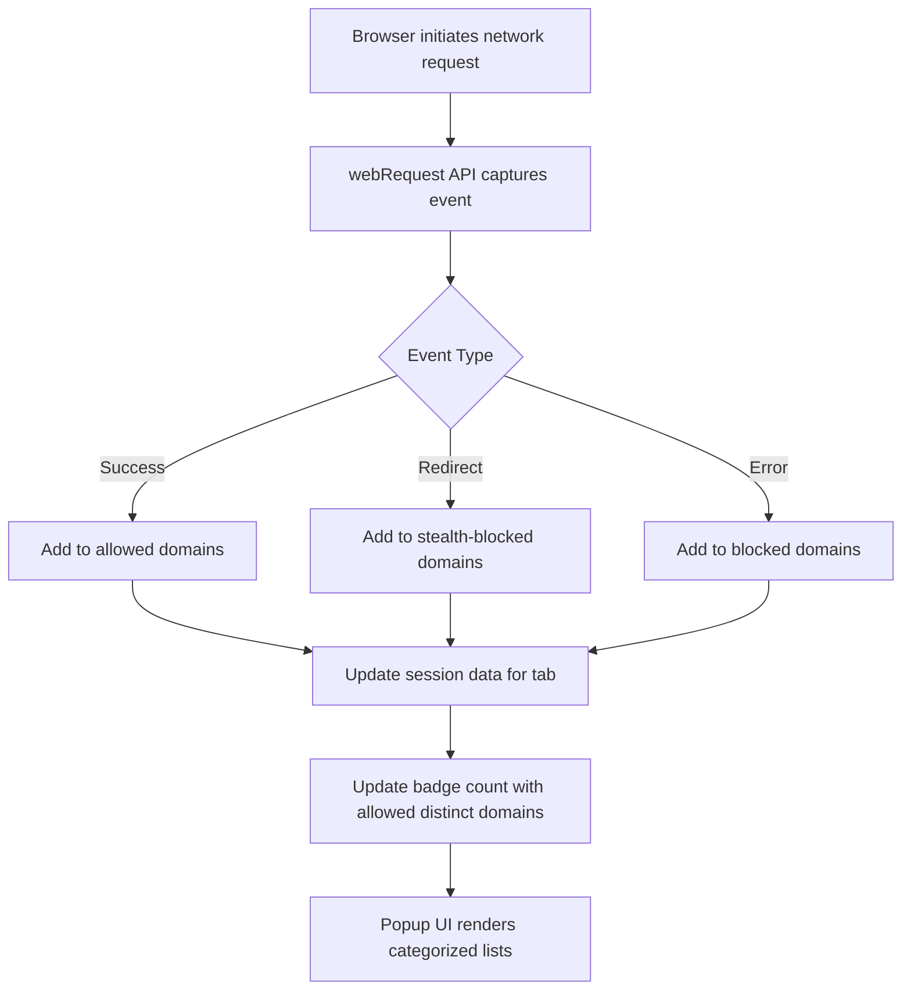

# Data Flow & Core Concepts

Understanding how uBO Scope observes, categorizes, and presents network requests is key to harnessing its power for transparent browsing. This page unpacks the data flow within the extension, defines crucial terms, and clarifies what the badge count displayed on the toolbar represents.

## How Network Requests Are Observed

uBO Scope listens to your browser’s network activity using the webRequest APIs available in modern browsers like Chrome, Firefox, and Safari. It captures every network request your browser initiates during a browsing session, regardless of whether these requests are allowed, stealth-blocked, or outright blocked by any content blocker.

- **Capture Points**: The extension taps into three primary events:
  - `onBeforeRedirect`
  - `onErrorOccurred`
  - `onResponseStarted`

Each network request is queued and then processed in batches to update internal session data efficiently.

### Example User Flow:

1. You visit a webpage.
2. The browser starts making network requests to various servers.
3. uBO Scope traces each request through the webRequest API events mentioned.
4. Based on the request outcome, uBO Scope updates its session data:
   - Allowed connections
   - Stealth-blocked connections (requests redirected silently)
   - Blocked connections (requests that fail or are denied)
5. It presents this data in a categorized popup for your review.

## Key Outcome Categories Explained

uBO Scope groups observed connections into three distinct categories, reflecting their treatment during the browsing session.

| Outcome          | What It Means                                                                                              |
|------------------|----------------------------------------------------------------------------------------------------------|
| **Allowed**      | Requests that completed successfully, meaning connections went through without blocking.                  |
| **Stealth-Blocked** | Requests covertly redirected or modified to prevent direct blocking detection, ensuring minimal page disruption. |
| **Blocked**      | Requests that failed or were explicitly blocked, such as by content blockers or network errors.            |

### Why Categorize This Way?

This classification provides a nuanced view of your browsing’s network activity beyond simplistic block counts. Stealth-blocking, for example, identifies requests intercepted silently to avoid webpage breakage—information that typical blockers don’t report explicitly.

## Defining Essential Terms

### Third-Party Server

Any server that your browser connects to which is different from the main website’s domain. Detecting connections to third parties is crucial because these often relate to advertising, tracking, or CDNs (Content Delivery Networks).

### Stealth Blocking

A subtle method where requests are redirected or modified instead of being outright blocked to make the blocking less obvious to websites. This technique helps maintain page functionality while preventing unwanted content from loading.

### Badge Count Explained

The badge on the toolbar icon displays the count of **distinct third-party domains with successful allowed connections**. 

- **Lower is better:** A smaller number means fewer unique third-party servers were connected to, which often correlates with better privacy.
- This count does **not** include blocked or stealth-blocked domains.

<Tip>
This count reflects *connections*, not individual requests. Multiple requests to the same domain count as one.
</Tip>

## Data Flow Overview

Below is a simplified flow illustrating how network requests traverse through uBO Scope components, categorized and updated before final display:

During a page load or tab lifecycle, each request is recorded by tab, and summarized as domain counts separated by category.

## Practical Scenario

Imagine exploring a news website:

- The main site sends one request (allowed).
- A CDN delivers images via a third-party domain (allowed).
- A tracker attempts a request that is stealth-blocked to prevent detection.
- An advertising server’s request is blocked outright.

uBO Scope captures each of these, updating its session data and showing:

- Not blocked domains including the news site and CDN
- Stealth-blocked domains
- Blocked domains

The badge count reflects only the **number of distinct domains that were allowed**, giving you a clear, privacy-focused metric.

## Best Practices for Users

- Refresh or re-open the popup to see the latest data as browsing continues.
- Monitor badge counts to gain insight into third-party connections over time.
- Use the categorized lists to identify potentially unwanted third-party servers.

## Common Pitfalls to Avoid

- Do not rely solely on block counts as a measure of privacy protection—focus on distinct third-party connections.
- Remember some third parties (e.g., CDNs) are often necessary for website functionality.
- Understand that the badge count excludes stealth-blocked and blocked domains, which may still impact network behavior.

## Next Steps

- For installation and initial setup guidance, see [Prerequisites & System Requirements](/getting-started/installation-quickstart/prerequisites-system-requirements).
- Learn how to interpret the badge and popup results on the page [Understanding the Badge & Popup](/getting-started/setup-usage/interpreting-results).
- Explore the [System Architecture Overview](/overview/product-architecture/system-architecture-diagram) for detailed technical context.

---

For further insights or to contribute, visit the GitHub repository: [https://github.com/gorhill/uBO-Scope](https://github.com/gorhill/uBO-Scope)
