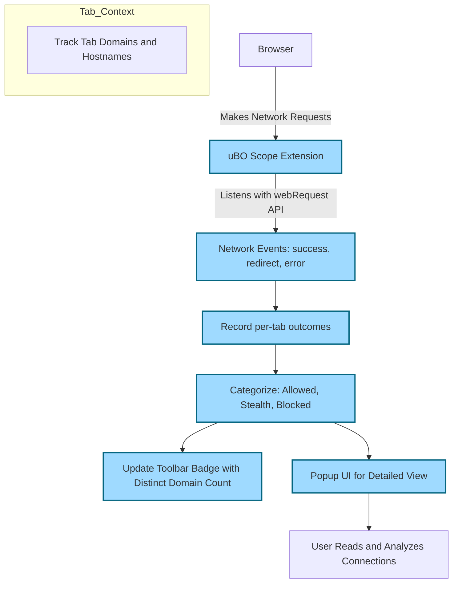

# What is uBO Scope?

## Discover Every Remote Connection Your Browser Makes

uBO Scope is a powerful yet lightweight browser extension designed to bring complete transparency to your web browsing by revealing every connection your browser attempts—or successfully establishes—to remote servers. It empowers you with a clear, detailed view of network activity that usually remains behind the scenes.

### Why This Matters to You

- **Total Visibility:** See every third-party server your browser communicates with, whether connections were allowed, stealthily blocked, or outright stopped.
- **Better Privacy Insight:** Understand how many and which external domains your browsing interacts with, allowing you to make informed decisions about your privacy.
- **Myth Busting:** Cut through misleading browser or content blocker myths by observing real connection data, not just superficial block counts.
- **Filter List Support:** Provides useful data to content filter maintainers for improving blocking rules, especially in constrained environments.

### Who Should Use uBO Scope?
This tool is ideal for privacy-conscious users who want to:
- Audit third-party connections in real-time.
- Verify the effectiveness of their content blockers.
- Understand the network footprint of visited webpages.

## What is uBO Scope?

In simple terms, uBO Scope is a companion extension to content blockers like uBlock Origin that monitors and reports all network requests your browser makes. Rather than blocking content itself, it focuses on observing and accurately reporting connection attempts to remote servers.

It listens to the browser's native `webRequest` API, which records all web requests initiated by webpages, including those that succeed, get blocked (by any means), or are redirected.

## Core Philosophy and Business Value

uBO Scope was created to address the gap between user perception and reality regarding network connections in web browsing:
- **Transparency:** Users deserve to see not just what their content blocker blocks, but **all** network connections attempted.
- **Accurate Metrics:** It reveals that block counts alone don’t tell the full story; fewer distinct third-party connections is the ultimate goal.
- **Trustworthy Auditing:** Helps users and filter list maintainers reliably audit connection activity, reducing reliance on dubious benchmarks like 'ad blocker test' webpages.

This makes uBO Scope a unique tool that goes beyond traditional content blockers, providing data essential for a realistic view of your browsing environment.

## How uBO Scope Works at a High Level

After installation, uBO Scope hooks into the browser’s network request system:

- It captures all outgoing network requests from tabs.
- Classifies each connection attempt into three categories:
  - **Allowed:** Requests that were successful.
  - **Stealth:** Requests that were blocked stealthily (such as by browser internals or subtle content block techniques).
  - **Blocked:** Requests explicitly blocked (e.g., by a content blocker or similar mechanism).
- Maintains session-scoped data to track connection activity by domain and hostname per browser tab.
- Displays summarized domain counts as a badge on the extension icon, helping you quickly gauge the network connections for your active tab.

The extension provides a user interface (popup) that details these categorized connections, showing the counted domains and allowing users to contextualize their browsing activity vividly.

---

## Real-World Example: Transparency in Action

Imagine you visit your favorite news site. Behind the scenes, the page makes multiple network requests — to its hosting server, to advertisement networks, social media widgets, and analytics servers. Without uBO Scope, many of these connections remain invisible.

With uBO Scope, a single glance at the toolbar badge reveals how many distinct third-party domains were contacted. Opening the popup shows you exactly which domains were contacted, which ones were blocked, and which were invisibly stealth-blocked. This empowers you to decide if your privacy is maintained or if further action (like tweaking your content blockers) is needed.

---

## Important Insights & Tips

- **Focus on Domain Counts:** The badge represents the count of distinct third-party remote servers. A lower number is better, indicating fewer external connections.
- **Not All Third Parties Are Bad:** Content delivery networks (CDNs) and essential services may appear; the goal is to minimize unnecessary or unwanted connections.
- **Block Count Is Not a Reliability Metric:** More blocked requests do not always mean better blocking. More blocking can sometimes correlate with more distinct remote connections allowed.
- **Avoid Ad Blocker Test Webpages:** Such tests often create artificial network requests and don't reflect real-world behavior. uBO Scope helps you see true network activity.

---

## Summary of Key Concepts

| Term | Meaning |
|-------|---------|
| **Allowed** | Successful remote connections to servers for the active tab. |
| **Stealth-blocked** | Requests blocked invisibly by content blockers or browser mechanisms (not directly visible to webpages). |
| **Blocked** | Explicitly blocked requests detected by the extension. |
| **Tab Domain** | The domain of the main webpage being visited in a tab, used to group connections contextually. |

## Visualization of uBO Scope's Network Monitoring Flow

---

## Next Steps

Ready to dive deeper?
- Visit [Core Concepts & Terminology](/overview/product-intro-and-basics/core-concepts-and-terminology) to understand the specific language and technical context behind network monitoring.
- Explore [Who Should Use uBO Scope?](/overview/product-intro-and-basics/target-audience-and-use-cases) to identify your best use cases and practical applications.
- Start with [Installing on Your Browser](/getting-started/installation-and-setup/install-on-chromium) to get uBO Scope running.

<u><em>Empower your browsing transparency today with uBO Scope.</em></u>
