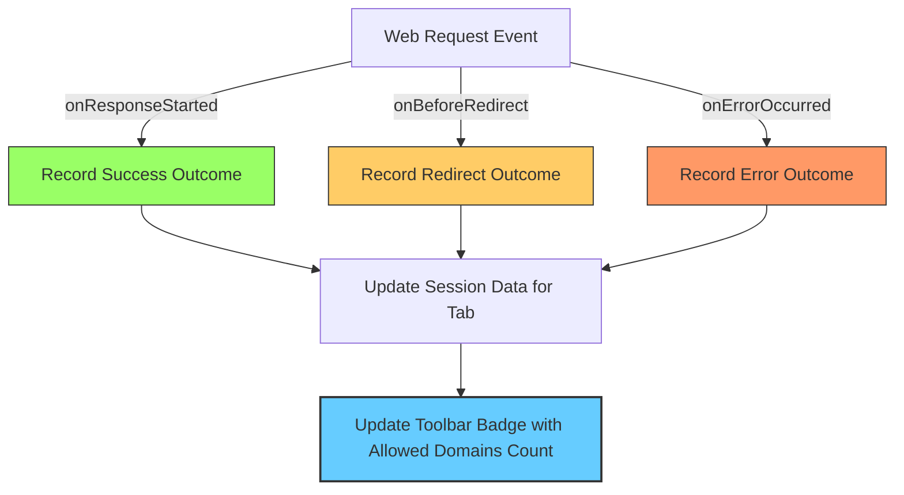

# What is uBO Scope?

Discover the true scope of your web browsing connections with **uBO Scope**, a powerful browser extension designed to reveal every attempted or successful connection to remote servers on webpages you visit. Unlike typical tools, uBO Scope shows you all network activity regardless of which content blocker or DNS filtering system is in place, giving you an unfiltered view of web interactions.

---

## Why Does This Matter?

Every webpage you load in your browser connects to various servers behind the scenes — some necessary, many third-party, some potentially invasive or unwanted. However, modern content blockers and DNS filters often conceal or filter out these connections, making it unclear exactly which servers your browser is actually reaching out to.

**uBO Scope shines a light on this network activity**, showing you precisely which third-party servers are contacted, no matter what blocking technology you’re using. This visibility empowers you to understand your web footprint, verify the effectiveness of your content blockers, and make informed decisions about your online privacy.

---

## What is uBO Scope?

**uBO Scope** is a lightweight browser extension that monitors and reports all network requests made by webpages, including:

- Successful connections
- Redirects
- Blocked requests (due to errors or blocking)

It counts and reports the number of distinct third-party remote servers that a webpage interacts with. This count is displayed as a badge on the browser toolbar icon, providing you immediate feedback on the diversity and scope of external connections.

The extension operates independently of content blockers, leveraging the browser's `webRequest` API to observe requests regardless of DNS-based or extension-based filtering in effect.

---

## How uBO Scope Works

The core mechanism behind uBO Scope is continuous monitoring of network requests:

1. Listens to all outgoing web requests from the browser that match the configured host permissions (e.g., HTTP, HTTPS, WebSocket).
2. Classifies each request based on its outcome — whether allowed, redirected stealthily, or blocked due to an error.
3. Aggregates requested domains and hostnames, grouped by their top-level domain and public suffix (using an embedded Public Suffix List).
4. Shows counts of these domains to present a clear summary of which third-party servers are in play.

This process results in a real-time, actionable dashboard accessible via the popup UI, allowing deep exploration of which domains were contacted during your current browsing session.

---

## Core Benefits

- **Transparent visibility:** See every remote server your browser attempts to connect with, even if a content blocker is active.
- **Objective measurement:** Unlike block counters that can be misleading, the badge shows distinct connection counts for a true understanding of network reach.
- **Cross-blocker compatibility:** Functions irrespective of other content blockers or DNS filters, relying directly on the browser’s network request reporting.
- **Privacy insights:** Helps confirm which third-party trackers or resources are actually contacted versus those blocked or stealthily redirected.

---

## Common Use Scenarios

- **Evaluating content blockers:** Determine if your blocker truly limits external connections or merely inflates block counts.
- **Privacy assessment:** Identify unexpected third-party servers your browser reaches, facilitating tighter privacy controls.
- **Filter list maintenance:** Verify the real impact of filter lists on actual network requests.
- **Myth busting:** Debunk unreliable ad blocker test websites and misleading metrics.

---

## Understanding the Badge Count

The numeric badge on uBO Scope’s toolbar icon reflects the number of **distinct third-party domains** the current active tab has connected to successfully. A **lower number indicates fewer external connections, generally desirable** for privacy and performance reasons.

> Note: Not all connections flagged are malicious or unwanted; many legitimate third-party servers such as CDNs are expected.

---

## How to Access uBO Scope Data

Click the uBO Scope icon in your browser toolbar to open the popup view. Here you will find:

- The current page’s hostname and domain.
- Counts and breakdowns of domains categorized as:
  - **Not Blocked:** Requests that succeeded without issues.
  - **Stealth-Blocked:** Requests redirected stealthily (subtle network changes).
  - **Blocked:** Requests that failed due to blocking or errors.
- Per-domain counts, showing how often each domain was contacted.

This detailed view helps you trace network behaviors during a browsing session.

---

## Practical Tips

- Regularly monitor connections on sites you trust and sites you don’t to compare behaviors.
- Use uBO Scope alongside your preferred content blockers to validate their effectiveness.
- Pay attention when you see higher-than-expected distinct counts—this might indicate unnecessary or unwanted third-party calls.
- Remember, the extension cannot report requests that occur entirely outside the browser’s controlled spaces (e.g., some VPN or OS-level DNS filtering).

---

## Summary

uBO Scope brings unprecedented transparency to your browsing network activity, helping you see through the fog of blocking technologies. Its clear, domain-focused analytics empower you to take control of your online privacy and understand what is really happening behind the scenes.

Explore further sections in this documentation to learn about the detailed architecture, how to interpret results effectively, and how to get started with uBO Scope.

---

For installation and first use, visit the [Getting Started guide](/getting-started/introduction-setup/about-and-purpose).

For deeper analysis techniques and use cases, see [Revealing All Remote Server Connections](/guides/core-workflows/connection-analysis) and [Interpreting the Badge Count and Popup Results](/guides/core-workflows/interpreting-badge-and-results).

---

## License and Source

uBO Scope is open source, licensed under the GNU General Public License v3 or later. Explore the code and contribute on GitHub: [https://github.com/gorhill/uBO-Scope](https://github.com/gorhill/uBO-Scope)

---

## Additional Resources

- [Official GitHub Repository](https://github.com/gorhill/uBO-Scope)
- [Public Suffix List Utilized by uBO Scope](https://publicsuffix.org/)
- [uBlock Origin Project](https://github.com/gorhill/uBlock)

---

<Info>
Beware of misleading ad blocker metric websites; rely on uBO Scope for accurate network request insights.
</Info>

---

### Example: How the badge count updates

Each network request outcome updates an internal session and the tab badge as shown in the following simplified flow:

This cycle continues throughout your browsing to keep the data and badge count current.
