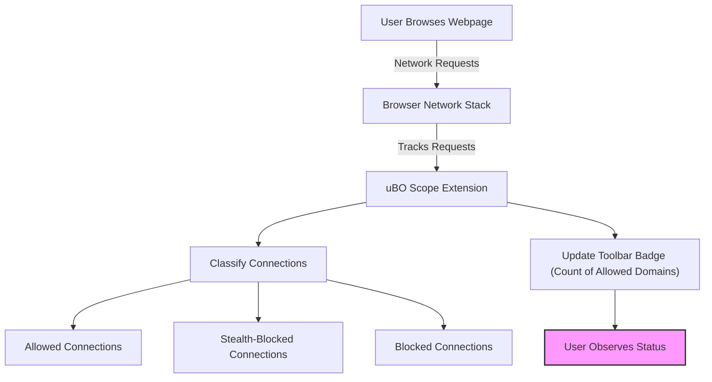

# What is uBO Scope?

Discover the power of transparency with uBO Scope — a simple yet insightful browser extension designed to expose every network connection initiated by the web pages you visit. Unlike traditional content blockers that focus only on counting blocked ads or trackers, uBO Scope uncovers the entire landscape of outgoing connections, giving you a clear view of the digital footprints left behind.

## Revealing the Invisible Network

Every time you load a webpage, your browser silently reaches out to many remote servers. Some connections are intentional and benign — like fetching images or loading scripts from content delivery networks (CDNs). Others, however, might be unwanted or invisible to you.

uBO Scope strips away this opacity by reporting **all attempted or successful network connections** from active browser tabs. This helps you understand exactly which third-party servers your browser contacted, regardless of whether a content blocker prevented them or not.

### What Makes uBO Scope Unique?

- **Counts distinct third-party remote servers, not just blocked requests.** It highlights the number of *unique* external domains involved, helping you focus on meaningful impact.
- **Works independently of content blockers.** Even if multiple blockers or DNS filters are running, uBO Scope faithfully reports network activity as your browser observes it.
- **Exposes stealthy network behaviors.** It differentiates connections that were blocked outright from those that were stealthily blocked or allowed, giving you nuanced insight.
- **Cross-browser support and minimal footprint.** Designed to run efficiently across Chromium, Firefox, and Safari browsers.

## Why Should You Care About uBO Scope?

Understanding network connections on the web empowers you to make informed privacy and security decisions. uBO Scope gives you:

- A clear picture of how many distinct external servers a page is connecting to, beyond what block lists reveal.
- Transparency into stealth blocking that might otherwise go unnoticed.
- A practical tool for filter list maintainers seeking to validate the real-world impact of their rules.

Through this extension, myths about content blocker effectiveness are challenged, shifting your focus from arbitrary counts to meaningful network outcomes.

## Real-World Scenario: Monitoring a Tab

Imagine you open a news website:

1. uBO Scope tracks every network request your browser makes for this page.
2. It classifies the requests into three buckets: allowed connections, stealth-blocked requests (silently blocked), and outright blocked ones.
3. When you click the uBO Scope icon, a popup breaks down each domain contacted, showing how many requests went to each.
4. The badge on the extension icon shows the count of distinct allowed third-party domains, making it easy to spot heavy network activity.

This flow helps you quickly assess if a site is reaching out to a wide array of unknown servers or sticking to a small group of trusted providers.

## The Core Mission

uBO Scope's mission is straightforward: **to measure and report all network activity observed by your browser, providing clear insight into the web's hidden connections.** This foundational transparency enables users of all skill levels to understand the web's complexity and to question assumptions about content blocking efficacy.

## Summary

- uBO Scope reveals all outgoing network connections per browser tab.
- It distinguishes between 'allowed', 'stealth-blocked', and 'blocked' connections.
- The toolbar icon badge shows the count of distinct allowed third-party domains.
- It works alongside any content blocker, providing independent and trustworthy tracking.

Unlock a new level of network visibility and empower your browsing experience with uBO Scope.

---

## Getting Started

Ready to see what your browser is really connecting to? Start by installing uBO Scope from your browser's extension store, then visit a site and click the uBO Scope icon to view the details of that tab's network connections.

For installation instructions, troubleshooting tips, and detailed workflows, refer to the related documentation pages:

- [Installing uBO Scope](https://github.com/gorhill/uBO-Scope)
- [Navigating the uBO Scope Interface](/overview/core-concepts-architecture/navigating-ubo-scope-ui)
- [Understanding the Badge Count](/guides/using-ubo-scope/interpreting-badge)

---

## License & Source

uBO Scope is open source software licensed under GNU General Public License v3.0. Its source code and ongoing development can be found on GitHub: [https://github.com/gorhill/uBO-Scope](https://github.com/gorhill/uBO-Scope)

---

<Info>
Note: While uBO Scope does not block connections itself, it provides crucial context to understand what your content blockers allow or prevent, helping you achieve greater privacy awareness.
</Info>

# Related Concepts Diagram

This diagram illustrates the user browsing process and how uBO Scope captures and presents network connection outcomes.

---