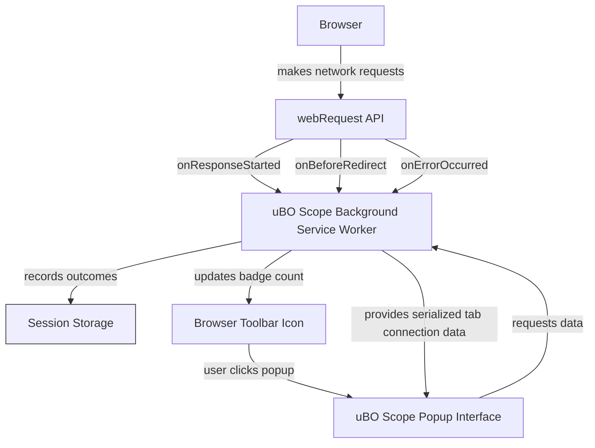

# What is uBO Scope?

## Discover Every Network Connection While You Browse

uBO Scope is a straightforward yet powerful browser extension that puts you in control by revealing **every network connection**—whether attempted or successful—that your browser makes to remote servers. By utilizing the browser's `webRequest` API independently of any content blocker, uBO Scope offers **clear visibility into network activity**, empowering you to make informed decisions about your privacy and security.

### Why uBO Scope Matters

- **Complete Transparency:** See all remote server requests your browser attempts, regardless of your current content blocker or DNS-based filtering.
- **Independent Monitoring:** Operates separately from any blocker, giving an unbiased view of network connections.
- **Actionable Insights:** Helps identify stealthy or invisible connections that standard blockers might miss.
- **Privacy Empowerment:** Provides concrete data for evaluating and improving your online privacy.

### Who Should Use uBO Scope?

- Privacy-conscious users who want direct insight into network connections.
- Security enthusiasts needing to monitor hidden or stealthy web requests.
- Filter list maintainers seeking an independent tool to validate blocking efficiency.
- Anyone curious about what servers their browser talks to behind the scenes.

---

## What Is uBO Scope?

At its core, uBO Scope is a browser extension that listens to network traffic generated by your browser while you navigate the web. Unlike typical content blockers that intercept or block requests, uBO Scope **observes all outgoing network requests** through the browser’s `webRequest` API, showing you the full picture of what connections your browser attempts and the outcome of each.

This robust visibility includes:

- Requests that succeed,
- Requests that are blocked,
- Requests that are stealthily redirected or suppressed.

By aggregating and presenting this data transparently, uBO Scope helps you understand the true network footprint of your browsing.

### How It Works

uBO Scope hooks into the browser's network events—specifically `onBeforeRedirect`, `onErrorOccurred`, and `onResponseStarted`—to record what happens to each request your browser issues to remote servers. It then categorizes these requests as allowed, stealth-blocked, or blocked, tracking domains and counts per tab for clarity. This data is presented through a simple popup interface that you can open directly from the browser toolbar.

This monitoring occurs independently of any content blocker you use, meaning it provides a unique, unbiased view that complements other tools.

---

## Key Features & Capabilities

### 1. Comprehensive Network Request Monitoring

uBO Scope tracks every network request your browser initiates, including HTTP(S) and WebSocket connections, regardless of whether a content blocker intercepts them.

### 2. Outcome Categorization

Requests are sorted into three primary categories:

- **Allowed:** Connections that completed successfully.
- **Stealth:** Connections that were redirected or stealth-blocked by other extensions or mechanisms.
- **Blocked:** Connections that failed or were blocked outright.

### 3. Domain Aggregation and Counting

Requests are grouped by their registered domain, and counts reflect how many connections were made per domain, helping you quickly identify which third parties your browser contacts most frequently.

### 4. Tab-Specific Tracking

uBO Scope correlates network requests to individual browser tabs, providing per-tab insights that make it easy to assess a specific page’s network behavior.

### 5. Browser Compatibility

Designed as a modern extension, uBO Scope supports Chromium, Firefox, and Safari browsers by leveraging the respective `webRequest` APIs.

### Real-World Example

Imagine browsing a news site: uBO Scope reveals connections to the main news server (allowed), several ad networks (blocked), and stealthy trackers attempting invisible connections (stealth). This insight lets you understand the digital ecosystem behind the page.

---

## Why Should You Care?

### Gain Full Visibility Beyond Your Blocker

Content blockers vary in effectiveness and may use methods that are invisible to the page or other tools. uBO Scope cuts through the fog by offering independent observations of **all** network activity.

### Detect Stealthy Tracking and Hidden Requests

Invisible, stealth-blocked requests can undermine your privacy. uBO Scope surfaces these attempts, exposing them for your awareness or further investigation.

### Improve Privacy Outcomes

By understanding which third parties are contacted and which connections succeed or fail, you can tailor your content blockers and filters more effectively, reducing unnecessary exposure.

### Make Data-Driven Decisions

Rather than guessing if your blocker is working as intended or relying on misleading test pages, use uBO Scope’s real usage data to assess real-world network behavior accurately.

### Before and After Scenario

- **Without uBO Scope:** Network connections to third parties occur unnoticed, and your understanding of your browser’s footprint is limited.
- **With uBO Scope:** You have a clear, actionable overview of connections, allowing you to identify and address privacy risks actively.

---

## Getting Started Preview

### Quick Start

1. Install the uBO Scope browser extension from your browser’s official addon store.
2. Click the uBO Scope toolbar icon while browsing any webpage.
3. View the detailed list of remote domains connected, categorized by allowed, stealth, or blocked.

### Prerequisites

- Supported browsers: Chromium-based browsers (Chrome, Edge), Mozilla Firefox (version 128.0+), Safari (version 18.5+).
- Browser must support the `webRequest` API.
- Permissions: Extension requires access to active tab, storage, and webRequest to operate.

### Next Steps

- Explore the **Value Proposition & Primary Use Cases** to learn more about how uBO Scope fits your privacy workflow.
- Refer to **Using the Popup: Viewing and Interpreting Results** for detailed guidance on reading the interface.
- Dive into **Understanding Third-Party Connections and Badge Counts** to decode the toolbar icon insights.

---

## Common User Tips & Best Practices

- Open the popup frequently while browsing to understand how different sites behave.
- Use the domain counts to identify unexpected or excessive third-party connections.
- Combine uBO Scope with content blockers for layered privacy protection.
- Remember that some third-party connections (e.g., CDNs) are normal and necessary.

## Troubleshooting

- If no data appears, ensure you have granted the necessary permissions.
- Confirm your browser version meets the minimum requirements.
- Verify the extension is enabled and active.
- For issues related to network visibility, check that no other extensions or browser settings block access to the `webRequest` API.

---

Harness the power of visibility with uBO Scope—know exactly which remote servers your browser connects to, empower your privacy decisions, and browse with confidence.

---

For more information and installation details, visit the [uBO Scope GitHub repository](https://github.com/gorhill/uBO-Scope).

---

## Diagram: uBO Scope Network Request Flow

This flowchart illustrates how uBO Scope listens to browser network events, records connection outcomes per tab, updates the toolbar badge with the count of distinct allowed domains, and provides the user interface to visualize connection data.
