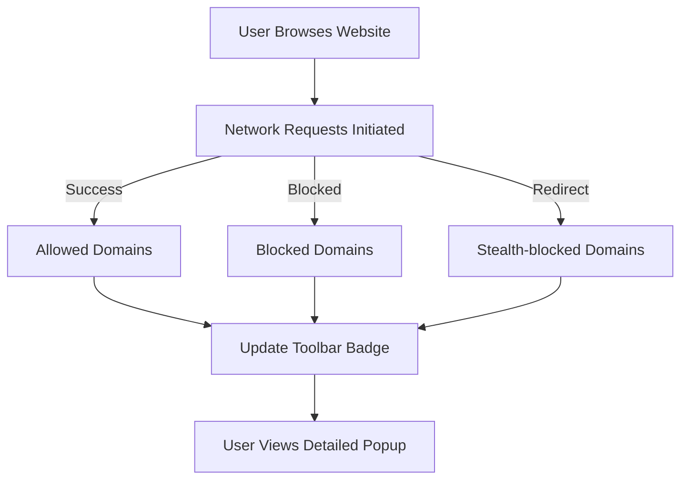

# What is uBO Scope?

## Discover Every Network Connection Your Browser Makes

uBO Scope is a powerful browser extension designed to shine a light on every connection your browser attempts or successfully establishes with remote servers. Regardless of what content blocker you use—or even if you use none—it reports all network activity within your browser through its intuitive interface.

### Why This Matters to You

Modern web browsing often involves countless requests to numerous third-party servers behind the scenes. While some extensions claim to block more ads or trackers, uBO Scope focuses on the _actual outcome_ of these network requests: how many third-party servers your browser truly connects to.

This insight is crucial whether you're a privacy-conscious user, a web developer verifying resource loads, or a filter list maintainer seeking real data about connections.

### Core Value Propositions

- **Complete Visibility:** See _all_ network connections your browser makes—successful, redirected, blocked, or stealth-blocked.
- **Content Blocker Agnostic:** Reveals connections regardless of any content blocker, DNS-level blocking, or stealth techniques in use.
- **Reliable Metrics:** Toolbar badge shows the number of _distinct third-party remote servers_ connected to—helping you understand real exposure.
- **Debunk Common Myths:** Validates claims about blocking effectiveness with real, transparent data.
- **Lightweight and Transparent:** Uses your browser's native `webRequest` API without interfering with your browsing experience.

### Who Should Use uBO Scope?

- Privacy-conscious individuals wanting to audit their browsing footprint.
- Developers and researchers analyzing website network activity.
- Filter list maintainers who need accurate connection information beyond ad-blocker statistics.

---

## Understanding uBO Scope

### What is uBO Scope?

uBO Scope is a companion browser extension to uBlock Origin, developed to measure and report network connections made by your browser. By listening to all network requests via the browser's `webRequest` API, it tracks and classifies each network request's outcome, revealing the true extent of third-party interactions.

Unlike typical network monitors or debugging tools, uBO Scope operates independently of any content blocker. It reports every attempted connection, whether blocked by an extension or allowed, to help you assess actual exposure to third-party servers.

### What Problem Does It Solve?

Users often rely on extension-reported block counts or third-party test sites to gauge how well a content blocker protects privacy. These measures are misleading:

- Block counts do not reflect how many unique third-party connections are actually allowed.
- 'Ad blocker test' sites create artificial environments that don't mimic real-world browsing.
- Content blockers can use stealth techniques that evade detection by webpages.

uBO Scope solves this by exposing the _real_ connections happening in your browser with accuracy and transparency.

### How Is uBO Scope Different?

- It reports distinct remote third-party hosts connected per site, not just raw block counts.
- Shows connections even if content blocking is performed outside the extension (e.g., DNS blocking).
- Provides a clear badge indicating the number of unique third-party servers contacted for each browser tab.
- Transparent and simple: no guessing, no inflated block metrics, just the truth about network connections.

### A Glimpse at How uBO Scope Works

At a high level, uBO Scope listens to browser events for network requests (like redirects, successful responses, and errors). For each browser tab, it tracks and categorizes remote connections into:

- **Allowed:** Connections successfully made.
- **Blocked:** Connections that failed or were blocked.
- **Stealth-blocked:** Redirected connections indicating stealth blocking by content blockers.

This structured data is aggregated and displayed via the extension's toolbar badge and popup, giving you a clear, actionable snapshot.

---

## Key Features & Capabilities of uBO Scope

### 1. Comprehensive Network Request Tracking
- Tracks all HTTP, HTTPS, WS, and WSS requests initiated by webpages.
- Listens for events: start, redirect, success, and error.
- Records all remote server hostnames involved.

### 2. Accurate Domain Categorization
- Uses the Public Suffix List to correctly determine domains from hostnames.
- Differentiates between main frame and child frame requests.
- Separates connections into allowed, blocked, and stealth-blocked groups.

### 3. Real-Time Badge Updates
- Displays on the toolbar icon the distinct count of third-party domains connected per tab.
- Provides immediate visibility without opening the popup.

### 4. Detailed Popup Interface
- Lists all domains connected grouped by outcome (allowed, blocked, stealth-blocked).
- Shows connection counts per domain, reflecting frequency.
- Converts punycode domains to Unicode for easier reading.

### 5. Persistence and Session Memory
- Remembers connection data across browser sessions.
- Ensures continuity in network monitoring during extended browsing.

### Example: Visualizing Connection Outcomes

---

## Why Should You Care About uBO Scope?

### Gain True Insight Into Your Browser's Network Activity
Understand the _real_ extent of tracking or resource loading across websites you visit. Rather than relying on misleading block counts, uBO Scope reveals the unique servers actually contacted.

### Make Informed Privacy and Security Decisions
See exactly which third-party services your browser connects to—even under content blockers—and decide if you want to refine your filter lists or blocking strategies.

### Debunk Misconceptions and Improve Filter Lists
Filter maintainers and advanced users can use real measurement to evaluate which domains are truly involved in content delivery or tracking, leading to more effective blocking.

### Improve Troubleshooting
When websites behave unexpectedly, uBO Scope offers a clear view of network activity to pinpoint blocked or allowed connections, helping you identify issues or false positives.

### Before & After Scenario
| Without uBO Scope                         | With uBO Scope                                          |
|-----------------------------------------|--------------------------------------------------------|
| Rely on block counts that can be misleading | See actual unique third-party domains connected         |
| Trust 'ad blocker test' sites, which create unrealistic scenarios | Validate blocking claims with live, real-world data       |
| Blind to stealth or DNS blocking effects  | Detect stealth-blocked and blocked domains accurately    |

### Measurable Benefits
- Spend less time guessing which trackers or domains are active.
- Know if your content blocker or custom filters actually reduce exposure.
- Save bandwidth by spotting unwanted connections.

---

## Getting Started Preview

### Quick Start
Once installed, uBO Scope runs silently in the background. Start browsing as usual, and watch the toolbar badge:

- The badge number indicates how many unique third-party remote domains your current tab connected to.
- Click the toolbar icon to open a detailed popup listing all connected domains categorized by their outcome.

### Prerequisites
- Supported in modern browsers like Chrome (version 122+), Firefox (128+), and Safari (18.5+).
- Requires permissions to monitor network requests (`webRequest`, activeTab, storage).

### Next Steps
- Proceed to install uBO Scope for your browser platform.
- Learn how to interpret the badge and popup data in the guides.
- Explore common scenarios where uBO Scope clarifies network behaviors.

---

Explore further documentation to maximize your use of uBO Scope:

- [Value Proposition & Use Cases](/overview/product-intro/value-proposition-use-cases)
- [Understanding Allowed, Blocked, and Stealth Domains](/guides/practical-workflows/understanding-domain-outcomes)
- [Debunking Content Blocking Myths with Real Data](/guides/practical-workflows/debunking-common-myths)

Visit the project repository for updates and source code: [uBO-Scope on GitHub](https://github.com/gorhill/uBO-Scope)

---