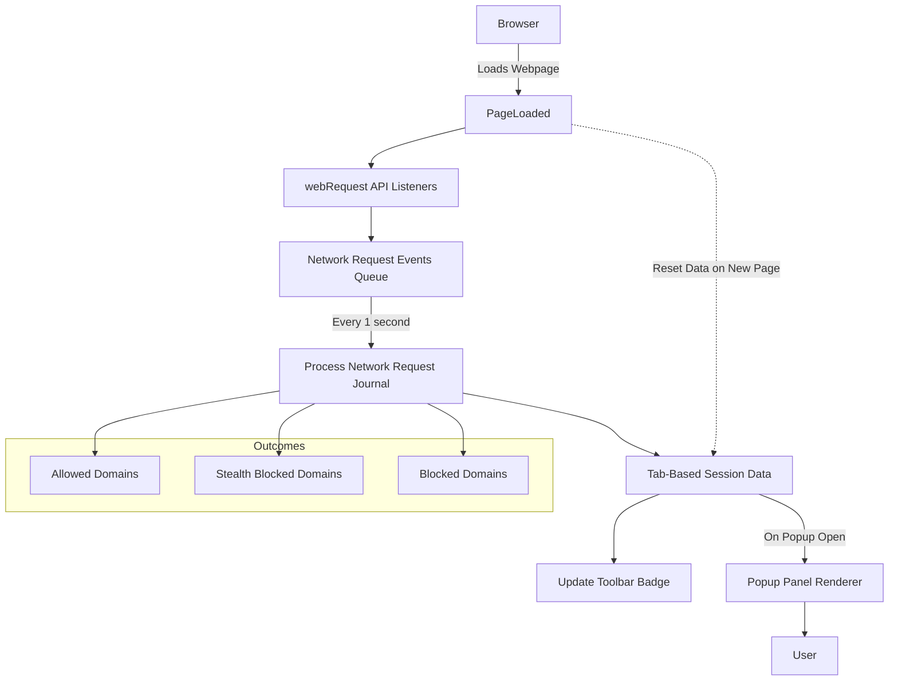

# How Does uBO Scope Work? (Intuitive Explanation)

Discover how uBO Scope operates behind the scenes to give you clear, actionable insights about network connections your browser makes. This page walks you through the intuitive flow of how the extension observes, collects, and summarizes data about remote server connections — all presented in an easy-to-understand popup panel, no technical jargon needed.

---

## Understanding uBO Scope's Operation: A User-Centered View

When you install and activate uBO Scope, it silently watches your browser’s network activity. It doesn’t just count all requests blindly — instead, it categorizes them into meaningful groups: those that were allowed to connect, those stealthily redirected or blocked, and those outright blocked by your content blockers or the browser.

The purpose? To provide transparency about all third-party connections initiated by the webpages you visit. Rather than overwhelming you with raw data, it compiles these connections into aggregated insights that reflect real privacy-relevant events.

### Step 1: Observing Network Requests

Using the browser’s **webRequest API**, uBO Scope listens to network requests your browser makes — from page loads, embedded images, scripts, frames, and more. Each request triggers events such as:

- **Redirects** — When a request is silently rerouted
- **Errors** — When network requests fail or are blocked
- **Successes** — When requests complete successfully

This raw data stream is the foundation for understanding what actually happens as the page loads and runs.

### Step 2: Categorizing Outcomes by Domain

Each network request is analyzed to extract its **hostname** and corresponding **registered domain** (using the public suffix list). Based on the request’s fate, it gets sorted into one of these outcome groups:

- **Allowed:** Requests that succeeded without interference
- **Stealth Blocked:** Requests that triggered redirects used by blockers to silently stop content (making it hard for webpages to detect blocking)
- **Blocked:** Requests that failed or were explicitly blocked

This classification lets you see at a glance how many distinct domains your browser connected to — and whether those attempts were thwarted.

### Step 3: Aggregation and Tab-Level Tracking

uBO Scope tracks these outcomes **per browser tab**. When you navigate to a new page, the extension resets counts for that tab and rebuilds its profile of remote connections relevant to that visit.

The extension maintains detailed maps of domains and hostnames under each outcome, counting not just the number of requests but also the diversity of third-party domains involved in loading the page.

### Step 4: Visualizing Insights in the Popup Panel

The aggregated data is then sent to the popup panel that appears when you click the uBO Scope toolbar icon. Here, it shows:

- The **total number of distinct third-party domains connected to** during the page load
- Lists of domains under each outcome type: allowed, stealth-blocked, and blocked

The popup’s intuitive layout helps you quickly understand your exposure to trackers, advertisers, and other third parties.

---

## How uBO Scope’s Scope Fits in Your Browser

### What Happens When You Open the Popup?

When activated, uBO Scope asks the background script for the current tab’s connection data. The background script retrieves stored details and sends back the serialized summary of domains by outcome.

The popup then decodes and renders this data into a clean interface that highlights the number of connected domains and their classification.

### Why Does This Matter?

By focusing on **distinct third-party domains** rather than raw block counts, uBO Scope delivers a privacy-centric perspective: fewer third-party domains mean fewer external entities can track you.

This approach also clarifies common misunderstandings — for example, a blocker showing a high block count may still allow connections to many third-party domains, potentially leading to more privacy leakage.

---

## Practical Example: Visualizing a Webpage’s Third-Party Connections

Imagine you visit a news site. uBO Scope listens as your browser requests:

- The main site’s URL (allowed)
- Several third-party ads domains (blocked or stealth-blocked)
- CDN domains delivering images and scripts (allowed)

After the page loads, you click the uBO Scope icon and see:

- **Domains connected:** 5
- Under **not blocked:** examplecdn.com, fonts.example.net
- Under **stealth-blocked:** ads.adserver.com
- Under **blocked:** tracking.domain.com

This lets you instantly gauge the effectiveness of your content blockers and how many external entities the page tried to contact.

---

## Tips for Making the Most of uBO Scope’s Insights

- **Check after loading important pages** to see what third parties are involved.
- **Use uBO Scope as a verification tool** alongside your content blocker to understand stealth blocking behavior.
- Remember the badge count on the toolbar reflects the number of **allowed** domains, so a lower number generally means better privacy.
- If you see unexpected domains in the “not blocked” list, consider investigating or adjusting your filter lists.

---

## Common Pitfalls & Troubleshooting

<AccordionGroup title="Common Pitfalls with uBO Scope">
<Accordion title="Why does the extension sometimes show 'NO DATA'?">
If the popup opens before the tab’s data is fully available, the panel will display 'NO DATA'. Refresh the page and reopen the popup to let the extension collect complete information.
</Accordion>
<Accordion title="Why do some network requests not appear in the data?">
uBO Scope relies on the browser's webRequest API, which cannot monitor all types of network activity (such as requests initiated outside the browser’s normal request flow). Therefore, some connections may be invisible to the extension.
</Accordion>
<Accordion title="The badge count doesn’t match my expectations, why?">
The badge reflects **distinct third-party domains that were allowed**. High block counts in your content blocker don’t necessarily mean more domains blocked—it may mean more requests attempted, but many domains are still allowed.
</Accordion>
</AccordionGroup>

---

## Next Steps: Getting Started with uBO Scope

Ready to see these insights yourself? To start, visit the [Installing uBO Scope](https://github.com/gorhill/uBO-Scope) page and follow setup instructions. Then explore the [Understanding the Popup Interface](https://your-docs-path/guides/getting-started/understanding-popup) to learn how to interpret the data you see.

For deeper understanding, consult the [What is uBO Scope?](./what-is-ubo-scope) overview page.

---

## Summary Diagram: Data Flow Inside uBO Scope

This diagram illustrates the intuitive flow from your browser requesting URLs, uBO Scope monitoring these requests, categorizing them, maintaining session storage per tab, updating the badge for quick reference, and providing detailed summaries via the popup interface.

---