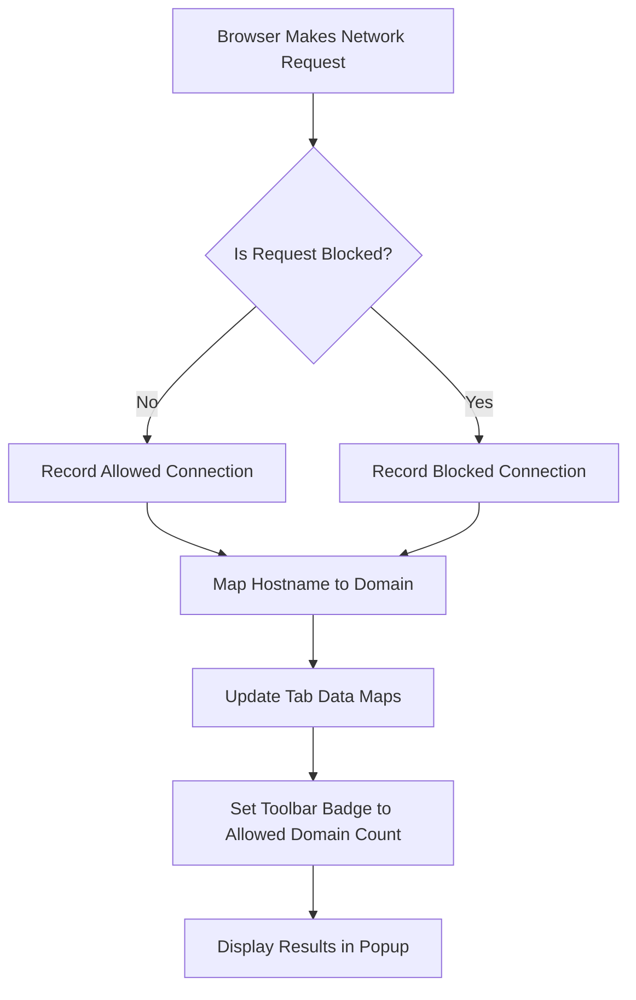

# Key Features and Value Proposition

## Unlock Complete Visibility Into Your Browser's Network Connections

uBO Scope serves as your transparent window into the network activity of your web browser. It reveals every remote server your browser attempts or succeeds to connect to, regardless of any content blockers or DNS filters in place. This means you get an unfiltered, accurate count of third-party connections, giving you the power to understand exactly which domains your browser is communicating with.

### Why This Matters

- **True Picture of Third-Party Connections:** The toolbar badge reflects the number of distinct third-party remote servers connected, not just blocked requests, focusing your attention on what resources actually reach your device.
- **Content Blocker-Independent Reporting:** No matter which content blocker or DNS-based filter you use, uBO Scope tracks outgoing connection attempts via the browser's `webRequest` API, ensuring consistent visibility.
- **Myth Busting and Empowerment:** It helps you dispel common misconceptions about content blockers and ad blocker testing pages by showing real network connection behavior.
- **Valuable for Privacy Advocates and Filter List Maintainers:** By accurately counting third-party connections, it becomes an indispensable tool for those caring about privacy and for maintainers working on filter lists.

## Core Capabilities

### Distinct Third-Party Connection Counting

uBO Scope uses advanced monitoring of network requests at the browser level. It distinguishes distinct third-party domains involved in network connections, not merely the total number of requests, and updates the toolbar icon badge count accordingly. A lower count directly correlates to better privacy and content control.

### Classification of Connection Outcomes

The extension categorizes network connections into three groups displayed in the popup interface:

- **Allowed:** Domains from which connections were successfully established.
- **Blocked:** Domains where connection attempts failed or were blocked.
- **Stealth-Blocked:** Connections that underwent redirects or hidden blocking behavior.

This classification helps users quickly interpret network activity related to any active webpage.

### Independence from Specific Content Blockers

Unlike many diagnostic tools tied to individual ad blockers or filters, uBO Scope relies solely on the browser's own `webRequest` API to monitor network connections. This independence means it gives an unbiased, holistic view of your browser's network behavior, unaffected by any single content blocking strategy.

### Support for All Modern Browsers

uBO Scope is fully compatible with Chromium-based browsers, Firefox, and Safari (version 18.5 and up), adapting to each platform's extension architecture while preserving consistent functionality.

## Real-World Benefits

### For Everyday Users

Gain transparency over how many third-party remote servers a website is actually connecting to — beyond what content blockers report. This clarity helps you make informed decisions about your privacy configuration.

### For Privacy Enthusiasts

Reveal hidden connections that may be allowed through content blockers, enabling you to fine-tune your protection and understand real third-party tracking exposure.

### For Filter List Maintainers

Leverage the extension's detailed connection insights to understand how filters behave in realistic conditions even on devices where traditional developer tools are unavailable.

## Practical Evidence: Why uBO Scope’s Connection Count Is More Reliable

Many users and even filter developers misunderstand content blocker quality by looking at the number of blocked requests rather than the number of distinct third-party servers allowed. A blocker that shows high block counts may still allow connections to more domains, reducing its effectiveness.

<u>Example of the Issue:</u>

> "This content blocker reports blocking more than that one, so it’s better."

uBO Scope dispels this by focusing on actual allowed third-party connections rather than block counts alone.

Similarly, popular "ad blocker test" pages generate synthetic requests that don’t represent typical browsing, causing misleading conclusions. uBO Scope's real-time monitoring of actual network traffic reveals the truth behind these claims.

## How It Works — At a Glance

uBO Scope leverages browser `webRequest` API listeners to monitor every network request a page makes. It extracts hostnames from URLs, maps these to registered domains using a parsed public suffix list (to correctly identify domain boundaries), and maintains categorized maps to record allowed, blocked, and stealth-blocked connections. This data drives the badge count and the detailed popup view.

## Visual Summary



## Tips for Getting the Most from uBO Scope

- Use the badge count as your primary privacy metric — fewer distinct third-party connections are better.
- Open the popup to understand exactly which domains are connecting, blocked, or stealth-blocked per tab.
- Remember that some third-party connections are legitimate (e.g., CDNs) and that a low count usually corresponds to better privacy.
- Use uBO Scope alongside your content blocker as a transparency tool, not as a blocker itself.

## Common Pitfalls to Avoid

- Don't equate the number of blocked requests with better privacy: focus on allowed third-party domains.
- Avoid relying on "ad blocker test" webpages for accurate blocker evaluation — they generate artificial scenarios.
- Understand that uBO Scope relies on browser APIs; connections made outside this scope may not be visible.

## Next Steps

Explore how to [Get Started with uBO Scope](/getting-started/introduction-and-prerequisites/about-ubo-scope) and understand the [Popup Interface](/getting-started/first-use-and-validation/understanding-the-popup) to make full use of the insights provided.

Dive deeper into the product with [What is uBO Scope?](/overview/product-intro/what-is-ubo-scope) and [Who Should Use uBO Scope?](/overview/product-intro/who-should-use-ubo-scope) to tailor your experience.


---

# Code example: Reading the badge count and viewing domains

This snippet illustrates the process of counting allowed domains for a tab and updating the badge count programmatically.

```javascript
function updateTabBadge(tabId) {
    const tabDetails = session.tabIdToDetailsMap.get(tabId);
    if (!tabDetails) return;
    const allowedDomainCount = tabDetails.allowed.domains.size;
    browser.action.setBadgeText({
        tabId,
        text: allowedDomainCount > 0 ? allowedDomainCount.toString() : ''
    });
}
```

Use this to understand how uBO Scope links network activity measurement directly with its visual badge indicator.


---

For more details, see the [source code on GitHub](https://github.com/gorhill/uBO-Scope).


---