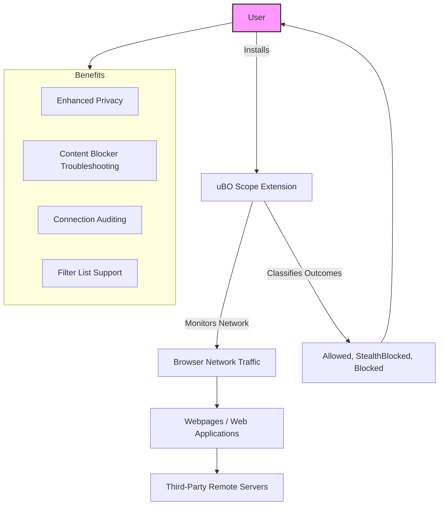

# Target Audience & Use Cases

uBO Scope is crafted to serve users who demand transparency and insightful visibility into the network connections their browsers make as they surf the web. This page defines who benefits most from uBO Scope and highlights the key scenarios where its value truly shines.

---

## Who Benefits Most from uBO Scope?

### Privacy Enthusiasts
If you prioritize your online privacy, understanding which third-party servers your browser connects to is crucial. uBO Scope exposes all remote connections attempted or established by webpages, helping you identify potential tracking sources beyond traditional blockers.

### Web Professionals
Developers, QA engineers, and security auditors gain deep insight into the network behavior of websites and web applications. uBO Scope's transparent reporting helps troubleshoot third-party content loading, audit dependencies, and verify blocker efficacy.

### Filter List Maintainers
Creating and maintaining reliable content-blocking filter lists demands detailed knowledge of the real-world connections websites make. uBO Scope enables maintainers to audit actual remote servers contacted, even when browsing environments limit access to developer tools.

### Users Seeking Deeper Network Visibility
If you want to go beyond standard content blockers and see the actual network traffic outcomes—what is allowed, stealth-blocked, or fully blocked—this extension provides clear and reliable feedback.

---

## Key Use Cases

Below are practical situations where uBO Scope delivers clear benefits and actionable insights:

### Troubleshooting Content Blocker Effectiveness
Many users struggle to gauge how well their content blockers perform. uBO Scope reports the distinct third-party remote servers from which web content loads, cutting through misleading block counts or artificial benchmark tests by ad blocker test pages.

### Auditing and Verifying Third-Party Connections
Whether auditing compliance or privacy, knowing which domains your browsing session contacts is fundamental. uBO Scope categorizes these connections into ‘allowed’, ‘stealth-blocked’, and ‘blocked’ outcomes, providing clarity on what network activity truly occurs.

### Comparing Content Blocking Strategies
When evaluating different blockers, uBO Scope helps confirm which third-party connections persist and which are suppressed, highlighting the actual reduction in external exposure rather than relying on synthetic test results.

### Supporting Accountability and Transparency
For organizations monitoring web privacy policies or security postures, uBO Scope offers a straightforward means to confirm third-party data exchanges transparently in real user sessions.

---

## How uBO Scope Fits Into Your Workflow

Imagine you are a privacy-conscious user who wants to evaluate a new content blocker. You install uBO Scope alongside and browse your favorite sites. Looking at the extension’s badge count and popup panel, you see exactly how many distinct third-party domains your browser connects with, and which are blocked or allowed. 

Or, consider a filter list maintainer troubleshooting a complex webpage. Using uBO Scope, you audit every remote connection attempt, including elusive or stealth-blocked ones, gaining accurate insight into the site’s third-party network footprint.

This clear, focused visibility into network connections helps users make informed decisions about privacy tools and web security.

---

## Practical Tips for Target Audiences

- **Privacy Enthusiasts:** Use uBO Scope alongside your favorite content blockers to detect invisible third-party connections.
- **Web Professionals:** Combine network connection data from uBO Scope with browser developer tools for comprehensive analysis.
- **Filter List Maintainers:** Leverage the extension’s detailed connection outcomes to refine and validate blocking rules.
- **General Users:** Rely on the popup UI to understand the third-party domains active on visited pages and gain confidence in blocking solutions.

---

## Common Pitfalls and Considerations

- The badge count reflects the number of distinct third-party domains contacted, which is a more meaningful metric than raw block counts.
- uBO Scope reports all network requests visible via browser APIs, but connections outside the browser’s `webRequest` API scope will not be captured.
- High block counts on other blockers do not necessarily mean better blocking—in fact, more blocked requests can mean more allowed distinct server connections. uBO Scope helps clarify this distinction.

---

## Next Steps

After understanding if uBO Scope is right for your needs, proceed to:

- [Installing uBO Scope](/getting-started/setup-overview/installing-ubo-scope) to add the extension to your browser.
- [Quick Validation: Is It Working?](/getting-started/usage-validation/quick-validation) to ensure you see accurate connection tracking.
- Explore [Analyzing Third-Party Connections](/guides/practical-usage/analyzing-third-party-connections) to leverage the extension’s detailed reporting.

---

For a foundational understanding of what uBO Scope does and how it works, see [What is uBO Scope?](/overview/product-intro/what-is-uboscope).

---

# Visualizing Value

---

_For detailed network behavior and UI information, refer to the popup and architecture documentation._

---

[GitHub Repository](https://github.com/gorhill/uBO-Scope) • [Public Suffix List Resource](https://publicsuffix.org/list/)

---