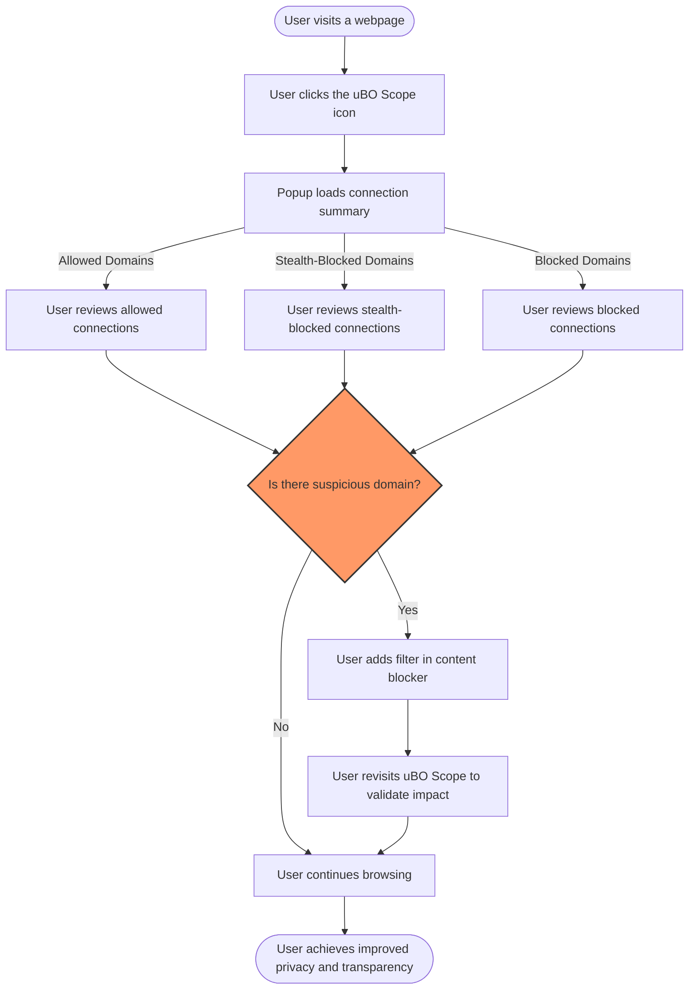

# Key Use Cases for uBO Scope

uBO Scope is more than just a network connection reporter—it's a practical tool designed to empower users by revealing the hidden dynamics of their browser's interactions with remote servers. This page highlights typical, real-world scenarios where uBO Scope shines, enabling you to leverage its transparency and detailed reporting to achieve better control, understanding, and maintenance of your browsing environment.

---

## Why Use uBO Scope?  
Discover how uBO Scope's unique approach provides clarity on your browser's network behavior, especially where traditional content blockers and testing tools fall short.

- **Compare Content Blockers with Confidence:** Rather than relying on misleading block counts or fabricated test sites, use uBO Scope to see the **actual number of distinct remote servers your browser interacts with**. A lower count means fewer third-party connections, correlating directly to better privacy and reduced tracking.

- **Detect Network Transparency Issues:** Understand which network requests succeed, which are stealth-blocked by your content blocker, and which fail due to explicit blocking. This aids in detecting subtle failures or failures to block seen only by direct network observation.

- **Support Filter List Maintainers:** For maintainers facing the challenge of verifying filter effectiveness on different devices, including resource-constrained environments, uBO Scope provides key insights to validate stealth and performance modes.

---

## Core Use Cases

### 1. Validating Content Blocker Effectiveness

When testing different content blockers, you may encounter conflicting claims based on the toolbar badge counts or results from specialized "ad blocker test" pages. uBO Scope cuts through this confusion by focusing on:

- **Counting distinct third-party domains with actual connections,** regardless of how many individual requests were blocked or allowed.
- Reporting the **true outcome of requests**, splitting third parties into:
  - **Allowed (not blocked and successfully connected)**
  - **Stealth-blocked (blocked silently to not break websites)**
  - **Blocked explicitly**

This comprehensive insight allows you to compare blockers based on how many unique servers they actually let your browser communicate with.

<Callout>
**Important:** uBO Scope reports are independent of the internal heuristics or UI metrics of the blockers; it relies on the browser’s `webRequest` API which is not influenced by content blockers' internal counters.
</Callout>

---

### 2. Auditing Third-Party Network Connections on Webpages

Privacy-conscious users can leverage uBO Scope to audit any webpage's network communications:

- Instantly view how many and which **distinct third-party domains** are contacted.
- Gain visibility into stealth-blocked requests, which traditional browser developer tools may not clearly reveal.
- Identify suspicious or unnecessary external connections that might indicate tracking or performance issues.

This empowers users to make informed decisions about which domains to block or allow.

### Example Scenario:

Suppose you visit a news website and see an unexpectedly high count on uBO Scope’s badge.
1. Open the uBO Scope popup.
2. Review the domains under 'allowed,' 'stealth-blocked,' and 'blocked' categories.
3. Spot a third-party domain unfamiliar or unrelated to the site’s purpose.
4. Add filters to block or disable that domain in your content blocker.

Repeat the audit to validate your changes' effectiveness.

---

### 3. Supporting Filter List Maintainers

Filter maintainers need reliable tools to test lists in various environments and blocking modes:

- **Stealth blocking detection:** uBO Scope identifies stealth-blocked domains that evade detection by conventional testing.
- **Performance mode verification:** Understand how filter rules perform in “non-breaking” silent block modes.
- **Data for refinement:** Use detailed network outcome reports to improve filter rules and reduce false positives or negatives.

uBO Scope provides maintainers with a platform-agnostic mechanism to observe the **real network impact** of their filters.

---

### 4. Debunking Common Myths in Content Blocking

Many users misunderstand metrics like block count badges or rely on ad blocker test webpages. uBO Scope helps clarify:

- The badge count on content blockers does **not** equate to better blocking; sometimes a higher badge count means more allowed connections.
- Ad blocker test pages use artificially fabricated network requests not encountered in real browsing, rendering their results unreliable.

By focusing on **actual distinct remote server connections**, uBO Scope helps users separate hype from reality.

---

## Practical Tips & Best Practices

- **Regularly check the badge count on your browser toolbar:** A rising number of distinct third-party connections may indicate new tracking domains.
- **Use the popup interface to drill down:** Explore allowed, stealth-blocked, and blocked domains to understand your browsing exposure.
- **Combine with your content blocker:** Use uBO Scope alongside blockers like uBlock Origin to validate their effectiveness rather than relying on their native UI counters.
- **Share findings with filter maintainers:** If you identify suspicious domains, consider reporting or contributing to filter list improvements.

---

## Common Pitfalls to Avoid

- **Do not rely solely on badge counts of content blockers** to judge their effectiveness.
- **Avoid trusting ad blocker test pages** for content blocker validation.
- **Don’t ignore stealth-blocked domains;** they may represent connections bypassing normal blocking UI.

By using uBO Scope, you avoid these pitfalls through direct observation.

---

## Getting Started Preview

To start harnessing these use cases:

1. Install uBO Scope from your browser’s extension store ([Chrome Web Store](https://chromewebstore.google.com/detail/ubo-scope/bbdpgcaljkaaigfcomhidmneffjjjfgp) or [Firefox Add-ons](https://addons.mozilla.org/firefox/addon/ubo-scope/)).
2. Activate the extension and open any webpage.
3. Click the uBO Scope icon to view the popup interface showing your site’s third-party connection summary.
4. Explore allowed, stealth-blocked, and blocked domains for actionable insights.

Refer to the [Getting Started Guide](/getting-started/introduction-and-installation/installation-guide) and [Understanding the Popup Interface](/getting-started/first-run-and-validation/understanding-the-popup) pages for detailed steps.

---

## Diagram: Typical User Workflow with uBO Scope

---

## Additional Resources
- [What is uBO Scope?](/overview/product-intro/what-is-ubo-scope) — Understand the product’s core purpose and features.
- [Who is uBO Scope For?](/overview/product-intro/value-prop-and-audience) — Identify if you are part of the target audience.
- [Audit Third-Party Network Connections](/guides/core-workflows/audit-network-connections) — Learn how to systematically use uBO Scope for network audits.
- [Troubleshooting & Limitations](/guides/advanced-usage/troubleshooting) — Find help for common issues.

---

By focusing on these key use cases, users can unlock the full potential of uBO Scope to gain unparalleled clarity and control over their browser's network interactions.