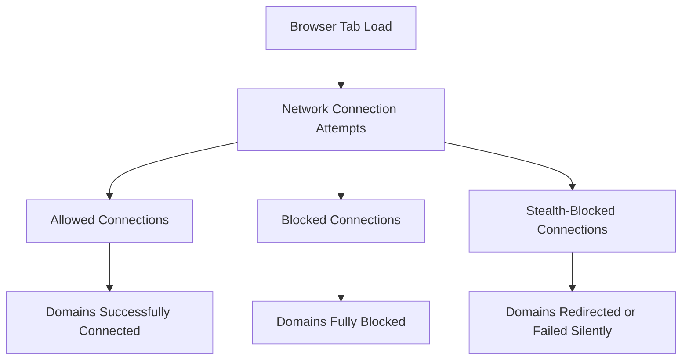

# Why Use uBO Scope?

Discover the powerful insights uBO Scope brings by providing accurate tracking of your browser's third-party network connections. This page clarifies misunderstandings about ad blockers and highlights scenarios where uBO Scope offers indispensable clarity for both privacy-conscious users and filter list maintainers.

---

## Unveiling the Truth Behind Network Connections

Many users believe their ad blocker shows the full picture of all third-party connections occurring in their browser. In reality, conventional blockers focus predominantly on blocking known advertising or tracking domains without revealing the full scope of network activity.

uBO Scope complements ad blockers by transparently tracking and reporting every remote connection attempt your browser makes — regardless of whether it was blocked or allowed. By doing so, it:

- Dispels myths around what ad blockers catch and what slips through.
- Highlights connections that are stealthily redirected or blocked without your awareness.
- Presents quantifiable data rather than vague security claims.

This transparency ensures you are fully informed about your browser’s network behavior, empowering you to make smarter choices about privacy and filtering.

## Why Accurate Tracking Matters

Tracking third-party domains matters because many content blockers and filter lists often obscure or mischaracterize the true extent of remote connections. Without an accurate view:

- **Users can underestimate privacy risks** because some connections occur silently or are stealth-blocked, making them invisible in typical block logs.
- **Filter list maintainers lack precise feedback** about how their rules affect real-world traffic and stealth-block scenarios.
- **Security professionals struggle to audit effectively** due to incomplete connection data.

uBO Scope provides the factual, actionable data needed for these stakeholders to understand and improve their approach.

---

## Key Benefits of Using uBO Scope

- **Comprehensive Visibility**: See all remote connections your browser attempts — blocked, allowed, and stealth-blocked.
- **Clarity on Ad Blocking Limitations**: Understand precisely which third parties are blocked and which slip by.
- **Insightful Categorization**: Connections are clearly grouped by their outcome, simplifying analysis.
- **Data for Filter List Improvement**: Helps maintainers optimize rules based on real connection patterns.
- **Lightweight and Fast**: Runs as a companion extension without slowing your browser.

---

## Practical Use Cases Where uBO Scope Excels

### 1. Privacy-Conscious Users

You want to verify that your blocker truly protects you. uBO Scope shows you if unexpected third parties connect — or if some blocked connections happen stealthily without visible alert.

Imagine browsing a news site and questioning whether tracking scripts are really blocked. uBO Scope displays:

- Which domains loaded successfully (allowed).
- Which were actually blocked outright.
- Which connections redirected or failed to load silently (stealth-blocked).

This empowers you with confidence and detailed insights about your privacy.

### 2. Filter List Maintainers

Maintaining and improving complex filter rules requires feedback on how blocking policies play out in real browsing scenarios. uBO Scope supplies precise records of all network connection attempts, including:

- Domains impacted by redirects or stealth blocking.
- Patterns of connections that evade blocking or cause errors.

This data is invaluable for refining filter lists and enhancing ad blocker effectiveness.

### 3. Security Auditors and Researchers

For security analysts, understanding all third-party connections from browsers during audits or research informs risk assessment and threat modeling.

uBO Scope captures the full breadth of network activity, helping auditors verify the scope and nature of remote communications initiated by web pages.

---

## How uBO Scope Fits Into Your Workflow

Starting uBO Scope is simple. Once installed and running, it tracks browser connections in real time and presents a categorized summary:

- The number of unique connected domains.
- Groupings for those not blocked, stealth-blocked, or blocked.

This actionable breakdown lets you quickly analyze what’s happening behind the scenes on any tab.

By integrating these insights with your regular browsing or filter maintenance routines, you gain a clearer understanding and greater control over your web experience.


## Common Misconceptions About Ad Blockers

- **Ad blockers block all third-party requests:** Many do not show or fully block all third-party domains, particularly stealth or redirect connections.
- **Blocked means completely invisible:** A connection labeled blocked by lists may still cause redirects or hidden events that impact privacy.
- **Filter lists are one-size-fits-all:** Without real-time connection data, maintainers may not realize how rules behave under diverse browsing conditions.

uBO Scope clears these misconceptions with hard data and transparent tracking.

---

## Practical Tips for Maximizing uBO Scope

- Use uBO Scope alongside your primary ad blocker for maximum protection and insight.
- Regularly check the domains listed under each category to detect unexpected or suspicious connections.
- When refining filter lists, leverage the detailed connection reports to zero in on stealth behaviors.
- Combine uBO Scope’s insights with the [Interpreting Network Activity](../guides/analyzing-connections/interpreting-activity) guide for deeper understanding.

---

## Summary

uBO Scope transforms the way you see your browser’s network activity by revealing all remote connections — not just those blocked or known. Whether you are protecting your privacy, tuning filter lists, or auditing security, uBO Scope provides clear, actionable information that changes the narrative around browser connections.

Embrace visibility, clarity, and control with uBO Scope.

---

## Next Steps

- Explore the [What is uBO Scope?](./about-ubo-scope) page for a basic product introduction.
- Visit [Feature Highlights at a Glance](../quickstart-usecases/feature-quickstart) to see the core capabilities.
- Dive into [Who Should Use uBO Scope?](../quickstart-usecases/audience-usecases) to confirm it’s right for you.
- Follow the [Installation Instructions](../../getting-started/installation-setup-validation/installation-instructions) to add uBO Scope to your browser.


---

*For further understanding on how uBO Scope works within your browser context and relates to ad blocking, see [System Architecture Overview](../architecture-core/architecture-overview) and [Key Concepts & Terminology](../architecture-core/core-concepts).*

---

## Relevant Code Examples

For advanced users or filter maintainers interested in technical internals, uBO Scope organizes connection data into categories:

```javascript
// Example snippet illustrating recording connection outcomes
function recordOutcome(tabId, request) {
    // Tab details contain allowed, stealth, and blocked maps
    // Connections are categorized and counted for analysis
}
```

This underlying organization ensures that users see precise counts and statuses for each domain contact attempt.


---

## Troubleshooting Common Issues

If you don’t see expected data in uBO Scope:

- Ensure the extension has the necessary permissions (e.g., access to webRequest API).
- Confirm your browser version meets minimum requirements.
- Check the Network Activity guide sections for interpreting empty or incomplete reports.


---

## Visualization of Connection Categories



This flow captures how uBO Scope classifies the network requests made from a browser tab.


---

For additional insights, see the [Real-World Use Cases](../guides/analyzing-connections/real-world-scenarios) page which expands on applying uBO Scope data in practical scenarios.
