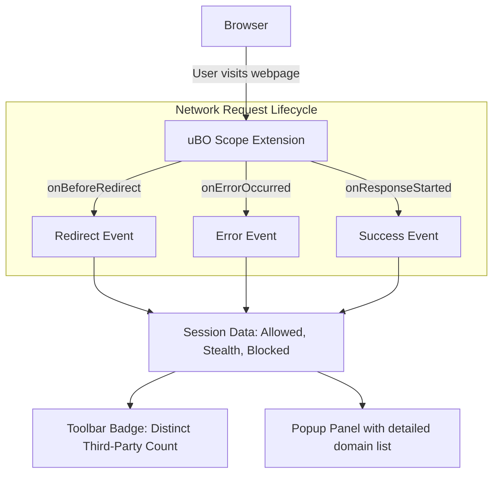

# What is uBO Scope?

## Revealing All Remote Server Connections in Your Browser

Imagine visiting a webpage and instantly knowing every remote server it talks to — including those connections your usual content blocker might not show you. uBO Scope is a lightweight browser extension that surfaces this hidden web of network activity. It records every attempted or successful connection to third-party servers for any page you visit, giving you unparalleled insight into what’s happening behind the scenes.

### Why Does This Matter?

Web content often comes bundled with scripts, ads, trackers, and other resources that connect to multiple external servers. Many of these connections may track you or serve unwanted content. While content blockers attempt to restrict this, they often don’t reveal the full picture of all attempted connections, especially those stealthy or blocked before they even start.

uBO Scope empowers you to see **all** these connections, regardless of your content blockers or network-level DNS protections. This transparency lets you make informed decisions about your privacy, browser security, and content filtering.

---

## What is uBO Scope?

uBO Scope is a **browser extension** designed explicitly to show every network connection a webpage makes to remote servers. It:

- Monitors requests made by web pages to third-party remote servers
- Reports both **attempted** and **successful** connections
- Works independently of your content blocker—showing connections regardless of blocking

Using the browser's `webRequest` API, uBO Scope listens to network events and tracks the precise outcome of each request.

### The Problems It Solves

- **Lack of visibility** into stealth connections and redirects
- Difficulty verifying the actual number of unique third-party connections a page makes
- Misleading metrics from content blockers focused only on the number of blocked requests rather than unique remote servers contacted

By providing clear data on the domains involved, uBO Scope helps privacy-conscious users and filter list maintainers truly understand tracking and serve behavior.

### What Makes uBO Scope Unique?

- **Third-party Focus:** The extension’s toolbar badge counts the distinct *third-party* remote servers connected, a more accurate privacy metric than total requests or blocks.
- **Independent of Content Blockers:** Since it uses browser network events, it reports connections regardless of which content blocker or DNS-level blocking is active.
- **Transparent and Trustworthy:** No complicated heuristics or filtering; it simply reveals what your browser attempts or succeeds in connecting to.

---

## How It Works in Brief

​​
- Listens to three key network events: request redirects, errors, and successful responses
- Records outcomes for each page tab, distinguishing between allowed, stealth (redirected stealthily), and blocked connections
- Aggregates connections by domains and hostnames to present a concise summary
- Displays this data in its popup panel to give you real-time insights per browsing tab

The extension maintains session data per tab, using a public suffix list to accurately group domains, and updates the UI badge accordingly.

---

## Practical Impact and Use Cases

- **Privacy-Oriented Users:** See all third-party connections made by a webpage, even those silently redirected or stealth blocked.
- **Filter List Maintainers:** Access raw network connection data to refine filters and identify new tracking domains.
- **Content Blocker Evaluators:** Use uBO Scope to verify whether a content blocker truly prevents connections or just blocks requests.

### Before uBO Scope

You might rely on content blocker counts or unverified "ad blocker test" pages that don’t reflect real network behavior.

### After uBO Scope

You gain clear, unbiased visibility into all third-party connections, enabling smarter browsing decisions.

<Callout title='Tip'>A lower number on the toolbar badge means fewer unique third-party connections, which generally implies better privacy.</Callout>

---

## Summary

- uBO Scope is an extension that reveals **every remote server connection attempt or success** for the webpages you visit.
- It provides transparency beyond what content blockers show, focusing on unique third-party remote servers contacted.
- The extension uses browser network request events to accurately track connection outcomes.
- Ideal for privacy-conscious users and filter list maintainers wanting unfiltered network visibility.

---

## Next Steps

Begin with the [Using the Popup Panel](/overview/feature-glance/popup-overview) to learn how to interpret the connection data shown. For installation, see [Quickstart & Installation Links](/overview/feature-glance/quickstart-install). To understand how uBO Scope gathers this data behind the scenes, explore [How uBO Scope Works](/overview/architecture-concepts/how-it-works).

---

## Additional Resources

- Explore the [repository on GitHub](https://github.com/gorhill/uBO-Scope)
- Review the [FAQ and myths](https://github.com/gorhill/uBO-Scope#debunking-common-misconceptions) surrounding content blockers and connection metrics
- Learn about domain processing with the [Public Suffix List](http://publicsuffix.org/)

---

<u>Note:</u> uBO Scope depends on browsers exposing network request details through their `webRequest` API. Some network requests outside this API's scope may not be visible.

---

# Frequently Encountered Scenarios

<AccordionGroup title="Common Questions about uBO Scope">
<Accordion title="Does uBO Scope block any requests?">
No. uBO Scope is strictly a passive observer. It reports on connection attempts and their outcomes but does not interfere or block network requests.
</Accordion>
<Accordion title="How does the toolbar badge number work?">
The badge shows the count of distinct third-party domains for which connections were successfully attempted or allowed by the browser on the current tab. Lower counts usually indicate fewer third-party contacts.
</Accordion>
<Accordion title="Can uBO Scope detect connections blocked by DNS or external filters?">
If the network requests are not reported by the browser's `webRequest` API due to external DNS blocking or network-level filtering, uBO Scope might not detect those. However, most browser-level content blocking is reported.
</Accordion>
</AccordionGroup>

---

By revealing all remote server connections for every webpage you visit, uBO Scope offers unparalleled network transparency, helping you verify privacy protections and sharpen content blocker evaluations with certainty.

---

###### For more, visit the [uBO Scope Overview](../overview/product-intro/what-is-ubo-scope) and related documentation.

