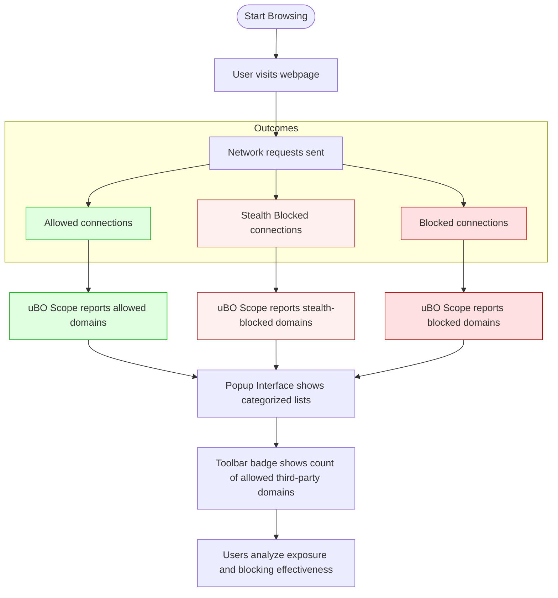

# Target Audience & Use Cases

## Discover Who Benefits Most from uBO Scope

uBO Scope is designed with precision to serve specific user groups who demand an accurate, unvarnished view of their browser's third-party network connections. By understanding who benefits most, you can determine how uBO Scope fits into your privacy toolkit and workflow.

### Who Should Use uBO Scope?

- **Privacy-Conscious Users**: Individuals who strive to minimize digital footprints by monitoring exactly which third-party servers their browser connects to.
- **Filter List Maintainers**: Developers and maintainers of content-blocking filter lists requiring a reliable tool to observe real-world network request outcomes and verify blocker effectiveness.
- **Researchers and Analysts**: Those seeking to validate the stealth and true impact of content blockers beyond surface-level block counts.
- **Technical Users Validating Blockers**: Users who need to assess whether a blocker truly restricts connections to unwanted domains or merely inflates block counts.

---

## Practical Scenarios & Real-World Use Cases

### 1. Debunking Misconceptions About Content Blocking

Many users assume that a higher block count on a toolbar icon means better protection. uBO Scope challenges this myth by:

- Reporting **distinct third-party domains with successful connections**, the meaningful metric for real exposure.
- Showing that **fewer allowed connections** to third parties often represent stronger, more effective blocking.

_For example_, if you compare two blockers, the one reporting a lower number of allowed third-party domains typically provides better privacy, despite a lower block count.

### 2. Assessing Extension Stealthiness

Some content blockers operate stealthily, hiding their activity from scripts running on websites or obfuscating blocking results. uBO Scope reveals this by:

- Presenting a clear breakdown of network requests categorized into allowed, stealth-blocked, and blocked.
- Helping users identify blockers that truly prevent connections versus those that merely mask blocking.

_This is crucial_ since traditional "ad blocker test" pages often fail to detect stealth blocking techniques, giving misleading results.

### 3. Evaluating Browsing Risks From Third-Party Connections

Understanding which third-party servers your browser contacts during normal browsing allows you to:

- Identify legitimate third parties (like CDN providers) versus potentially tracking or malicious entities.
- Make informed decisions about which domains or hostnames to block or whitelist.
- Reduce your exposure footprint by optimizing your content blocker settings or filter lists.

_Real example:_ When visiting a news site, uBO Scope reports the number and identity of external domains connected, helping you assess exposure beyond what your blocker claims to block.

### 4. Support for Filter List Maintenance

Filter list authors gain tangible benefits by using uBO Scope to:

- Monitor actual network behaviors behind the scenes on diverse websites.
- Quickly validate if filter rules are working as intended or if connections sneak through.
- Gain insights on stealth-blocked requests that might evade standard detection.

This makes uBO Scope an indispensable tool for those who maintain or develop content filtering solutions.

---

## Why Target This Audience?

Each of these user groups faces challenges that common tools and blocker metrics fail to solve:

- Casual block count metrics are misleading and incomplete.
- Stealth blocking tactics can confuse test pages or simple monitors.
- End-users and maintainers need authoritative visibility into actual network events rather than inferred blocking outcomes.

uBO Scope bridges this gap by focusing on what truly matters — the **distinct third-party connections your browser makes and their outcomes**, regardless of the blocking method used.

---

## Getting the Most Out of uBO Scope

### Before Using uBO Scope

- Ensure uBO Scope is installed and activated in your browser.
- Familiarize yourself with its popup interface, which categorizes connections into:
  - Allowed (not blocked)
  - Stealth-blocked (blocked without obvious indications)
  - Blocked explicitly

### Success Criteria When Using uBO Scope

- You see a clear and categorized list of third-party domains contacted during browsing sessions.
- The toolbar badge accurately reflects the number of unique allowed third-party domains.
- You can distinguish between outright blocked requests and stealth blocking failures.

---

## Common Scenarios Visualized

---

## Tips for Effective Use

- **Do not rely on block counts alone:** Use uBO Scope to observe unique third-party domains instead.
- **Contrast results across blockers:** Compare how different blockers affect the allowed third-party domain count.
- **Use alongside existing privacy tools:** uBO Scope complements, not replaces, content blockers like uBlock Origin.
- **Look into stealth-blocked domains:** These may reveal blockers' hidden operations or potential gaps.

---

## Troubleshooting & Common Pitfalls

- If no data appears or badge remains empty, ensure uBO Scope has permission to monitor web requests and is enabled.
- Remember that some network requests made outside browser APIs may not be tracked.
- The badge count indicates successful connections to third-party domains, so empty or zero counts reflect strict blocking or limited browsing.

---

Explore related documentation for foundational understanding, such as the [What is uBO Scope?](overview/product-introduction/what-is-ubo-scope) page for product introduction, and practical insights on [Monitoring Third-party Connections](guides/practical-use-cases/monitoring-3rd-party-connections) to further enhance your privacy control journey.
